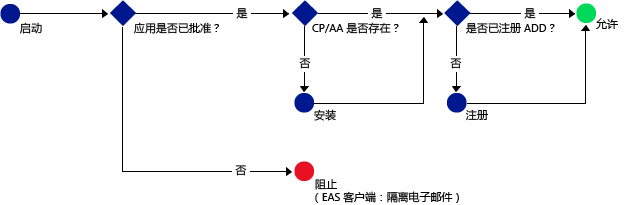

# 仅允许支持 Intune MAM 策略的移动应用访问 Office 365 服务
[Intune 移动应用管理 (MAM) 策略](protect-apps-and-data-with-microsoft-intune.md)可帮助保护在 Intune 中注册进行管理的设备上的公司数据。 还可以在**员工拥有的未在 Intune 中注册进行管理的设备**上使用 MAM 策略。  在这种情况下，即使不管理该设备，仍需要确保公司数据和资源受保护。 通过使用 MAM 的条件访问 (MAM CA)，可以创建仅允许支持 Intune MAM 策略的移动应用访问 O365 服务（如 Exchange Online）的策略。

例如，通过仅允许 **Microsoft Outlook 应用**访问 Exchange Online，可以**阻止 iOS 和 Android 上的内置邮件应用**，这些应用不具有 Intune MAM 策略提供的数据保护，从而无法从 **Exchange Online** 获取电子邮件。

下图说明 MAM CA 策略用于确定何时允许和阻止访问的流：。

图表中使用的缩写的说明：
* **CP**：公司门户应用
* **AA**：Azure Authenticator 应用
* **AAD**：Azure Active Directory
* **EAS**：Exchange Active Sync

## 先决条件
可以配置 MAM CA 策略**之前**，你必须具有**企业移动性 + 安全性或 Azure Active Directory Premium 订阅**，并且用户必须获得 EMS 或 Azure AD 许可。 有关详细信息，请参阅[企业移动性定价页](https://www.microsoft.com/en-us/cloud-platform/enterprise-mobility-pricing)或 [Azure Active Directory 定价页](https://azure.microsoft.com/en-us/pricing/details/active-directory/)。

## 受支持的应用
**Exchange Online**：**Microsoft Outlook** for Android 和 Microsoft Outlook for iOS。

若要了解具有 MAM CA 策略的应用的用户体验，请参阅[将应用与 MAM CA 结合使用时预期会出现的情况](use-apps-with-mam-ca.md)。

## 后续步骤
[为 MAM 应用创建 Exchange Online 策略](mam-ca-for-exchange-online.md)

[阻止没有现代身份验证的应用](block-apps-with-no-modern-authentication.md)

### 另请参阅

[使用 MAM 策略保护应用数据](protect-app-data-using-mobile-app-management-policies-with-microsoft-intune.md)

<!--HONumber=Oct16_HO4-->

