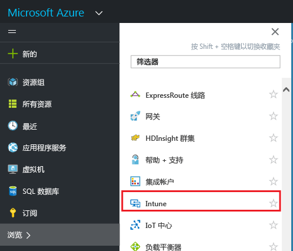
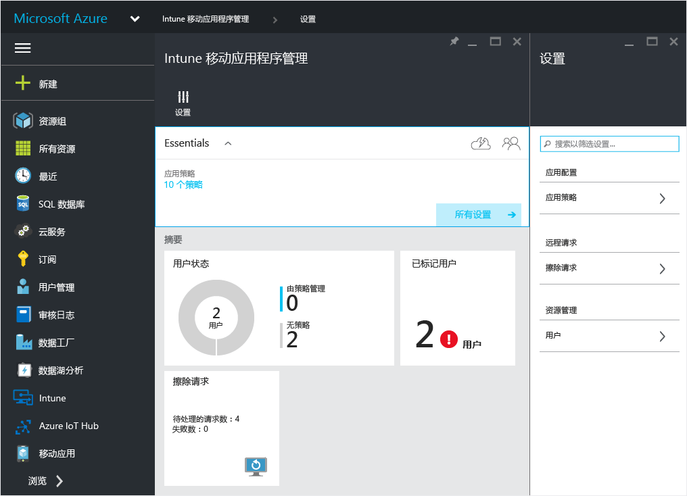

# 用于 Microsoft Intune MAM 策略的 Azure 门户
## 使用 Azure 门户
Azure 门户可用于创建和管理移动应用管理 (MAM) 策略。

Azure 门户支持为以下应用创建 MAM 策略：
- ** Intune 注册和管理**的设备上运行的应用。
- 未在任何 MDM 解决方案中**注册**的设备上运行的应用
- **已在第三方 MDM 解决方案中注册**的设备上运行的应用。

>[!IMPORTANT]

> 如果当前使用 Intune 管理控制台管理设备，则可以创建一个 MAM 策略，来支持在 Intune 中使用 [Intune 管理控制台](configure-and-deploy-mobile-application-management-policies-in-the-microsoft-intune-console.md)注册的设备的应用。

> 可能无法在 Intune 管理控制台上看到全部 MAM 策略设置。 Azure 门户是用于创建 MAM 策略的新管理控制台。 如果同时在 Intune 管理控制台和 Azure 门户中创建了 MAM 策略，则 Azure 门户中的策略将应用到该应用并部署到用户。

## 登录到 Azure 门户并自定义起始页

1.  转到 [Azure 门户](https://portal.azure.com)，然后使用你的 [!INCLUDE[wit_nextref](../includes/wit_nextref_md.md)] 凭据登录。

    

2.  登录后，你将看到“仪表板”页。 可以自定义“**仪表板**”页。

    

3.  从**浏览**菜单中查找 **Intune**。

4.  选择“Intune” > “Intune 移动应用管理” > “设置”。

    

    > [!TIP]
    > 若要将边栏选项卡固定到“开始”页，请选择“Intune 移动应用管理”边栏选项卡上的图钉图标。

    

    
## 后续步骤
[准备好配置移动应用管理策略](get-ready-to-configure-mobile-app-management-policies-with-microsoft-intune.md)

<!--HONumber=Oct16_HO3-->

