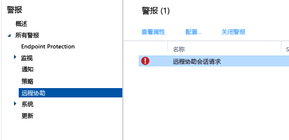

---
# required metadata

title: 常见 Windows 电脑管理任务 | Microsoft Intune
description:
keywords:
author: robstackmsft
manager: jeffgilb
ms.date: 04/28/2016
ms.topic: article
ms.prod:
ms.service: microsoft-intune
ms.technology:
ms.assetid: eb912c73-54d2-4d78-ac34-3cbe825804c7

# optional metadata

#ROBOTS:
#audience:
#ms.devlang:
ms.reviewer: owenyen
ms.suite: ems
#ms.tgt_pltfrm:
#ms.custom:

---

# 使用 Microsoft Intune 计算机客户端的常见 Windows PC 管理任务
查看本主题中的任务，了解如何管理运行 Intune 客户端的计算机。 如果你尚未在计算机上安装客户端，请参阅[使用 Microsoft Intune 安装 Windows 电脑客户端](install-the-windows-pc-client-with-microsoft-intune.md)。

## 使用策略来简化电脑管理
### 管理 Windows 防火墙
策略可简化被管理的计算机上 Windows 防火墙设置的管理。 有关详细信息，请参阅[在 Microsoft Intune 中使用 Windows 防火墙策略帮助保护 Windows 电脑](help-protect-windows-pcs-using-windows-firewall-policies-in-microsoft-intune.md)。

### 管理 Microsoft Intune Center
Microsoft Intune Center 使用户能够：

-   从公司门户中获取应用程序。

-   检查更新。

-   管理 Microsoft Intune Endpoint Protection。

<!--- -   Request remote assistance.--->

Microsoft Intune Center 安装在所有被管理的计算机上。 你可以在 Intune 策略中配置下列设置，并且这些设置将在 Microsoft Intune Center 中向用户显示：

|策略设置|详细信息|
|------------------|--------------------|
|**Name**|负责管理计算机的管理员的名称。  最大长度：40 个字符|
|**电话号码**|负责管理计算机的管理员的电话号码。  最大长度：20 个字符|
|**电子邮件地址**|负责管理计算机的管理员的电子邮件地址。  最大长度：40 个字符|
|**网站名称**|用户的支持网站的名称。  最大长度：40 个字符|
|**网站 URL**|支持网站的 URL。  最大长度：150 个字符|
|**注意**|向用户显示的注释。  最大长度：120 个字符|

### 管理软件更新设置
使用策略来配置被管理的计算机用于从 Microsoft 和第三方检查并下载软件更新的设置。 有关详细信息，请参阅[在 Microsoft Intune 中利用软件更新使 Windows 电脑保持最新版本](keep-windows-pcs-up-to-date-with-software-updates-in-microsoft-intune.md)。

### 管理 Endpoint Protection 设置
使用策略来配置你随后部署到被管理的计算机的 Endpoint Protection 的设置。 其中包括扫描计划、要在检测到恶意软件时采取的操作等设置。 有关详细信息，请参阅[使用适用于 Microsoft Intune 的 Endpoint Protection 帮助保障 Windows 电脑的安全](help-secure-windows-pcs-with-endpoint-protection-for-microsoft-intune.md)。

## 查看硬件和软件清单
Intune 收集有关被管理的计算机的硬件和软件的详细信息。 使用下列过程中的信息来了解如何创建：

-   列出有关计算机硬件性能的信息的报表。

-   列出每台计算机上所安装的软件的报表。

-   如何刷新计算机清单以确保报表中的数据为最新。

### 显示有关你的计算机的信息

1.  在 [Microsoft Intune 管理控制台](https://manage.microsoft.com/)中，选择**报表**&gt;**计算机清单报表**。

2.  在“创建新报表”  页上，接受默认值或对其进行自定义以筛选报表将返回的结果。 例如，你可以选择只在报表中显示运行 Windows 8.1 的计算机。

3.  选择“查看报表”，在新窗口中打开“计算机清单报表”。

    你可以选择各个列标题，按任何列（如“名称”、“底盘类型”或“制造商”）对报表进行排序。

### 显示你的计算机上安装的软件

1.  在 [Microsoft Intune 管理控制台](https://manage.microsoft.com/)中，选择**报表**&gt;**检测到的软件报表**。

2.  在“创建新报表”  页上，接受默认值或对其进行自定义以筛选报表将返回的结果。 例如，你可以选择只在报表中显示 Microsoft 发布的软件。

3.  选择“查看报表”，在新窗口中打开“检测到的软件报表”。

    你可以选择各个列标题，按任何列（如“名称”、“发布者”或“类别”）对报表进行排序。 通过选择列表项旁边的方向箭头，可以展开列表中的更新以显示更多详细信息（例如安装了更新的计算机）。

### 刷新计算机清单以确保其为最新

1.  在 [Microsoft Intune 管理控制台](https://manage.microsoft.com/)中，选择**组**&gt;**所有设备**（或包含需刷新清单的计算机的另一个组）。

2.  选择一台计算机，或按住  “Ctrl”键以选择多台计算机。

3.  在任务栏上，选择**远程任务**&gt;**刷新清单**。

4.  若要查看任务状态，请选择页面右下角的“远程任务”。

    “任务状态”  对话框显示当前远程任务、任务状态、设备名称和任何报告的错误，并提供指向疑难解答信息的链接。

## 远程重启 Windows 电脑

1.  在 [Microsoft Intune 管理控制台](https://manage.microsoft.com/)中，选择**组**&gt;**所有设备**（或包含需重新启动的计算机的另一个组）。

2.  选择一台或多台计算机，然后选择**远程任务**&gt;**重新启动计算机**。

3.  若要查看任务状态，请选择页面右下角的“远程任务”。

4.  在“任务状态”  对话框中，查看当前远程任务、任务状态、设备名称以及报告的任何错误。

## 停用计算机

1.  在 [Microsoft Intune 管理控制台](https://manage.microsoft.com/)中，选择**组**&gt;**所有设备**（或包含需停用的计算机的另一个组）。

2.  选择要停用的设备，然后选择**停用/擦除**。

若要将计算机重新注册到 Intune 中，请使用[使用 Microsoft Intune 安装 Windows 电脑客户端](install-the-windows-pc-client-with-microsoft-intune.md)主题中的信息在该计算机上重新安装客户端软件。

如果计算机无法连接到 Intune，则“仪表板”工作区中会显示一条消息。

在停用计算机时：

-   将会从 Intune 清单中删除该计算机，并且与该计算机关联的许可证将可供重用。

-   其状态不再显示在 Intune 控制台中。

-   Intune 将从计算机中删除客户端软件。 如果计算机未连接到 Intune 服务，则在它下次连接时将会删除客户端软件。

-   Microsoft Intune Endpoint Protection 将从计算机中删除。 如果计算机安装了另一个终结点应用程序，并且此应用程序处于禁用状态，则删除 Microsoft Intune Endpoint Protection 之后，可以重新启用该应用程序以确保计算机得到保护。

-   将从计算机中删除任何策略，并且策略设置的值将更改。

-   计算机不再从 Intune 服务接收软件更新或恶意软件定义更新。

-   根据停用的计算机的配置情况，停用的计算机可能会继续使用 Windows Server Update Services、Windows 更新或 Microsoft 更新接收更新。

    > [!IMPORTANT]如果客户端软件是通过使用组策略对象 (GPO) 安装的，则必须删除组策略对象 (GPO)，然后才能删除客户端软件以防止软件重新安装。

    如果未能卸载客户端，请阅读 [Endpoint Protection 疑难解答](/intune/troubleshoot/troubleshoot-endpoint-protection-in-microsoft-intune)以获取更多帮助。

## 管理用户-设备链接
你必须将用户链接到计算机，然后才能将软件部署到用户。 你可以将某个用户链接到多台计算机，但每台计算机只能链接到一个用户。 用户会自动链接到他们使用公司门户在 Intune 中注册的任何计算机。

### 将用户链接到计算机

1.  在 [Microsoft Intune 管理控制台](https://manage.microsoft.com/)中，选择**组**&gt;**所有设备**（或包含需链接到用户的计算机的另一个组）。

2.  选择要链接用户的计算机，然后选择**链接用户**。

    “链接用户”  对话框显示可用用户的列表，将显示用户的显示名称、用户 ID 和每个用户当前链接到的计算机的数量。 如果用户已链接到所选计算机，则该用户的名称和用户 ID 会显示在“当前用户” 下面。 如果计算机未链接到任何用户，则“当前用户”  下面将显示“无用户” 。

3.  执行以下操作之一：

    -   若要使计算机与其当前用户（如果存在当前用户）链接，请选择**取消**。

    -   若要删除指向当前用户的链接（如果有），请选择**删除链接**&gt;**确定**。

    -   要将计算机链接到新用户，请在“所有用户”  列表中，选择用户。 确认用户数据正确，然后选择**确定**。

> [!TIP]如果想要限制最终用户将自己链接到计算机的能力，则启用 **Microsoft Intune 代理设置**策略中的**限制用户将自己链接到计算机的能力**选项。

<!--- ## Request and provide remote assistance to Windows PCs that use the Intune client software

> [!IMPORTANT]
> You might not see the options to configure TeamViewer integration for remote assistance in the Intune admin console. This capability is not currently available to all customers, but will be rolling our more widely soon.
     

Microsoft Intune can use the [TeamViewer](https://www.teamviewer.com) software to let users of PCs that run the Intune client software get remote assistance help from you. When a user requests help from the Microsoft Intune Center, you are informed by an alert, can accept the request, and then provide assistance.
This functionality replaces the existing Windows Remote Assistance functionality in Intune.

### Before you start

Before you can begin to establish and respond to remote assistance requests, you must ensure the following prerequisites are in place:

- You must have [signed up for a TeamViewer account](https://login.teamviewer.com/LogOn#register) to log into the TeamViewer website.
- Windows PCs that you want to administer must be [managed by the Windows PC client](manage-windows-pcs-with-microsoft-intune.md)
- All Windows PC operating systems supported by Intune can be administered.

### Configure the TeamViewer Connector

1. In the [Microsoft Intune administration console](https://manage.microsoft.com), choose **Admin**.
2. In the **Admin** workspace, choose **TeamViewer**.
3. On the **TeamViewer** page, under **TeamViewer Connector**, choose **Enable**.
4. In the **Enable TeamViewer** dialog box, view, then **Accept** the license terms. If you don't already own a TeamViewer license, choose **Purchase a TeamViewer license**.
5. After the TeamViewer browser window opens, sign into the site with your TeamViewer credentials.
6. On the TeamViewer site, read, then accept the options to allow Intune to connect with TeamViewer.
7. In the Intune console, verify that the **TeamViewer Connector** item shows as **Enabled**.

### Open a remote assistance request (end user)

1. On a client Windows PC, open the **Microsoft Intune Center**.
2. Under **Remote Assistance**, choose **Request Remote Assistance**.
3. After you approve the request (see below), TeamViewer opens on the client. The user must accept any messages indicating that the web browser is trying to open the TeamViewer application.
4. The user sees a message asking if you can control their PC. They must accept this message to continue.
5. During the remote assistance session, the user sees a window that shows them you are connected. If they close this window, the remote session ends.

### Respond to a remote assistance request

1. When a user submits a remote assistance request, you can view it in the **Alerts** workspace, under **Monitoring** > **Remote Assistance**. For example:
> 

 If a request goes unanswered for more than 4 hours, it is removed.
2. To accept the request, choose **Approve request and launch Remote Assistance**.
3. In the **A New Remote Assistance Request is Pending** dialog box, choose **Accept the remote assistance request**. If it's not already installed, TeamViewer will install any necessary apps on your computer.
4. TeamViewer then notifies the end user that you want to take control of their PC. After the user has accepted the request, the TeamViewer windows opens, and you can control the PC. 
 
While in a remote assistance session, you can use all available TeamViewer commands to control the remote PC. For help with these commands, download the [Manual for remote control](http://www.teamviewer.com/en/support/documents/) from the TeamViewer website.

### Close the remote assistance session

From the **Actions** menu of the **TeamViewer** window, choose **End Session**.--->

<!--HONumber=Jun16_HO2-->

