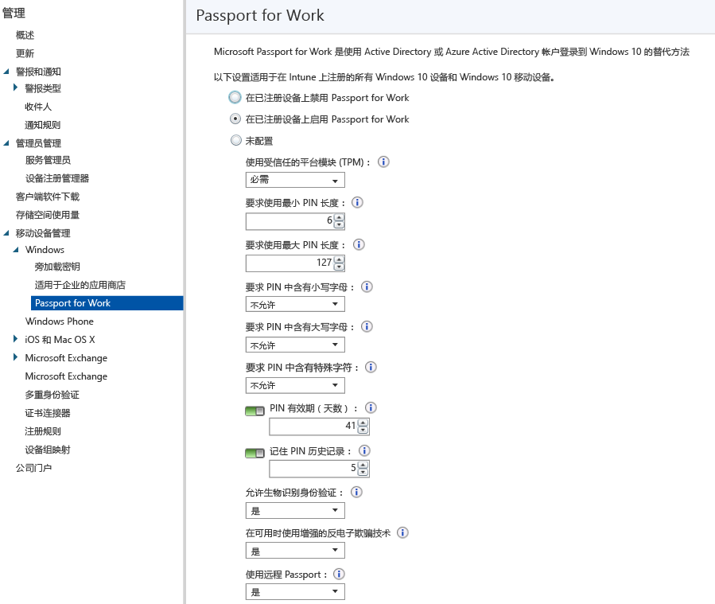

# 通过 Microsoft Intune 控制设备上的 Microsoft Passport 设置
Microsoft Intune 与 Microsoft Passport for Work 集成（Microsoft Passport for Work 是使用 Active Directory 或 Azure Active Directory 帐户取代密码、智能卡或虚拟智能卡进行登录的一种替代方法）。

通过 Passport，你可以使用*用户手势*取代密码进行登录。 用户手势可以是简单 PIN、Windows Hello 等生物识别身份验证或指纹读取器等外部设备。

>[!TIP]
>Microsoft Passport for Work 现在称为 Windows Hello 企业版。 Intune 控制台尚未反映此更改。

Intune 以两种方式与 Passport for Work 集成：

-   可以使用 Intune 策略来控制用户能够和不能用于登录的手势。

-   可在 Passport for Work 密钥存储提供程序 (KSP) 中存储身份验证证书。 有关详细信息，请参阅[使用 Microsoft Intune 中的证书配置文件确保资源访问的安全性](secure-resource-access-with-certificate-profiles.md)。

## 创建 Passport for Work 策略

1.  在 [Microsoft Intune 管理控制台](https://manage.microsoft.com)中，选择“管理”&gt;“移动设备管理”&gt;“Windows”&gt;“Passport for Work”打开 Passport for Work 页面。

    

2.  选择下列设置之一：
    - “在已注册设备上禁用 Passport for Work”。 如果不想在 Windows 10 设备上使用 Passport for Work，请选择此设置。 屏幕上的所有其他设置将不可用。
    - “在已注册设备上启用 Passport for Work”。 如果想在所有 Windows 10 设备上配置 Passport for Work 设置，请选择此设置。
    - “不配置”。 如果不想使用 Intune 来控制 Passport for Work 设置，请选择此设置。 不会更改 Windows 10 设备上的任何现有 Passport for Work 设置。 屏幕上的所有其他设置将不可用。
3.  如果选择了“在已注册设备上启用 Passport for Work”，请配置将应用于所有已注册 Windows 10 和 Windows 10 移动版设备的必要设置。
4.  完成后，请选择“保存”。

## Passport for Work：PIN 设置

- “要求最小 PIN 长度”/要求最大 PIN 长度”。 将设备配置为使用你指定的最小和最大 PIN 长度，以帮助确保安全登录。 默认 PIN 长度为 6 个字符，但是你可以强制最小长度为 4 个字符。 最大 PIN 长度为 127 个字符。
- “要求 PIN 中含有小写字母”/要求 PIN 中含有大写字母”/要求 PIN 中含有特殊字符”。 你可以通过要求在 PIN 中使用大写字母、小写字母和特殊字符，从而强制实施更强的 PIN。 选择：
    - “允许”。 用户可以在其 PIN 中使用该字符类型，但不强制使用。
    - “必需”。 用户在其 PIN 中必须至少包含其中一种字符类型。 例如，常见的做法是要求包含至少一个大写字母和一个特殊字符。
    - “不允许”（默认）。 用户必须在他们的 PIN 中使用这些字符类型。 （这也是不配置此设置时的行为。）
    > [!TIP]
    > 特殊字符包括：**! “ # $ % &amp; ‘ ( ) &#42; + , - . / : ; &lt; = &gt; ? @ [ \ ] ^ _ &#96; { &#124; } ~**。
- “PIN 有效期（天数）”。 比较好的一种做法是指定 PIN 的有效期，在超过此期限后，最终用户必须更改该 PIN。 默认值为 41 天。
- “记住 PIN 历史记录”。 限制重复使用以前用过的 PIN。 默认情况下，不能重复使用最近用过的 5 个 PIN。

## Passport for Work：其他设置

- “使用受信任的平台模块 (TPM)”。 TPM 芯片额外提供了一层数据安全。 选择下列值之一：
    - “必需”（默认）。 仅限可访问 TPM 的设备预配 Passport for Work。
    - “首选”。 首次尝试使用 TPM 的设备。 如果不可用，他们可以使用软件加密。
- “允许生物识别身份验证”。 启用面部识别或指纹等生物识别身份验证作为 Passport for Work PIN 的替代方法。 如果生物识别身份验证失败，则用户仍必须配置工作 PIN。 选择：
    - “是”。 Passport for Work 允许生物识别身份验证。
    - “否”。 Passport for Work 阻止生物识别身份验证（适用于所有帐户类型）。
- “在可用时使用增强的反电子欺骗技术”。 配置是否在支持 Windows Hello 反电子欺骗功能的设备上使用该功能（例如，检测面部照片而非真实的面部）。 如果设置为“是”，则 Windows 将在支持反电子欺骗技术时要求所有用户对面部识别功能使用此技术。
- “使用远程 Passport”。 如果将此选项设置为“是”，则用户可以使用远程 Passport 充当台式计算机身份验证的便携伴侣设备。 台式计算机必须加入 Azure Active Directory，并且伴侣设备必须配置 Passport for Work PIN。

## 更多信息
有关 Microsoft Passport 的详细信息，请参阅 Windows 10 文档中的[指南](https://technet.microsoft.com/library/mt589441.aspx)。

<!--HONumber=Aug16_HO1-->

