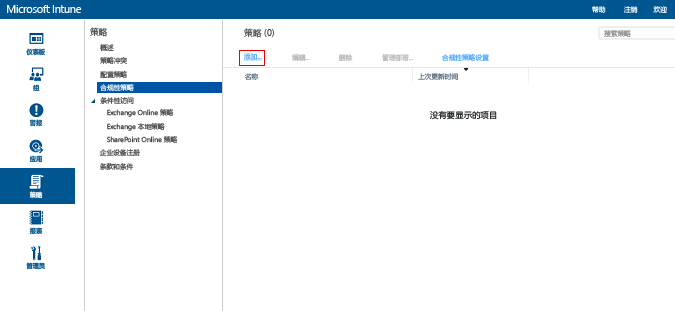

# 在 Microsoft Intune 中创建设备合规性策略
本主题概述了创建合规性策略时可使用的步骤，设备必须遵循该策略才能被视为相容。

##  步骤 1：添加新策略
  在 [Microsoft Intune 管理控制台](https://manage.microsoft.com)中，选择“策略”&gt;“遵从性策略”&gt;“添加”。

  

##  步骤 2：配置设置
在“创建策略” 页上启用所需的设置：
  -   密码和加密等系统安全设置
  -   设备运行状况设置，例如，设备是否已越狱，或者是否在 Windows 设备运行状况证明服务中被报告为正常。
  -   设备属性设置，例如所需的最低 OS 版本或允许的最高 OS 版本。

##  步骤 3：保存策略
完成后，请选择“保存策略”。

你可以选择在保存策略后立即部署策略，也可以选择稍后部署策略。 新的策略将在“策略”工作区的“合规性策略”节点处显示。

## 支持的策略设置
下表列出了合规性策略设置和支持这些设置的平台。

-------------
|Setting|iOS|Android|Windows|
|-----|----|-----|-----|
|需要密码才可解锁移动设备|iOS 6 及更高版本|Android 4.0 及更高版本  Samsung KNOX 标准版 4.0 和更高版本|Windows Phone 8 及更高版本|
|允许简单密码|iOS 6 及更高版本|不支持|Windows Phone 8 及更高版本|
|最短密码长度|iOS 6 及更高版本| Android 4.0 及更高版本 Samsung KNOX 标准版 4.0 和更高版本| Windows Phone 8 及更高版本 Windows 8.1|
|所需的密码类型|iOS 6 及更高版本|不可用|Windows Phone 8 及更高版本  Windows RT  Windows RT 8.1  Windows 8.1|
|最小字符集数|iOS 6 及更高版本|不可用|Windows Phone 8 及更高版本  Windows RT  Windows RT 8.1  Windows 8.1|
|密码质量|不可用|Android 4.0 及更高版本  Samsung KNOX 标准版 4.0 和更高版本|不可用|
|需要提供密码之前处于非活动状态的分钟数|iOS 6 及更高版本|Android 4.0 及更高版本 Samsung KNOX 标准版 4.0 和更高版本|Windows Phone 8 及更高版本 Windows RT 和 Windows RT 8.1 Windows 8.1|
|密码过期(天)|iOS 6 及更高版本|Android 4.0 及更高版本 Samsung KNOX 标准版 4.0 和更高版本|Windows Phone 8 及更高版本 Windows RT 和 Windows RT 8.1 Windows 8.1|
|记住密码历史记录|iOS 6 及更高版本|Android 4.0 及更高版本 Samsung KNOX 标准版 4.0 和更高版本|Windows Phone 8 及更高版本 Windows RT 和 Windows RT 8.1 Windows 8.1|
|防止重用以前的密码|iOS 6 及更高版本|Android 4.0 及更高版本 Samsung KNOX 标准版 4.0 和更高版本|Windows Phone 8 及更高版本 Windows RT 和 Windows RT 8.1 Windows 8.1|
|当设备从空闲状态返回时需要密码| 不可用| 不可用|Windows 10 移动版|
|需要对移动设备加密|不适用|Android 4.0 及更高版本 Samsung KNOX 标准版 4.0 和更高版本|Windows Phone 8 及更高版本  Windows 8.1|
|要求设备被报告为正常| 不可用| 不可用|Windows  Windows 10 移动版|
|设备不能已越狱或取得 root 权限|iOS 6 及更高版本|Android 4.0 及更高版本 Samsung KNOX 标准版 4.0 和更高版本|不可用|
|必须由 Intune 管理电子邮件帐户|iOS 6 及更高版本|不可用| 不可用|
|选择必须由 Intune 管理的电子邮件配置文件|iOS 6 及更高版本|不可用| 不可用|
|所需的最低操作系统|iOS 6 及更高版本|Android 4.0 及更高版本 Samsung KNOX 标准版 4.0 和更高版本| Windows Phone 8 及更高版本 Windows 8.1|
|允许的最高操作系统版本|iOS 6 及更高版本|Android 4.0 及更高版本 Samsung KNOX 标准版 4.0 和更高版本|Windows Phone 8 及更高版本 Windows 8.1|

选择以下值之一，了解有关每个平台上支持的合规性设置的详细信息：
> [!div class="op_single_selector"]
- [适用于 iOS 设备的合规性策略设置](ios-compliance-policy-settings-in-microsoft-intune.md)
- [适用于 Android 设备的合规性策略设置](android-compliance-policy-settings-in-microsoft-intune.md)
- [适用于 Windows 和 Windows Phone 的合规性策略设置 ](windows-compliance-policy-settings-in-microsoft-intune.md)

## 后续步骤
[部署和监视合规性策略](deploy-and-monitor-a-device-compliance-policy-in-microsoft-intune.md)

### 另请参阅
[设备合规性策略简介](introduction-to-device-compliance-policies-in-microsoft-intune.md)

<!--HONumber=Jun16_HO4-->

