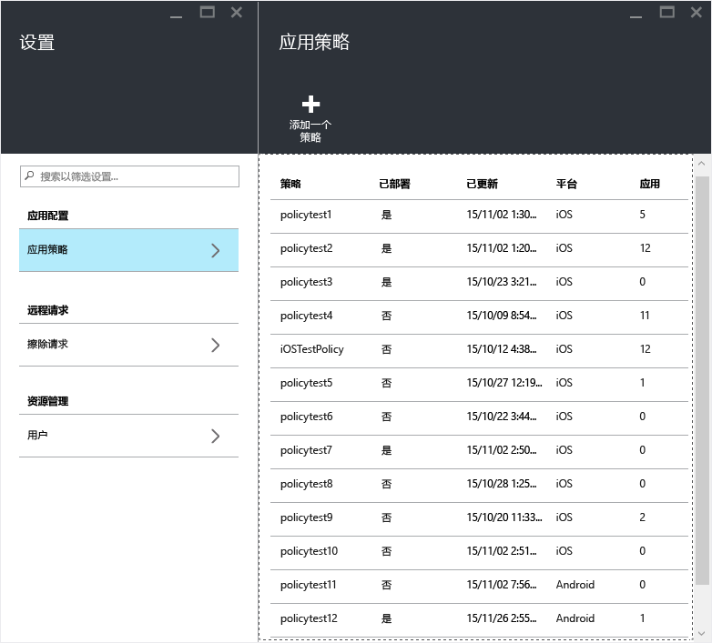
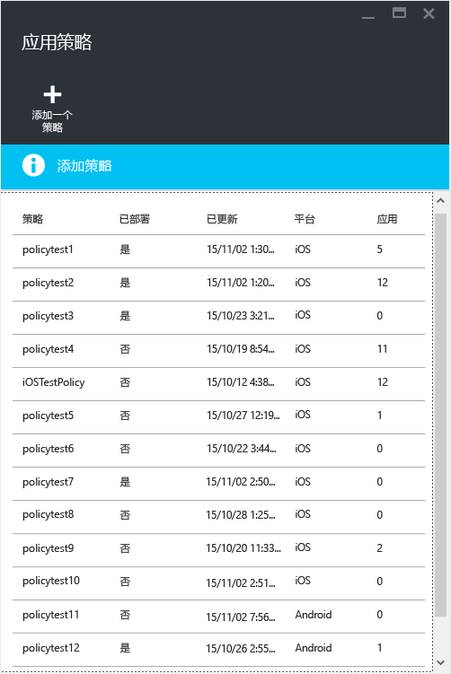

---
# required metadata

title: 创建和部署 MAM 策略 | Microsoft Intune
description:
keywords:
author: karthikaraman
manager: jeffgilb
ms.date: 04/28/2016
ms.topic: article
ms.prod:
ms.service: microsoft-intune
ms.technology:
ms.assetid: c1b9a343-1737-4a65-a9c6-aca48acad11c

# optional metadata

#ROBOTS:
#audience:
#ms.devlang:
ms.reviewer: joglocke
ms.suite: ems
#ms.tgt_pltfrm:
#ms.custom:

---

# 使用 Microsoft Intune 创建和部署移动应用管理策略
可以将移动应用管理 (MAM) 策略应用于在不一定由 Intune 管理的设备上运行的应用。 有关 MAM 策略工作原理以及 Intune MAM 策略所支持方案的更加详细的说明，请阅读[使用移动应用管理策略保护应用数据](protect-app-data-using-mobile-app-management-policies-with-microsoft-intune.md)主题。

本主题介绍在 **Azure 门户**中创建 MAM 策略的过程。 Azure 门户是一款新的管理员控制台，用于创建 MAM 策略；建议你使用此门户来创建 MAM 策略。 Azure 门户支持以下 MAM 方案：
- 在 Intune 中注册的设备
- 由第三方 MDM 解决方案管理的设备
- 不受任何 MDM 解决方案管理的设备 (BYOD)。

如果你当前使用 **Intune 管理控制台**管理设备，则可以创建一个 MAM 策略，来支持在 Intune 中使用 [Intune 管理控制台](configure-and-deploy-mobile-application-management-policies-in-the-microsoft-intune-console.md)注册的设备的应用。
>[!IMPORTANT]
> 你可能无法在 Intune 管理控制台中看到全部 MAM 策略设置。 Azure 门户是用于创建 MAM 策略的新管理控制台。 如果你同时在 Intune 管理控制台和 Azure 门户中创建了 MAM 策略，则 Azure 门户中的策略将应用到应用并部署到用户。

若要查看 Android 和 iOS 平台支持的策略设置的列表，请选择以下值之一：

> [!div class="op_single_selector"]
- [iOS 策略](ios-mam-policy-settings.md)
- [Android 策略](android-mam-policy-settings.md)

##  创建 MAM 策略
在创建 MAM 策略之前，请查看[先决条件和支持](get-ready-to-configure-mobile-app-management-policies-with-microsoft-intune.md)信息。
1.  选择“Intune 移动应用程序管理”**&gt;**“设置”，以打开“设置”边栏选项卡。

    

    > [!TIP] 如果首次使用 Azure 门户，请先阅读[用于 Microsoft Intune MAM 策略的 Azure 门户](azure-portal-for-microsoft-intune-mam-policies.md)以熟悉该门户。

2.  在“设置”边栏选项卡中，选择“应用策略”。  将打开“应用策略”  边栏选项卡，你将在此创建新策略和编辑现有策略。

    

3.  选择**添加策略**。

    

4.  为策略键入名称、添加简要说明并选择平台类型，以便为 iOS 或 Android 创建策略。  可以为每个平台创建多个策略。

    

5.  选择“应用”以打开“应用”边栏选项卡，其中显示了可用应用的列表。 可从该列表中选择希望与正创建的策略关联的一个或多个应用。 选择应用后，选择“应用”边栏选项卡底部的“选择”按钮以保存你的选择。

    > [!IMPORTANT] 必须至少选择一个应用才能创建策略。

6.  在“添加策略”边栏选项卡上，选择“配置所需设置”以打开“策略设置”边栏选项卡。

    有两种类别的策略设置：“数据重定位”和“访问”。  数据重定位策略适用于将数据移入和移出应用，而访问策略将决定最终用户在工作环境中如何访问应用。
    为了帮助你入门，策略设置具有默认值。  如果默认值满足你的需求，则无须进行任何更改。

    > [!TIP]
    > 仅在工作环境中使用应用时，才强制执行这些策略设置。  当最终用户使用应用执行个人任务时，他们将不受这些策略影响。

    

7.  选择“确定”保存此配置。  现将返回“添加策略”  边栏选项卡。 选择“创建”以创建策略并保存设置。

    

    

按上述流程创建策略后，它未部署到任何用户。  请按下述步骤部署策略。

> [!IMPORTANT]
> 对于使用 Intune 管理控制台为应用创建的 MAM 策略以及使用 Azure 门户创建的 MAM 策略，使用 Azure 门户创建的策略优先。 但是，Intune 或 Configuration Manager 控制台中的报告将报告从 Azure 门户创建的策略设置。 例如：
>
> -   你在 Intune 管理员控制台中创建了阻止从应用进行复制的移动应用程序管理策略。
> -   你在 Azure 控制台中创建了允许从应用进行复制的移动应用管理策略
> -   你将这两个策略关联到了同一应用。
> -   结果是，以从 Azure 控制台中创建的策略为优先，允许复制。
> -   但是，Intune 控制台中的状态和报告将错误地指示已阻止复制。

## 将策略部署到用户

1.  在“策略”边栏选项卡中，选择“用户组”，随即将打开“用户组”边栏选项卡。 选择“用户组”边栏选项卡中的“添加用户组”，以打开“添加用户组”边栏选项卡。

    

2.  用户组列表将显示在“添加用户组”  边栏选项卡上。 这是你“Azure Active Directory” 中所有安全组的列表。  可选择希望将此策略应用于的用户组，然后选择“选择”。 选择“选择”会将策略部署到用户。

    

    你现已创建策略并将其部署到用户。

仅分配有 [!INCLUDE[wit_nextref](../includes/wit_nextref_md.md)] 许可证的用户将受该策略影响。  所选安全组中未分配到 [!INCLUDE[wit_nextref](../includes/wit_nextref_md.md)] 许可证的用户不会受到影响。

如果你使用 Intune 与配置管理器来管理 iOS 和 Android 设备，则该策略将仅应用于直接位于所选组中的用户。  所选组中嵌套子组的成员将不受影响。

最终用户可以从 App store 或 Google Play 下载应用。 有关 MAM 如何保护设备上的公司数据的详细演练，请参阅[启用 MAM 的应用的最终用户体验](end-user-experience-for-mam-enabled-apps-with-microsoft-intune.md)主题。

##  更改现有策略
你可以编辑现有策略并将其应用于目标用户。 但是，当你更改现有策略时，已登录到应用的用户在 8 小时内将看不到更改。

若要立即看到更改的效果，最终用户必须注销应用，然后重新登录。

### 更改与策略关联的应用列表的步骤

1.  在“应用策略”边栏选项卡中，选择你想要更改的策略。 将打开特定于刚才所选策略的边栏选项卡。

    

2.  在该策略边栏选项卡中，选择“目标应用”以打开应用列表。

3.  在列表中删除或添加应用，然后选择“保存图标”以保存所做的更改。

### 更改用户组列表的步骤

1.  在“应用策略”边栏选项卡中，选择你想要更改的策略。 将打开特定于所选策略的边栏选项卡。

2.  在该策略边栏选项卡中，选择“用户组”以打开“用户组”边栏选项卡，其中显示了具有此策略的当前用户组的列表。

3.  若要向策略“添加新用户组”，请选择“添加用户组”并选择用户组。 选择“选择”以将策略部署到所选组。

    

4.  若要“删除用户组”，请突出显示你想要删除的用户组，选择省略号 (…)，然后选择“删除”以删除该用户组。

    

### 更改策略设置的步骤

1.  在“应用策略”边栏选项卡中，选择你想要更改的策略。 将打开特定于刚才所选策略的边栏选项卡。

    

2.  选择“策略设置”以打开“策略设置”边栏选项卡。

3.  更改设置，然后选择“保存图标”以保存所做的更改。

    

## 策略设置
若要查看 iOS 和 Android 的策略设置的完整列表，请选择以下值之一：

> [!div class="op_single_selector"]
  - [iOS 策略](ios-mam-policy-settings.md)
  - [Android 策略](android-mam-policy-settings.md)

## 后续步骤
[监视合规性和用户状态](monitor-mobile-app-management-policies-with-microsoft-intune.md)

### 另请参阅
[启用 MAM 的应用的最终用户体验](end-user-experience-for-mam-enabled-apps-with-microsoft-intune.md)

<!--HONumber=Jun16_HO2-->

