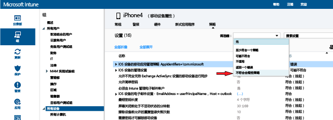

---
# required metadata

title: 在 Microsoft Intune 中部署和监视法规遵从性策略 | Microsoft Intune
description:
keywords:
author: karthikaraman
manager: jeffgilb
ms.date: 04/28/2016
ms.topic: article
ms.prod:
ms.service: microsoft-intune
ms.technology:
ms.assetid: d8f246d4-0d86-4c8b-a1bf-9977985506d8

# optional metadata

#ROBOTS:
#audience:
#ms.devlang:
ms.reviewer: chrisgre
ms.suite: ems
#ms.tgt_pltfrm:
#ms.custom:

---

# 在 Microsoft Intune 中部署和监视设备法规遵从性策略
## 部署合规性策略
将[创建](create-a-device-compliance-policy-in-microsoft-intune.md)的法规遵从性策略部署到你组织中的一个或多个用户组或设备组。

1.  在“策略”工作区中，选择想要部署的策略，然后选择“管理部署”。

2.  在“管理部署”对话框中，选择要向其部署策略的一个或多个组，然后选择“添加”>“确定”。
可以将法规遵从性策略部署到用户和/或设备。 使用刚才创建的 Active Directory 组并同步到 Intune，或在 Intune 控制台中手动创建这些组。 若要了解有关如何部署策略的详细信息，请参阅[部署配置策略](manage-settings-and-features-on-your-devices-with-microsoft-intune-policies.md)。

使用“策略”工作区“概述”页的状态摘要和警报来识别需要关注的策略问题。 此外，状态摘要会显示在“仪表板”  工作区中。

> [!IMPORTANT]如果你尚未部署合规性策略，但是启用了 Exchange 条件访问策略，则将允许设定为目标的所有设备进行访问。

## 如何解决 Intune 策略冲突
将多个 Intune 策略应用于设备时可能会发生策略冲突。 如果策略设置重叠，则 Intune 会使用以下规则解决任何冲突:

-   如果冲突的设置来自 Intune 配置策略和相容性策略，那么相容性策略中的设置优先于配置策略中的设置，即使配置策略中的设置更安全。

-   如果部署了多条相容性策略，则将使用其中最安全的策略。

## 监视合规性策略

#### 要查看不符合法规遵从性策略的设备

1.  在 [Microsoft Intune 管理控制台](https://manage.microsoft.com)中，选择“组”>“所有设备”。

2.  双击设备列表中设备的名称。

3.  选择“策略”选项卡以查看该设备的策略列表。

4.  从“筛选器”下拉列表中，选择“不符合合规性策略”。

#### 查看运行状况证明报告

1.  在 [Microsoft Intune 管理控制台](https://manage.microsoft.com)中，选择“报告”。

2.  在“运行状况证明报告 - 创建新的报告”页面，可以查看由 Intune 收集的包含所有 Windows 10 运行状况证明数据的报告。 你也可以使用筛选器创建包含数据子集的报告。 筛选器可以按设备类型、操作系统进行筛选或只按数据点的子集进行筛选。

## 后续步骤
现在可将合规性策略与条件访问策略一起使用，以便控制对组织中服务的访问。

[限制对电子邮件和 O365 服务的访问](restrict-access-to-email-and-o365-services-with-microsoft-intune.md)

### 另请参阅
[Intune 的设备法规遵从性策略简介](introduction-to-device-compliance-policies-in-microsoft-intune.md)

<!--HONumber=Jun16_HO2-->

