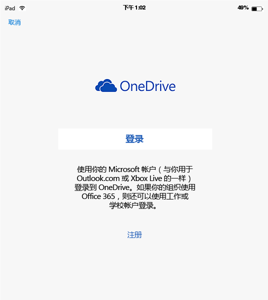
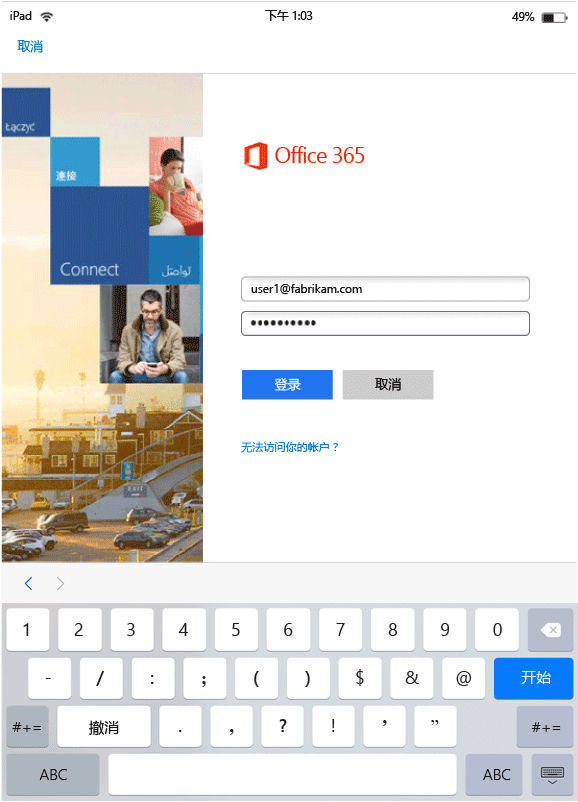
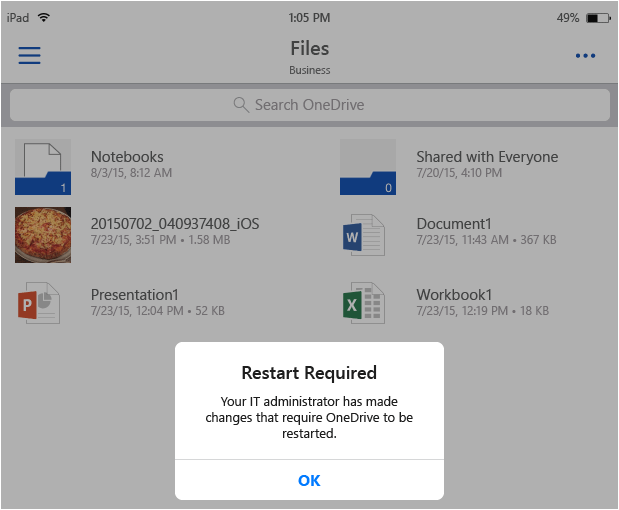
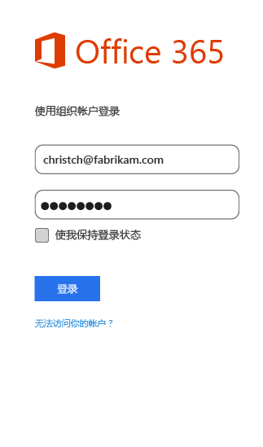

# 使用 Microsoft Intune 的启用 MAM 的应用的最终用户体验
仅当在工作环境中使用应用时，才应用移动应用程序管理 (MAM) 策略。  请阅读以下方案，以了解托管应用的工作原理。
##  在 iOS 设备上访问 OneDrive

1.  启动“OneDrive”   应用以打开登录页。

    

    > [!NOTE]
    > 在个人设备上，最终用户通常要下载应用。  如果设备由 MDM 解决方案托管，则你可将应用部署到该设备。

2.  键入你的工作帐户用户名。 你将会重定向到“O365 身份验证”  页，以便输入工作凭据。

    

3.  你的凭据成功通过由 Azure AD 进行的身份验证后，将应用 MAM 策略，并将要求你重启“OneDrive”  应用。
  >[注意！]“需要重启”对话框仅在未注册 Intune 的设备上显示。

    

4.  重启“OneDrive”应用时，该应用将启动，并开启 MAM 策略。 现在将提示你为该应用设置“PIN”  。 （如果你为此配置了该策略）。

    

5.  设置 PIN 并确认后，即可访问你“OneDrive for Business” 上的文件。

    

    > [!NOTE]
    > 更改已部署策略时，将在下次打开该应用时应用更改。

##  在 Android 设备上访问 OneDrive

1.  启动 OneDrive 应用以打开登录页。

    > [!NOTE]
    > 在个人设备上，最终用户通常要下载应用。  如果设备由 MDM 解决方案托管，则你可将应用部署到该设备。

2.  键入你的工作帐户用户名。 你将会重定向到“O365 身份验证”  页，以便输入工作凭据。

    

3.  你的凭据成功通过由“Azure AD” 进行的身份验证后，如果尚未在设备上安装公司门户应用，则会显示一条带有安装指令的消息。  点击“获取应用”  以继续。

>[!NOTE]
>Android 设备上与 MAM 策略关联的所有应用都需要公司门户应用。 对于未在 Intune 中注册的设备，应用必须安装在设备上，而无需启动或登录应用。  

  

4.  你现将位于“Google Play”  应用商店，可在其中下载和安装“公司门户”  应用。

    公司门户应用有助于保护数据安全。

    

5.  完成安装后，选择“接受”以接受条款。

6.   “OneDrive”应用将自动启动。

7.  如果将策略设置设置为需要使用 PIN 才能访问“OneDrive” 应用，则当你下次打开 OneDrive 时，将提示你设置“PIN”  。

    

8.  设置并确认 PIN 后，即可继续使用“OneDrive” ，它现由应用策略托管。

##  使用具有多身份支持的应用
Microsoft Word 可用作这种情况的一个示例。

1.  在你的设备上打开“Word”  应用。 我们使用 iOS 设备演示步骤。

2.  点击“新建”  以创建新的 Word 文档。

    

3.  输入所选的句子。  当你尝试保存此文档时，个人位置和工作位置均将显示为保存刚创建文档的位置的选项。  在此步骤中，由于尚未建立此工作/个人环境，所以应用策略尚未应用。

4.  将文档保存到你的 OneDrive for Business 位置。 现已将其标记为公司数据，适用于策略限制。

    

5.  将你保存的文档打开到工作位置。  复制文本，打开你的个人“Facebook”帐户并尝试粘贴复制的文本。  你应无法将该内容粘贴到新的 Facebook 帖子中。 粘贴选项并不灰显，但当按“粘贴” 时没有任何反应。

    

    

6.  现在重复步骤 2 和 3 再创建一个新文档，输入所选的一个句子，然后将其保存到你的个人位置（而非工作位置），例如 **OneDrive - 个人**。

    

7.  打开该保存为个人的文档。  复制文本，打开“Facebook”  应用并尝试粘贴复制的文本。 你会发现可以将该内容粘贴到 Facebook 帖子。

    

##  管理用户帐户

Intune 仅支持对于每个设备，将 MAM 策略部署到一个用户帐户。 如果设备具有多个工作帐户，则 MAM 策略只管理一个工作帐户。

根据所使用的应用，第二个用户可能会也可能不会在设备上受阻。 但是在所有情况下，只有获取 MAM 策略的第一个用户才会受该策略影响。

如果设备在部署 MAM 策略之前具有现有的多个用户帐户，则 MAM 策略部署到的帐户首先由 Intune MAM 策略管理。

“Microsoft Word”、“Excel”和“PowerPoint”不会阻止第二个用户帐户，但第二个用户帐户不受 MAM 策略影响。  

对于“OneDrive 和 Outlook 应用”，只能使用一个工作帐户。  将阻止在这些应用中添加多个工作帐户。  但是，你可以在设备上删除用户并添加其他用户。

阅读以下示例方案以更深入地了解如何处理多个用户帐户。

用户 A 为两家公司（“X 公司”和“Y 公司”）工资。用户 A 对于每家公司具有一个工作帐户，它们都使用 Intune 来部署 MAM 策略。 **X 公司**在**Y 公司****之前**部署 MAM 策略。与“X 公司”关联的帐户会获得 MAM 策略，而与 Y 公司关联的帐户不会。如果你希望与 Y 公司关联的用户帐户通过 MAM 策略管理，则必须删除与 X 公司关联的用户帐户。
### 添加第二个帐户
#### IOS
如果使用 iOS 设备，则当你在同一设备上尝试添加第二个工作帐户时，可能会看到拦截消息。  还将显示删除现有帐户并添加新帐户的选项。 可以通过选择“是”来执行此操作。

####  Android
如果使用 Android 设备，则你可能会看到具有删除现有帐户并添加新帐户指令的阻止消息。  若要在 Android 设备上删除现有帐户，请转到**“设置”&gt;“常规”&gt;应用程序管理器”&gt;“公司门户”，然后选择“清除数据”**。

##  使用权限管理共享应用查看媒体文件
若要在 Android 设备上查看公司 AV、PDF 和图像文件，请使用 [Microsoft 权限管理 (RMS) 共享应用](https://play.google.com/store/apps/details?id=com.microsoft.ipviewer)。

从 Google Play 商店下载此应用。  在设备上安装该应用之后，便可启动该应用，并使用公司凭据进行身份验证。 现在应能够从其他策略托管应用查看未受保护和受保护的文件。

支持以下文件类型：

* **音频：**AAC LC、HE-AACv1 (AAC+)、HE-AACv2（增强型 AAC+）、AAC ELD（增强型低延迟 AAC）、AMR-NB、AMR-WB、FLAC、MP3、MIDI、Vorbis、PCM/WAVE。
* **视频：**H.263、H.264 AVC、MPEG-4 SP、VP8。
* **图像：**jpg、pjpg、png、ppng、bmp、pbmp、gif、pgif，jpeg、pjpeg。
* PDF、PPDF

------------
|**pfile**|**text**|
|----|----|
|Pfile 是一种用于受保护文件的通用“包装”格式，它可封装加密内容和 RMS 许可证，还可用于保护任何文件类型。|即使是在受保护的情况下，也可在应用中打开文本文件（包括 XML 和 CSV 等）进行查看。 文件类型：txt、ptxt、csv、pcsv、log、plog、xml、pxml。|
---------------
**未在 Intune 中注册的 Android 设备**

需启动 RMS 应用并使用工作帐户进行身份验证，才可使用 RMS 共享应用以通过 Intune 托管的其他应用查看文件。  登录时，你将看到以下消息“**仅在不具备 RMS 许可证时**：

**身份验证成功 – 现可查看公司文件；但尚未设置组织，无法保护文件。” 请联系 IT 管理员，以获取详细信息。**

你仍可使用 RMS 共享应用来查看公司文件。 并仍可通过 Intune 托管的其他应用打开和查看公司文件，且还仍将应用 MAM 策略。  此消息是指你将不能添加 RMS 共享应用所提供的额外保护功能。  必须具有 RMS 许可证才可保护文件。 若要了解有关 RMS 文件保护功能的详细信息，请参阅[保护设备上的文件](https://docs.microsoft.com/en-us/rights-management/rms-client/sharing-app-protect-in-place)和[保护通过电子邮件共享的文件](https://docs.microsoft.com/en-us/rights-management/rms-client/sharing-app-protect-by-email)。

### 另请参阅
[使用 Microsoft Intune 创建和部署移动应用管理策略](create-and-deploy-mobile-app-management-policies-with-microsoft-intune.md)

<!--HONumber=Jul16_HO3-->

