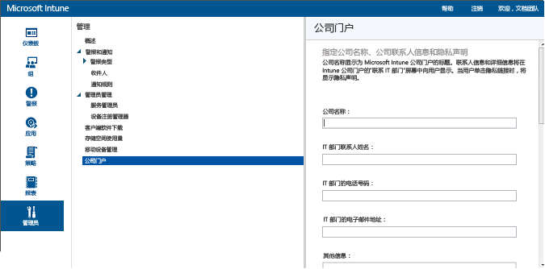

# 在 Intune 中注册设备以进行管理
Microsoft Intune 移动设备管理 (MDM) 使用注册将设备纳入管理以及允许访问资源。 注册设备的方式取决于设备类型、所有权和所需管理级别。 “自带设备办公”(BYOD) 和公司拥有的设备 (COD) 方案需要注册过程。 使用 Exchange ActiveSync（在本地或在云中承载）的组织可以实现无需注册的更轻型管理。 还可以使用 Intune 客户端软件管理 Windows 电脑。

###  支持的设备平台

Intune 可以管理以下设备平台：

[!INCLUDE[mdm-supported-devices](../includes/mdm-supported-devices.md)]

## 设置移动设备管理机构
MDM 机构定义有权管理一组设备的管理服务。 适用于 MDM 机构的选项包括 Intune 本身以及带 Intune 的 Configuration Manager。 如果将 Configuration Manager 设置为管理机构，则没有其他服务可以用于移动设备管理。

>[!IMPORTANT]
> 请仔细考虑是希望仅使用 Intune（联机服务），还是使用带 Intune 的 System Center Configuration Manager（与联机服务相结合的本地软件解决方案）来管理移动设备。 设置移动设备管理机构之后，无法进行更改。

1.  在“[Microsoft Intune 管理控制台](http://manage.microsoft.com)”中，选择“**管理员**”&gt;“**移动设备管理**”。

2.  在“任务”  列表中，单击“设置移动设备管理机构” 。 将打开“设置 MDM 机构”  对话框。

    

3.  Intune 要求确认你希望使用 Intune 作为 MDM 机构。 勾选复选框，然后选择“**是**”以使用 Microsoft Intune 管理移动设备。

## 配置 Intune 公司门户

在 Intune 公司门户中，用户可以访问公司数据和执行常见任务，比如注册设备、安装应用，以及查找信息以从 IT 部门获得帮助。

> [!TIP]
> 当你自定义公司门户时，配置会同时应用于公司门户网站和公司门户应用。

自定义公司门户有助于为最终用户提供熟悉且有帮助的体验。 为此，只需以租户或服务管理员身份登录到“[Microsoft Intune 管理员控制台](https://manage.microsoft.com)”，选择“**管理员**”&gt;“**公司门户**”，然后配置公司门户设置。

## 设备注册方法概述

下表显示了公司拥有的设备的注册方法及其优势。

**iOS 注册方法**

| **方法** |  **[擦除](#Wipe)** | **[相关性](#Affinity)**   |   **[Locked](#Lock)** |
|:---:|:---:|:---:|:---:|
|**[BYOD](#BYOD)** | 否|    是 |   否 |
|**[DEM](#DEM)**|   否 |否 |否  |
|**[DEP](#DEP)**|   是 |   选择 |   选择|
|**[USB-SA](#USB-SA)**| 是 |   选择 |   否|
|**[USB-Direct](#USB-Direct)**| 否 |    否  | 否|

**Windows 和 Android 的注册方法**

| **方法** |  **[擦除](#Wipe)** | **[相关性](#Affinity)**   |   **[Locked](#Lock)** |
|:---:|:---:|:---:|:---:|
|**[BYOD](#BYOD)** | 否|    是 |   否 |
|**[DEM](#DEM)**|   否 |否 |否  |

**公司拥有的设备的注册方法**

### BYOD
“自带设备办公。” 用户安装公司门户应用并注册其设备。 通过公司门户注册设备将会使其加入工作区。 通过公司门户注册 iOS 设备需要 Apple ID。 对于公司拥有的设备，BYOD 无需其他配置。 参阅[设置设备管理](get-ready-to-enroll-devices-in-microsoft-intune.md#set-up-device-management)的相关步骤。 （[返回到表](#overview-of-device-enrollment-methods)）

### DEM
设备注册管理器。 管理员创建 DEM 帐户来管理企业自有设备。 然后，管理人员可安装公司门户并注册多个无用户设备。 了解有关 [DEM](enroll-corporate-owned-devices-with-the-device-enrollment-manager-in-microsoft-intune.md) 的详细信息。 （[返回到表](#overview-of-device-enrollment-methods)）

### DEP
Apple 设备注册计划。 管理员创建“无限升级”策略并将其部署到使用 DEP 购买和管理的企业自有 iOS 设备。 用户运行 iOS 设置助理时，就会对设备进行注册。 此方法支持**iOS 监督**模式，此模式转而又可：
  - 锁定注册
  - 条件性访问
  - 越狱检测
  - 移动应用程序管理

了解有关 [DEP](ios-device-enrollment-program-in-microsoft-intune.md) 的详细信息。 （[返回到表](#overview-of-device-enrollment-methods)）

### USB-SA
USB 连接、设置助理注册。 管理员创建 Intune 策略并将其导出到 Apple Configurator。 使用 Intune 策略准备连接了 USB 的企业自有设备。 管理员必须手动注册每个设备。 用户收到其设备并运行设置助理，注册其设备。 此方法支持**iOS 监督**模式，此模式转而又可：
  - 条件性访问
  - 越狱检测
  - 移动应用程序管理

了解有关[使用 Apple Configurator 设置助理注册](ios-setup-assistant-enrollment-in-microsoft-intune.md)的详细信息。 （[返回到表](#overview-of-device-enrollment-methods)）

### USB-Direct
直接注册。 管理员创建 Intune 策略并将其导出到 Apple Configurator。 连接了 USB 的企业拥有设备可直接进行注册，无需恢复出厂设置。 管理员必须手动注册每个设备。 这些设备作为无用户设备进行管理。 它们未锁定、不受监控，且无法支持条件性访问、越狱检测和移动应用程序管理。 了解有关[使用 Apple Configurator 直接注册](ios-direct-enrollment-in-microsoft-intune.md)的详细信息。 （[返回到表](#overview-of-device-enrollment-methods)）

**公司拥有的移动设备的行为**

### 擦除
指定是否需要将设备恢复出厂设置才可注册设备，该操作将删除设备中的所有数据，并将设备退回到原始状态。
[停用设备](retire-devices-from-microsoft-intune-management.md)（[返回到表](#overview-of-device-enrollment-methods)）

### 相关性
指定注册方法是否支持“用户关联”，该关联可将设备与特定用户相连接。 无论是否关联了用户，都可注册“选择”设备。 需要关联用户才可支持以下内容：
  - 移动应用程序管理 (MAM) 应用
  - 对电子邮件和公司数据的条件性访问
  - 公司门户应用

[用户关联](enroll-corporate-owned-ios-devices-in-microsoft-intune.md#using-company-portal-on-dep-or-apple-configurator-enrolled-devices)（[返回到表](#overview-of-device-enrollment-methods)）

### 锁定
指定是否可锁定设备以防止用户删除 Intune 策略，进而使得设备不受管理。 对于 iOS 设备，其需要处于监管模式才可进行锁定。
（[返回到表](#overview-of-device-enrollment-methods)）

## 启用设备注册  
 注册使用户可以在其个人设备上访问公司资源，并使管理员可以确保这些设备符合保护公司资源的策略。 这是使用 Intune 实现“自带设备办公”方案的最佳方式。 管理员必须在 Intune 控制台中启用注册，这可能需要创建与设备的信任关系以及向用户分配许可证。 设备随后进行注册（通常由用户输入其工作或学校凭据）。 设备随后从 Intune 接收策略并获取对资源的访问权限。

[准备好在 Intune 中注册设备](get-ready-to-enroll-devices-in-microsoft-intune.md)

## 注册公司拥有的设备。
可以使用 Intune 控制台管理公司拥有的设备 (COD)。 可以直接通过 Apple 提供的工具注册 iOS 设备。 管理员或经理可以使用设备注册管理器注册所有设备类型。 具有 IMEI 号码的设备也可以标识并标记为公司拥有，以实现 COD 方案。

[注册公司拥有的设备。](manage-corporate-owned-devices.md)

## 使用 Exchange ActiveSync 和 Intune 管理移动设备
可以使用 EAS MDM 策略，通过 Intune 管理未注册、但连接到 Exchange ActiveSync (EAS) 的移动设备。 Intune 使用 Exchange Connector 与 EAS（在本地或是云承载）通信。

[使用 Exchange ActiveSync 和 Intune 管理移动设备](mobile-device-management-with-exchange-activesync-and-microsoft-intune.md)

## 使用 Intune 管理 Windows PC  
还可以使用 Microsoft Intune 管理使用 Intune Windows 电脑客户端软件的 Windows 电脑。 使用 Intune 客户端管理的电脑可以：

 - 报告软件和硬件清单
 - 安装桌面应用程序（例如 .exe 和 .msi 文件）
 - 防火墙设置

使用 Intune 客户端软件管理的计算机不能有选择地擦除或停用，并且不能利用许多 Intune 管理功能（如条件性访问、VPN 和 Wi-Fi 设置或证书和电子邮件配置的部署）。

[使用 Intune 管理 Windows PC](manage-windows-pcs-with-microsoft-intune.md)

<!--HONumber=Aug16_HO2-->

