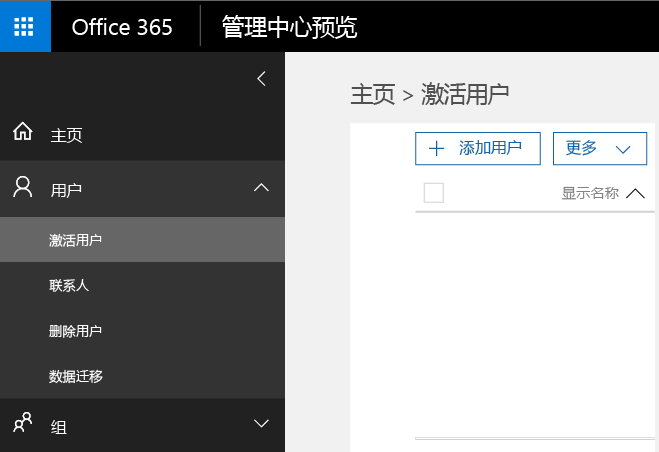
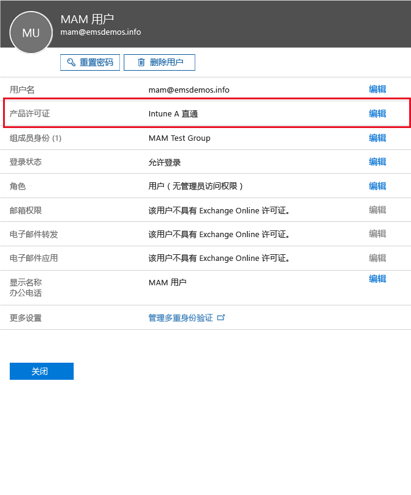
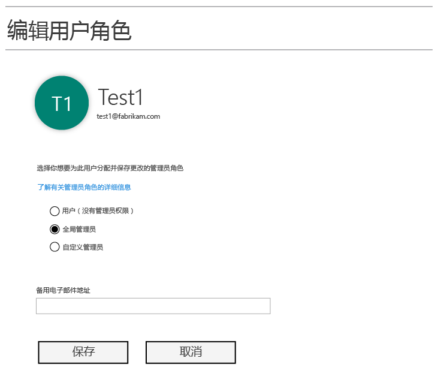
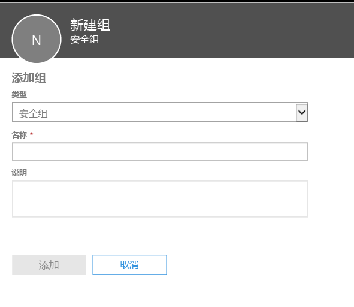
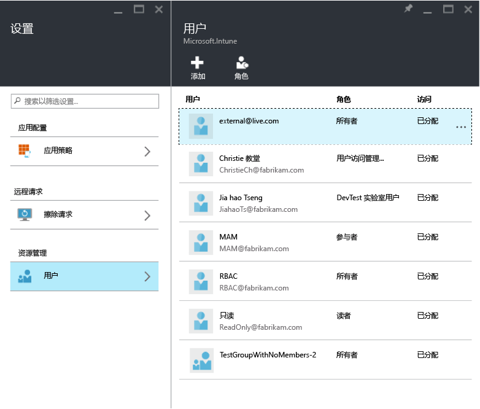
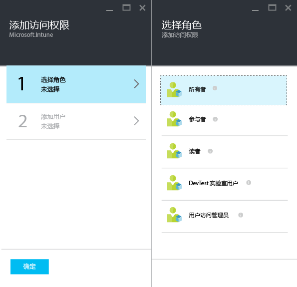
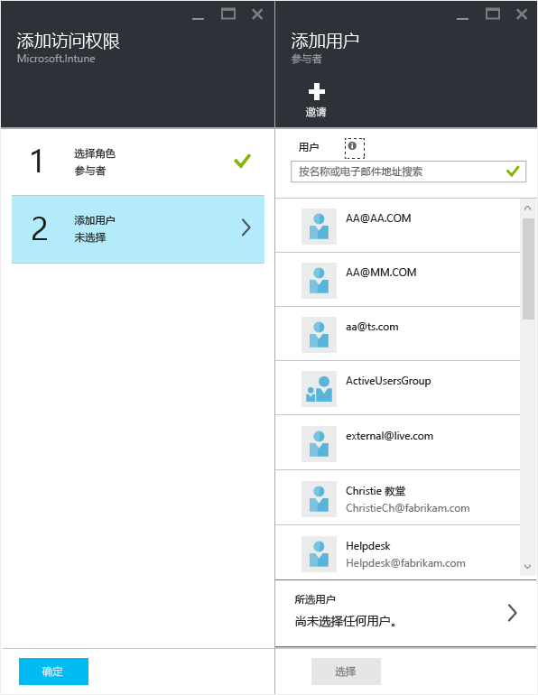

# 准备好使用 Microsoft Intune 配置移动应用管理策略
本主题介绍可以在 Azure 门户中创建移动应用管理 (MAM) 策略之前需要执行的操作。

Azure 门户是用于创建 MAM 策略的新管理控制台。 我们建议你使用此门户创建 MAM 策略。 Azure 门户支持以下 MAM 方案：
- 在 Intune 中注册的设备
- 由第三方 MDM 解决方案管理的设备
- 不受任何 MDM 解决方案管理的设备 (BYOD)

如果你不熟悉如何使用 Azure 门户，请参阅 [Microsoft Intune MAM 策略的 Azure 门户](azure-portal-for-microsoft-intune-mam-policies.md)主题，以快速了解概述。

>[!IMPORTANT]

> 如果你当前正在使用 Intune 管理控制台管理你的设备，则可以创建 MAM 策略，来支持在 Intune 中使用 Intune 管理控制台注册的设备的应用。 但我们建议你使用 Azure 门户，即使对于在 Intune 中注册的设备也是如此。 有关如何使用 Intune 管理控制台创建 MAM 策略的说明，请参阅[配置和部署 Microsoft Intune 控制台中的移动应用程序管理策略](configure-and-deploy-mobile-application-management-policies-in-the-microsoft-intune-console.md)。

> 你可能无法在 Intune 管理控制台中看到全部 MAM 策略设置。 如果你同时在 Intune 管理控制台和 Azure 门户中创建了 MAM 策略，则 Azure 门户中的策略将应用到应用并部署到用户。
> 在 Intune 管理控制台中创建的 MAM 策略不能导入到 Azure 门户中。  在 Azure 门户中，必须重新创建 MAM 策略。

##  受支持的平台
- iOS 8.1 或更高版本

- Android 4 或更高版本

目前不支持 Windows 设备。
##  受支持的应用
* **Microsoft 应用：**这些应用内置有 Intune 应用 SDK，且无需进一步处理就可应用 MAM 策略。
若要查看受支持的 Microsoft 应用的完整列表，请转到 Microsoft Intune 应用程序合作伙伴页上的 [Microsoft Intune 移动应用程序库](https://www.microsoft.com/en-us/server-cloud/products/microsoft-intune/partners.aspx)。 单击应用可查看支持的方案和平台以及查看应用是否支持多个标识。
* **组织的业务线应用：**需要准备应用以包含 Intune 应用 SDK，才可应用 MAM 策略。

  * 有关 Intune 管理的设备，请参阅[决定如何为 MAM 准备应用](decide-how-to-prepare-apps-for-mobile-application-management-with-microsoft-intune.md)。
  * 对于非托管的（如员工自有设备）设备，或者由第三方移动设备管理解决方案托管的设备，请参阅[保护未在 Intune 中注册的设备上的业务线应用和数据](protect-line-of-business-apps-and-data-on-devices-not-enrolled-in-microsoft-intune.md)。

可以配置 MAM 策略*之前*，需要以下准备事项：

-   Microsoft Intune 订阅。    用户需要 [!INCLUDE[wit_nextref](../includes/wit_nextref_md.md)] 许可证以获取具有 MAM 策略的应用。

-   以下事项需要 Office 365 订阅：
  - 将 MAM 策略应用于具有多个标识支持的应用。
  - 创建 SharePoint Online 和 Exchange Online 工作帐户。 不支持 Exchange 内部部署和 SharePoint 内部部署。
-   用于新式验证的 Skype for Business Online 设置。 有关详细信息，请参阅[启用新式验证](http://social.technet.microsoft.com/wiki/contents/articles/34339.skype-for-business-online-enable-your-tenant-for-modern-authentication.aspx)。

- Azure Active Directory (Azure AD) 用于创建用户。 当用户打开应用并输入其凭据时，Azure AD 对用户进行身份验证。

    > [!NOTE]
    > 如果你正在使用 [!INCLUDE[wit_nextref](../includes/wit_nextref_md.md)] 控制台设置用户，请注意 MAM 策略配置将移到 Azure 门户。 若要使用此门户，你需要通过使用 Office 365 门户设置 Azure AD 用户组。

## 创建用户并分配 Microsoft Intune 许可证

1. 请确保你具有 Intune 订阅。 如果当前使用 [!INCLUDE[wit_nextref](../includes/wit_nextref_md.md)] 来管理设备，那么你已经具有 [!INCLUDE[wit_nextref](../includes/wit_nextref_md.md)] 订阅。  如果你已购买企业移动性套件 (EMS) 许可证，那么你还具有 [!INCLUDE[wit_nextref](../includes/wit_nextref_md.md)] 订阅。 如果你要试用 [!INCLUDE[wit_nextref](../includes/wit_nextref_md.md)] 来检查 MAM 功能，则可在 [Microsoft Intune 网页](http://www.microsoft.com/en-us/server-cloud/products/microsoft-intune/)上获取试用帐户。

    若要检查你是否具有 [!INCLUDE[wit_nextref](../includes/wit_nextref_md.md)] 订阅，请在 Office 门户中转到“**帐单**”页面。  你应该可以看到在订阅中 [!INCLUDE[wit_nextref](../includes/wit_nextref_md.md)] 显示为“**活动**”状态。

2.  使用管理员凭据登录到 [Office 门户](http://portal.office.com)。

3.  转到“**活动用户**”页，添加用户并分配 [!INCLUDE[wit_nextref](../includes/wit_nextref_md.md)] 许可证。

    

    

4.  若要赋予用户访问 Office 门户、Azure AD 门户和 Azure 门户的权限，请将“**全局管理员**”角色分配给此用户。

    

5.  MAM 策略已部署到 Azure Active Directory 中的用户组。 若要创建用于 MAM 策略的用户组，请转到 Office 门户中的“**组**”页，然后在顶部菜单中选择“**添加组选项**”，以创建新的安全组。  键入名称和描述，然后单击“**创建**”。 创建组后，你可以通过单击“**编辑成员**”向该组添加用户。 即在 Azure Active Directory 中创建了安全组。

    

下表列出了可以分配给管理员用户的角色和权限。

|||
|--|----|
|**角色**|**权限**|
|全局管理员（Office 365 门户）|对 Office 365 门户和 Azure AD 门户的访问权限。  对 Azure 门户的访问权限（可以执行角色管理和移动应用管理任务）。|
|所有者（Azure 门户）|对 Azure 门户的访问权限（可以执行角色管理和移动应用管理任务）。|
|参与者（Azure 门户）|对 Azure 门户的访问权限（只可以执行移动应用管理任务）。|

## 将参与者角色分配给用户

全局管理员具有访问 [Azure 门户](https://portal.azure.com)的权限。  如果你希望其他管理员用户能够配置策略和执行其他移动应用管理任务，你可以将参与者角色分配给用户：

1.  在“**设置**”边栏选项卡中，单击“**资源管理**”部分的“**用户**”。

    

2.  单击“添加”  以打开“添加访问”  边栏选项卡。

3.  单击“**选择角色**”，然后单击“**参与者**”。

    

4.  单击“**添加用户**”，然后按名称或电子邮件地址搜索用户。 你在此列表中看到的用户是以前在 Azure AD 中使用 Office 门户创建的前 1000 个用户。 单击“**添加访问**”边栏选项卡上的“**确定**”以保存角色，并将角色分配给用户。

    

    > [!IMPORTANT]
    > 如果选择未向其分配 [!INCLUDE[wit_nextref](../includes/wit_nextref_md.md)] 许可证的用户，则用户将无法访问门户。

## 后续步骤
[使用 Microsoft Intune 创建和部署移动应用管理策略](create-and-deploy-mobile-app-management-policies-with-microsoft-intune.md)

<!--HONumber=Aug16_HO1-->

