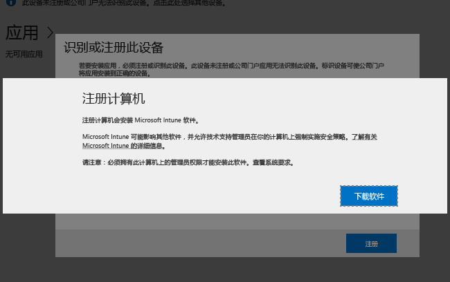

# 在 Windows 电脑上安装 Intune 软件客户端
通过安装 Intune 客户端软件来注册 Windows 电脑。 Intune 客户端软件可以通过以下方式安装：

- 手动安装
- 使用组策略安装
- 包括在磁盘映像中
- 由用户安装

## 下载 Intune 客户端软件

除用户自行安装 Intune 客户端软件之外，其余所有方法都需要下载软件用于部署。

1.  在 [Microsoft Intune 管理控制台](https://manage.microsoft.com/)中，单击“管理”&gt;“客户端软件下载”

  

2.  在“客户端软件下载”页上，单击“下载客户端软件”，然后将包含该软件的“Microsoft_Intune_Setup.zip”程序包保存到网络上的安全位置。

    > [!NOTE]
    > Intune 客户端软件安装程序包中包含有关你的帐户的信息。 如果未经授权的用户获得了此安装程序包的访问权限，则他们可以用该程序包的嵌入式证书所代表的帐户注册计算机。

3.  将安装程序包的内容提取到网络上的安全位置。

    > [!IMPORTANT]
    > 请不要重命名或删除提取的 **ACCOUNTCERT** 文件，否则客户端软件安装将失败。

## 手动部署

1.  在计算机上，浏览到客户端软件安装文件所在的文件夹，然后运行“Microsoft_Intune_Setup.exe”来安装客户端软件。

    > [!NOTE]
    > 当你将鼠标悬停在客户端计算机上任务栏中的图标上时，将显示安装的状态。

## 使用组策略部署

1.  在包含文件 **Microsoft_Intune_Setup.exe** 和 **MicrosoftIntune.accountcert** 的文件夹中，运行以下命令提取适用于 32 位和 64 位计算机且基于 Windows Installer 的安装程序：

    ```
    Microsoft_Intune_Setup.exe/Extract <destination folder>
    ```

2.  将“Microsoft_Intune_x86.msi”文件、“Microsoft_Intune_x64.msi”文件和“MicrosoftIntune.accountcert”文件复制到要安装客户端软件的所有计算机都可访问的一个网络位置。

    > [!IMPORTANT]
    > 请不要分隔或重命名文件，否则客户端软件安装将失败。

3.  使用组策略将软件部署到网络上的计算机。

    有关如何使用组策略来自动部署软件的详细信息，请参阅 Windows Server 文档。

## 作为映像的一部分安装
通过使用以下示例过程作为基础，你可以将 Intune 客户端软件作为操作系统映像的一部分部署到计算机：

1.  将客户端安装文件“Microsoft_Intune_Setup.exe”和“MicrosoftIntune.accountcert”复制到引用计算机上的“%Systemdrive%\Temp\Microsoft_Intune_Setup”文件夹。

2.  通过向“SetupComplete.cmd”  脚本中添加以下命令来创建“WindowsIntuneEnrollPending”  注册表项：

    ```
    %windir%\system32\reg.exe add HKEY_LOCAL_MACHINE\Software\Microsoft\Onlinemanagement\Deployment /v
    WindowsIntuneEnrollPending /t REG_DWORD /d 1
    ```

3.  将以下命令添加到“setupcomplete.cmd”中，以使用 /PrepareEnroll 命令行参数运行注册程序包：

    ```
    %systemdrive%\temp\Microsoft_Intune_Setup\Microsoft_Intune_Setup.exe /PrepareEnroll
    ```
    > [!TIP]
    > “SetupComplete.cmd”  脚本使 Windows 安装程序能够在用户登录之前修改系统。 “/PrepareEnroll”命令行参数会将目标计算机准备就绪，以便其在 Windows 安装程序结束后在 Intune 中自动注册。

4.  将“SetupComplete.cmd”放在引用计算机的“%Windir%\Setup\Scripts”文件夹中。

5.  捕获引用计算机的映像，然后将此映像部署到目标计算机。

完成 Windows 安装程序后重启目标计算机时，会创建“WindowsIntuneEnrollPending”  注册表项。 注册程序包会检查是否注册了计算机。 如果注册了计算机，则不需要采取其他操作。 如果未注册计算机，则注册程序包会创建“Microsoft Intune 自动注册任务”。

当自动注册任务在下一个计划的时间运行时，它会检查是否存在“WindowsIntuneEnrollPending”注册表值，并尝试在 Intune 中注册目标 PC。 如果注册由于任何原因失败，则下次运行任务时会重新尝试注册。 重新尝试会持续一个月。

注册成功后或一个月后，系统就会从目标计算机中删除 Intune 自动注册任务、“WindowsIntuneEnrollPending”注册表值和帐户证书。

## 指示用户自行注册

用户可以通过浏览到 [http://portal.manage.microsoft.com](http://portal..manage.microsoft.com) 安装 Intune 客户端软件。 如果 Web 门户可以检测到该设备是 Windows 电脑，它将提示通过下载 Intune 软件客户端来注册电脑。 下载完成后，用户可以安装软件以对其电脑进行管理。



## 监视和验证成功的客户端部署
使用下列过程之一来帮助你监视和验证成功的客户端部署。

### 通过 Microsoft Intune 管理员控制台验证客户端软件的安装

1.  在 [Microsoft Intune 管理控制台](https://manage.microsoft.com/)中，单击“组”&gt;“所有设备”&gt;“所有计算机”。

2.  向下滚动计算机的列表以查找与 Intune 通信的被管理的计算机，或者在“搜索设备”框中键入计算机名或任何部分名称来搜索特定被管理的计算机。

3.  在控制台的底部窗格中检查计算机的状态，并解决任何错误。

### 创建显示所有注册计算机的计算机清单报表

1.  在 [Microsoft Intune 管理控制台](https://manage.microsoft.com/)中，单击“报表”&gt;“计算机清单报表”。

2.  在“创建新报表”  页上，将所有字段保留为默认值（除非你要应用筛选器），并单击“查看报表” 。

3.  “计算机清单报告”页面会在新窗口中打开，窗口中会显示所有已在 Intune 中成功注册的计算机。

    > [!TIP]
    > 单击报表中的任何列标题以按该列的内容对列表进行排序。


### 另请参阅
[使用 Microsoft Intune 管理 Windows 电脑](manage-windows-pcs-with-microsoft-intune.md)
[客户端安装程序疑难解答](../troubleshoot/troubleshoot-client-setup-in-microsoft-intune.md)


<!--HONumber=Sep16_HO4-->


