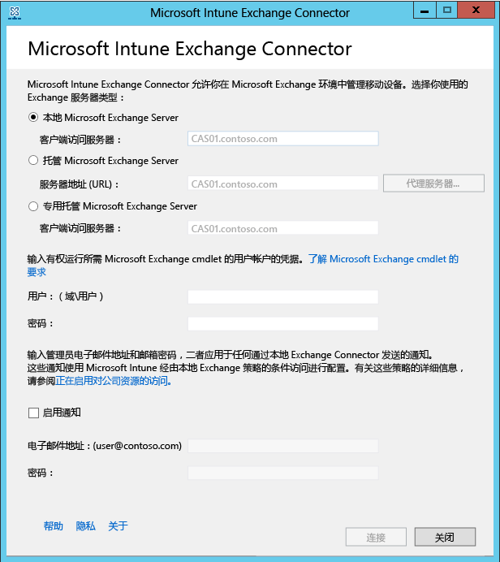

---
# required metadata

title: 为本地 Exchange 安装 Microsoft Intune Exchange Connector | Microsoft Intune
description:
keywords:
author: NathBarn
manager: jeffgilb
ms.date: 04/28/2016
ms.topic: article
ms.prod:
ms.service: microsoft-intune
ms.technology:
ms.assetid: 41ff4212-a6f5-4374-8731-631f7560cff1

# optional metadata

#ROBOTS:
#audience:
#ms.devlang:
ms.reviewer: jeffgilb
ms.suite: ems
#ms.tgt_pltfrm:
#ms.custom:

---

# 安装 Intune On-Premises Exchange Connector

若要设置连接以使 Microsoft Intune 能够与托管移动设备邮箱的 Exchange 服务器通信，你必须从 Intune 管理员控制台下载和配置 On-Premises Connector 工具。

## 本地连接器的要求
下表列出了你在其中安装 On-Premises Exchange Connector 的计算机的要求。

|要求|更多信息|
|---------------|--------------------|
|操作系统|Intune 支持在运行任何版本的 Windows Server 2008 SP2 64 位、Windows Server 2008 R2、Windows Server 2012 或 Windows Server 2012 R2 的计算机上安装 On-Premises Exchange Connector。  该连接器在任何服务器核心安装上都不受支持。|
|Microsoft Exchange 版本|On-Premises Connector 需要 Microsoft Exchange 2010 SP1 或更高版本。|
|移动设备管理机构| 将移动设备管理机构设置为 Intune|
|硬件|安装连接器的计算机至少需要 1.6 GHz CPU、2 GB RAM 和 10 GB 可用磁盘空间的硬件。|
|Active Directory 同步|你必须[设置 Active Directory 同步](/intune/get-started/start-with-a-paid-subscription-to-microsoft-intune-step-3)，以便将本地用户和安全组与 Azure Active Directory 的实例同步，然后才能使用任一 Connector 将 Intune 连接到 Exchange 服务器。|
|其他软件|Microsoft.NET Framework 4 和 Windows PowerShell 2.0 的完全安装必须安装在托管 Connector 的计算机上。|
|Network (网络)|你在其中安装连接器的计算机必须位于与托管 Exchange Server 的域具有信任关系的域中。  计算机需要配置才能使其通过防火墙和代理服务器在端口 80 和 443 上访问 Intune 服务。 Intune 使用的域包括 manage.microsoft.com、&#42;manage.microsoft.com 和 &#42;.manage.microsoft.com。|
|已配置并且正在运行托管 Exchange|有关详细信息，请参阅 [Exchange Server 2016](https://technet.microsoft.com/library/mt170645.aspx)。 |
|将移动设备管理机构设置为 Intune|[将移动设备机构设置为 Intune](get-ready-to-enroll-devices-in-microsoft-intune.md#BKMK_Set_MDM_Authority)|

### Exchange cmdlet 要求

你必须创建 Intune Exchange Connector 使用的 Active Directory 用户帐户。 帐户必须具有运行以下要求的 Windows PowerShell Exchange cmdlets 的权限：

 -   Get-ActiveSyncOrganizationSettings、Set-ActiveSyncOrganizationSettings
 -   Get-CasMailbox、Set-CasMailbox
 -   Get-ActiveSyncMailboxPolicy、Set-ActiveSyncMailboxPolicy、New-ActiveSyncMailboxPolicy、Remove-ActiveSyncMailboxPolicy
 -   Get-ActiveSyncDeviceAccessRule、Set-ActiveSyncDeviceAccessRule、New-ActiveSyncDeviceAccessRule、Remove-ActiveSyncDeviceAccessRule
 -   Get-ActiveSyncDeviceStatistics
 -   Get-ActiveSyncDevice
 -   Get-ExchangeServer
 -   Get-ActiveSyncDeviceClass
 -   Get-Recipient
 -   Clear-ActiveSyncDevice、Remove-ActiveSyncDevice
 -   Set-ADServerSettings
 -   Get-Command

## 下载 On-Premises Exchange Connector 软件安装包

1. 在支持 On-Premises Exchange Connector 的操作系统上，使用用户帐户打开 [Microsoft Intune 管理控制台](http://manage.microsoft.com) (http://manage.microsoft.com)，该帐户应为 Exchange 租户中有权使用 Exchange 服务器的管理员。

2.  在工作区快捷方式窗格中，选择“管理”

3.  在导航窗格中的“移动设备管理”下，展开“Microsoft Exchange”，然后选择“设置 Exchange 连接”

4.  在“设置 Exchange 连接”页上，选择“下载 On-Premises Connector”

5.  On-Premises Exchange Connector 包含在可以打开或保存的压缩 (.zip) 文件夹中。 在“文件下载”对话框中，选择“保存”以将压缩的文件夹存储到安全位置。

> [!IMPORTANT]
> 请勿重命名或移动 On-Premises Exchange Connector 文件夹中的文件。 移动或重命名该文件夹的内容将中断安装。

## 安装和配置 Intune On-Premises Exchange Connector
执行下列步骤以安装 Intune On-Premises Exchange Connector。 每个 Intune 订阅只能安装一次 On-Premises Exchange Connector，并且只能安装在一台计算机上。 如果尝试配置其他 On-Premises Exchange Connector，新连接将替换原始连接。

1.  在支持 On-Premises Connector 的操作系统上，将 **Exchange_Connector_Setup.zip** 中的文件提取到安全位置。

2.  提取文件后，打开提取的文件夹并双击 **Exchange_Connector_Setup.exe** 安装 On-Premises Exchange Connector。

    > 如果目标文件夹不是安全位置，则应该在安装本地连接器之后删除证书文件 **WindowsIntune.accountcert**。

3.  在“Exchange 服务器”字段中，选择 Exchange 服务器环境类型，即“本地 Microsoft Exchange 服务器”或“托管 Microsoft Exchange 服务器”

  

  对于本地 Exchange 服务器，请提供托管**客户端访问服务器**角色的 Exchange 服务器的服务器名称或完全限定的域名。

  对于托管 Exchange 服务器，请提供 Exchange 服务器地址。 查找托管 Exchange 服务器 URL：

      1.  打开 Outlook Web App for Office 365。

      2.  选择左上角的 “?” 图标，并选择“关于”

      3.  找到“POP 外部服务器”  值。

      4.  选择“代理服务器”以指定托管 Exchange 服务器的代理服务器设置。
        1.  选择“同步移动设备信息时使用代理服务器”

        2.  输入要用于访问服务器的 **代理服务器名称** 和 **端口号** 。

        3.  如果必须提供用户凭据来访问代理服务器，请选择“使用凭据连接到代理服务器”并输入“域\用户”和“密码”

        4.  选择“确定”

5.  提供连接到 Exchange 服务器所必需的凭据，即“用户(域\用户)”和“密码”。

6.  提供必要的管理凭据以将通知发送到用户的 Exchange 邮箱。 通知使用 Intune 通过条件访问策略进行配置。

    确保在 Exchange 客户端访问服务器上配置 Autodiscover 服务和 Exchange Web 服务。 与此有关的详细信息，请参阅 [Client Access server](https://technet.microsoft.com/library/dd298114.aspx)（客户端访问服务器）

7.  在“密码”字段中提供此帐户的密码，使 Intune 能够访问 Exchange 服务器。

8. 选择“连接”

    可能需要几分钟的时间来建立连接。

在配置期间，Exchange Connector 会存储你的代理设置以便能够访问 Internet。 如果你的代理设置发生更改，则必须重新配置 Exchange Connector 才能将更新的代理设置应用于 Exchange Connector。

当 Exchange Connector 设置连接后，与在 Exchange Connector 中管理的用户关联的移动设备会自动同步并添加到 Exchange Connector 中。 此同步可能需要一些时间才能完成。

> 如果你已经安装了 On-Premises Exchange Connector 并且在某一时刻删除 Exchange 连接，则必须从安装了 On-Premises Exchange Connector 的计算机中卸载此软件。

## 验证 Exchange 连接

在成功配置 Exchange Connector 之后，可以查看连接的状态和最后一次成功同步尝试的状态。 在 [Microsoft Intune 管理控制台](http://manage.microsoft.com)中选择“管理”工作区，并在“移动设备管理”下选择“Microsoft Exchange” ，然后验证你提供的详细信息是否出现在“Exchange 连接信息”下

你也可以检查最后一次成功同步尝试的时间和日期。

<!--HONumber=May16_HO2-->

