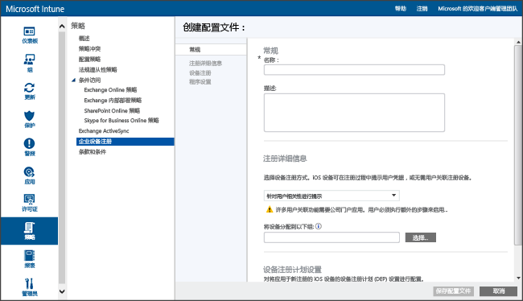

# 使用 Apple Configurator 直接注册 iOS 设备
Intune 支持注册企业所有的 iOS 设备，方法是使用在 Mac 计算机上运行的 [Apple Configurator](http://go.microsoft.com/fwlink/?LinkId=518017) 工具。 此过程不会将设备恢复至出厂设置，并将使用预定义策略注册设备。 此方法针对“无用户关联”的设备，并且要求通过 USB 将 iOS 设备连接到 Mac 计算机以设置企业注册。

直接注册 iOS 设备时，可以在无需获取设备的序列号的情况下注册设备。 在注册过程中，你还可以在 Intune 捕获设备名称前对设备命名以进行标识。 直接注册的设备不支持公司门户应用。 本指南假定你在 Mac 计算机上使用 Apple Configurator 2.0。

1.  如果尚未使用，请通过 Apple Configurator 创建已注册的 iOS 设备的设备注册配置文件。 设备注册配置文件定义应用于设备的设置。

    1.  在 [Microsoft Intune 管理控制台](http://manage.microsoft.com)中，转到“策略”&gt;“企业设备注册”，然后选择“添加”。

        

    2.  输入设备配置文件的详细信息：

        -   “名称” 设备注册配置文件的名称。 对用户不可见。

        -   “说明”- 设备注册配置文件的说明。 对用户不可见。

        -   “用户隶属关系”- 指定注册设备的方式。 对于直接注册，请选择“没有用户关联”。

        -   “设备组预分配”- 具有此配置文件的所有设备将最初属于此组。 在注册后，可以将设备重新分配。

            [!INCLUDE[groups deprecated](../includes/group-deprecation.md)]

    3.  单击“保存配置文件”以添加配置文件。

5.  将配置文件作为 .mobileconfig 导出，以部署到 iOS 设备：

    1.   选择已创建的设备配置文件。

    2.   选择任务栏中的**“导出”**。

    3.   选择“下载配置文件”并保存已下载的 .mobileconfig 文件。

6.  通过将已下载的 .mobileconfig 文件复制到 Mac 计算机来传输文件。
    > [!NOTE]
    > 注册配置文件 URL 从导出时开始两周内有效。 两周过后，必须导出新的注册配置文件 URL 以使用设置助理注册 iOS 设备。

7.  用 Apple Configurator 准备设备。 iOS 设备连接到 Mac 计算机，并注册移动设备管理。

    1.  在 Mac 计算机上，打开 **Apple Configurator 2.0**。

    2.  使用 USB 线将 iOS 设备连接到 Mac 计算机。 关闭“照片”、**iTunes** 和其他在检测设备时为设备打开的应用。

    3.  在 Apple Configurator 中，选择已连接的 iOS 设备，然后选择“添加”按钮。 可以添加到设备的选项将显示在下拉列表中。 选择“配置文件”。

    4.  使用文件选取器选择从 Intune 导出的 .mobileconfig 文件，然后选择“添加”。 配置文件将添加到设备。  如果设备是“非监督”状态，安装将在设备需要验收。

8.  已准备好在 iOS 设备上安装配置文件。 设备必须已经完成设置助理且准备好使用。 如果注册需要应用部署，设备应设置一个 Apple ID，因为应用部署将需要你有一个 Apple ID 登录到应用商店。

    1.  解锁 iOS 设备。

    2.  在“管理配置文件”的“安装配置文件”对话框中，选择“安装”。

    3.  如果需要的话，提供“设备密码”或“Apple ID”。

    4.  接受“警告”，并选择“安装”。

    5.  接受“远程警告”，并选择“信任”。

    6.  当“已安装配置文件”框确认配置文件“已安装”时，请选择“完成”。

9.  在 iOS 设备上，打开“设置”并转到“常规”&gt;“设备管理” &gt;“管理配置文件”。 确认配置文件安装已列出，并检查 iOS 策略限制和已安装的应用。 策略限制和应用可能需要 10 分钟才会出现在设备上。

10.  分配设备。 iOS 设备现已向 Intune 注册并已托管。

<!--HONumber=Oct16_HO3-->

