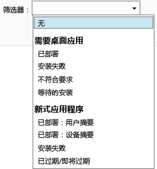

# 监视 Microsoft Intune 中的应用部署 | Microsoft Intune

## 监视应用部署
你可以查看你管理的应用，以及 Intune 管理控制台中任何部署的状态。

### 查看你管理的应用及其状态
在“应用”工作区中，单击“应用”节点，然后单击“应用”。

将显示你管理的应用的列表。 你可以单击任意应用，以在控制台窗口的下部窗格中查看安装状态。 单击此状态可查看更多详细信息。 例如，如果状态显示“1 名用户已可用此软件”，你可以单击该消息来查看该用户的名称。

> [!TIP]
> 可以使用“筛选器”下拉列表以仅显示满足指定条件的应用，如未能安装的应用或已成功部署的应用。
> 
> 

此外，“仪表板”工作区会显示应用状态概述。 如果单击概述中的任意位置，则将转到应用列表。

## 查看有关应用的更多详细信息
在应用列表中，选择任意应用，然后单击“查看属性”。

在应用的“软件属性”页上，单击以下任一选项卡：“常规”- 显示关于应用及其安装状态的常规信息，“设备”- 显示成功安装了应用的目标部署的设备，“用户”- 显示其设备成功安装了应用的目标部署的用户。

如前所述，你可以使用“筛选器”下拉列表来配置每个选项卡上显示的值。

<!--HONumber=Jun16_HO4-->

