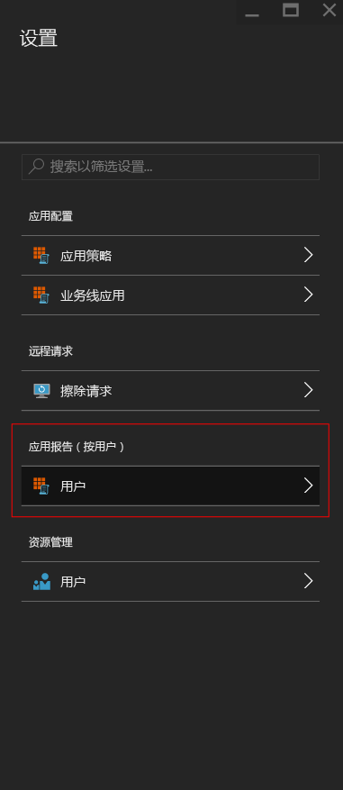
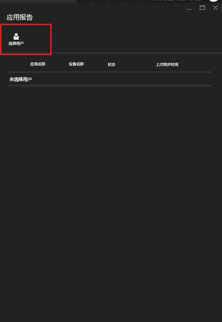
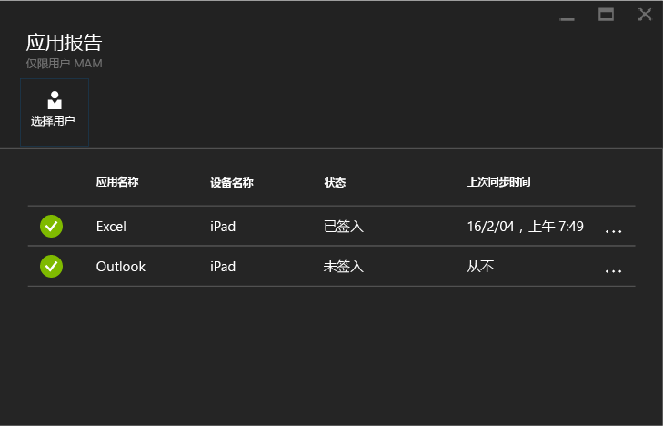

# 使用 Microsoft Intune 监视移动应用管理策略
在配置了 MAM 策略并将它成功应用于用户后，你可以在 [Azure 门户](https://portal.azure.com)上监视合规性状态。 Azure 门户包括有关受策略影响的用户、合规性状态和任何你的最终用户可能遭遇的问题的信息。
## 摘要视图
你可以在“Intune 移动应用程序管理”边栏选项卡上查看如下所述的合规性状态的摘要：

-   **用户：**你的公司中正在使用与该策略相关联的应用的用户总数。

-   **由策略管理：**- 在工作环境中至少使用过其中一种应用的用户数量。

-   **无策略：**正在使用与该策略相关联的应用但却不是策略的目标的用户数量。  你可以考虑将这些用户添加到你的策略。

- **已标记用户：**遭受问题的用户数量。 目前仅将具有已越狱设备的用户报告在**已标记用户**下。

## 详细视图
可以通过单击“用户状态”磁贴和“已标记用户”磁贴转到摘要的详细视图。

### 用户状态
你可以搜索单个用户并查看该用户的合规性状态。 “应用报告”边栏选项卡显示已选择用户的以下信息：
- 与用户帐户关联的设备
- 设备上具有 MAM 策略的应用
- 状态:

  **已签入：**这意味着策略已部署到用户，且应用在工作环境中至少使用了一次。

  **未签入：**这意味着策略已部署到用户，但应用从那时起尚未在工作环境中使用。

>[!NOTE]
> 如果你搜索的用户没有部署 MAM 策略，你将看到一条消息，告知你用户不面向任何应用策略。

若要查看用户的报告，请按照这些步骤进行操作：

**步骤 1：**要选择一个用户，单击“摘要”磁贴或选择“设置”边栏选项卡中的“应用报告(按用户)”选项，如下所示：

**步骤 2：**这将打开“应用报告”边栏选项卡。 选择“选择用户”以搜索 Azure Active Directory 用户。

**步骤 3：**从列表选择用户后，你将看到该用户的合规性状态的详细信息。

### 已标记用户
详细视图显示错误消息、错误发生时访问的应用、设备的平台和时间戳。  

### 另请参阅
[管理 iOS 应用之间的数据传输](manage-data-transfer-between-ios-apps-with-microsoft-intune.md)

[启用 MAM 的应用的最终用户体验](end-user-experience-for-mam-enabled-apps-with-microsoft-intune.md)

<!--HONumber=Jul16_HO3-->

