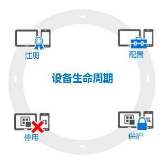

---
# required metadata

title: 设备生命周期概述 | Microsoft Intune
description:
keywords:
author: robstackmsft
manager: jeffgilb
ms.date: 04/28/2016
ms.topic: article
ms.prod:
ms.service: microsoft-intune
ms.technology:
ms.assetid: f6051fa7-133f-4712-86a5-e5f5bc5ab3c7

# optional metadata

#ROBOTS:
#audience:
#ms.devlang:
ms.reviewer: jeffgilb
ms.suite: ems
#ms.tgt_pltfrm:
#ms.custom:

---

# 移动设备管理 (MDM) 生命周期概述

Intune 设备生命周期从最初注册设备开始，然后经过几个步骤直到不再需要该设备时结束。

## 注册
当今的移动设备管理 (MDM) 策略适用于各种手机、平板电脑和电脑（iOS、Android、Windows 和 Mac OS X）。 如果你需要能够管理设备（这对企业拥有的设备来说很常见），第一步便是[设置设备注册](enroll-devices-in-microsoft-intune.md)。 你还可以通过向 Intune (MDM) 注册设备或[安装 Intune 客户端软件](manage-windows-pcs-with-microsoft-intune.md)来管理 Windows 电脑。

## 用户密码重置策略
将你的设备注册只是第一步。 要充分利用所有这些 Intune 功能并确保你的设备安全且符合公司标准，你可以从各种让你能够几乎配置托管设备运作方式各方各面的**策略**中选择。 例如，对于含有公司数据的设备，用户是否应该有密码？ 你可以要求获得密码。 你有企业 Wifi 吗？ 你可以自动配置它。 以下是可用的配置选项类型：

- [**配置策略**](manage-settings-and-features-on-your-devices-with-microsoft-intune-policies.md) - 这些策略让你配置你所管理设备的特性和功能的工作方式。 例如，你可以要求在 Windows Phone 上使用密码，或禁用 iPhone 的照相机使用。
- [**公司资源访问策略**](enable-access-to-company-resources-with-microsoft-intune.md) - 当你让你的用户在他们的个人设备上访问他们的工作时，这会给你带来难题。 例如，你怎么确保所有需要访问公司电子邮件的设备是正确配置的呢？ 如何确保用户可以使用 VPN 连接访问公司网络而不用了解所需的通常很复杂的设置呢？ Intune 可以自动配置你管理的设备来访问公共公司资源，从而减少这种负担。
- [**Windows 电脑管理策略（使用 Intune 客户端软件）**](common-windows-pc-management-tasks-with-the-microsoft-intune-computer-client.md) - 向 Intune 注册 Windows 电脑能会带给你最多的设备管理功能，Intune 将继续支持使用 Intune 客户端软件管理 Windows 电脑。 如果你需要有关可使用计算机执行的一些任务的信息，从这里开始。

## 保护
在现代 IT 世界中，保护设备免受未经授权的访问是你要执行的最重要的任务之一。 除了设备生命周期的**配置**步骤中的项之外，Intune 还提供进一步的功能可以帮助保护你管理的设备免受未经授权的访问或恶意攻击：
- [**多重身份验证**](protect-windows-devices-with-multi-factor-authentication.md) - 对用户登录添加额外一层的身份验证可以帮助使设备更加安全。 Windows、Windows Phone 和 Windows 移动设备提供多重身份验证，这要求提供第二级别的身份验证（如手机通话或短信），用户才能获得访问权限。
- [**Microsoft Passport 设置**](control-microsoft-passport-settings-on-devices-with-microsoft-intune.md) - Microsoft Passport 是另一种登录方法，可让用户使用*手势*，如指纹或 Windows Hello 而无需密码进行登录。
- [**保护 Windows 电脑的策略（使用 Intune 客户端软件）**](policies-to-protect-windows-pcs-in-microsoft-intune.md) - 当你使用 Intune 客户端软件管理 Windows 电脑时，你将可以使用让你在你管理的电脑上控制 Endpoint Protection、软件更新和 Windows 防火墙的设置的策略。

## 停用
当设备丢失或被盗、需要更换，或当用户移到另一个位置时，通常需要[停用或擦除](use-remote-wipe-to-help-protect-data-using-microsoft-intune.md)设备。 有多种方法可以完成此操作，比如重置设备、从管理将其删除或擦除其上的企业数据等。

<!--HONumber=May16_HO2-->

