# 规划用户和设备组
Intune 中的组使你能非常灵活地管理设备和用户。 你可以根据以下条件设置适合你组织需求的组：

- 地理位置
- department
- 硬件特征
- 操作系统
- 设备是用户拥有还是公司拥有

## Intune 组如何工作

此为 Intune 管理控制台中“组”节点的默认视图：

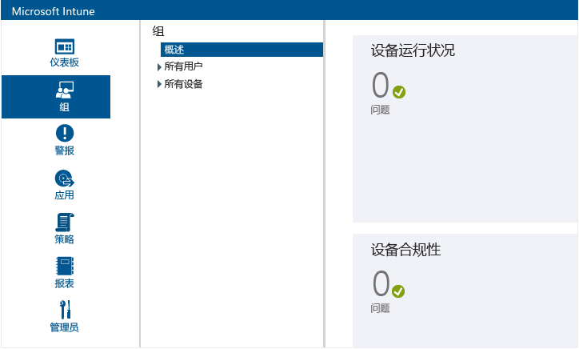

策略将部署到组上，因此组层次结构是关键的设计注意事项之一。 请务必注意在你创建组后，便无法更改该组的父组。 因此从开始使用 Intune 服务的那一刻起，设计组的方式便显得至关重要。 此处介绍了一些设计基于组织需求的组层次结构的建议做法。

## 组成员资格规则

- 组可以包含用户或设备，但不能同时包含两者。

    * **设备组**。 这既包括计算机，又包括移动设备。 必须先注册计算机，然后才能将其添加到组中。 必须将你的环境配置为支持移动设备，并且必须已注册了设备或通过 Exchange ActiveSync 发现了设备，才能将移动设备添加到组中。

    * **用户组**。 组中可包含安全组中的用户。 安全组与 Active Directory 的实例同步。 如果没有与 Active Directory 同步，则可以手动创建这些组。

- 设备或用户可以属于多个组。

- 一个组可以根据下列成员资格规则包括和排除成员：

    * **条件成员资格**。 这些是动态的规则，Intune 运行这些规则来添加或排除成员资格。 这些条件使用与 Active Directory 的本地实例同步的安全组和其他信息。 当安全组或数据更改时，组成员资格可能会在与 Active Directory 进行同步时更改。

    * **直接成员身份**。 这些是静态的规则，可用来明确地添加或删除成员。 成员资格列表是静态的。

-   在创建用户组或包括用户或计算机的设备组时，不需要 Active Directory 域服务 (AD DS)。 但是，对于包括移动设备的设备组，必须将你的环境配置为支持移动设备。

    此外，必须发现设备且将其添加到 Intune。

## 组关系规则

- 创建的每个组都必须具有父组。 在你创建组后，便无法更改该组的父组。

- 当你向子组中添加用户或设备时：

    * 子组始终是父组的子集。

    * 你添加到子组的新成员会自动添加到该组的父组。

    * 如果某个成员已从父组中排除，则无法将该成员添加到子组。

- 父组的成员资格定义子组的可用成员资格。

- 如果删除父组，则所有子组也将被删除。

- 可以将内容和策略部署到父组，同时排除到子组的部署。

- 如果用户或设备尚不是父组的成员，可以将特定用户或设备添加到子组。 如果执行此操作，子组的新成员将会添加到父组。

    但是，如果某个成员已从父组中排除，则无法将该成员添加到子组。

- 组成员资格是递归的。 例如：

    * **Pat** 是“便携式计算机用户”  安全组的唯一成员。

    * “便携式计算机用户”  组是“已批准用户”  安全组的成员。

    * 在 Intune 中创建一个组，该组使用包括**已批准用户**组的成员的动态成员资格查询。 结果是，Intune 用户组包括 **Pat**。

> [!TIP]
> 在创建组时，考虑将如何应用策略。 例如，你可能有特定于设备操作系统的策略、或特定于已在 Active Directory 服务中定义的不同角色或组织单位的策略。 有些管理员发现创建特定于 iOS、Android 和 Windows 的设备组非常有用。 这是对为每个组织角色创建用户组的补充。

<!--- should we just link to a policies topic at this point and remove this? Ask Rob
 You'll probably want to create a default policy that applies to all groups and devices, to establish the basic compliance requirements of your organization. Then, you create more specific policies for the broadest categories of users and devices, for example, email policies for each of the device operating systems.

 Be careful when you name your policies, so that you can easily identify them later. For example, a good, descriptive policy name is **WP Email Policy for Entire Company**.

 Each time you create a restrictive policy, you'll want to communicate it to your users. After you create the more general groups and policies, pay attention to how you create smaller groups so that you can reduce unnecessary communication.--->

## 内置组
Intune 提供九个无法编辑或删除的内置组： <!--maybe a screen shot would be best?-->

-   **所有用户**
    -   取消组合的用户
-   **所有设备**
    -   所有计算机
    -   所有移动设备
        -   所有直接管理的设备
        -   所有 Exchange ActiveSync 管理的设备
    -   所有企业所拥有的设备
    -   取消组合的设备

> [!NOTE]
> 让你的座右铭成为：*简单为美*。 如果你的组织没有特定的需求（例如下面所述的需求），则保持简单并采用默认组结构和策略。 从长远来看，这将使服务更易于管理。 如果能统一处理你的用户，维护便会更加方便。 因为组之间只存在细微差异，因此你需要维护的策略更少。

### 组织中的所有用户和设备
定义组织中所有用户和设备的父组。 你可能希望拥有应用到所有用户和设备的策略。 为此，可以使用 Intune 默认的**所有用户**和**所有设备**组。 按特定条件组织设备的子组，如自带设备办公 (BYOD) 组和企业所拥有的 (CO) 设备组，可以是**所有用户**和**所有设备**父组的子组。

## 为你的组织自定义组

### BYOD 和企业所拥有的设备
如果你的组织允许员工使用他们自己的设备办公、提供公司所拥有的设备或两者的结合，我们建议为这两种类别的设备应用单独的策略。

若是在 BYOD 或两者结合的情况下，请注意规划不侵犯本地隐私规则的策略。 为所有将自带设备办公的用户创建父组。 你可以将该组用于应用适用于此类别中所有用户的策略。

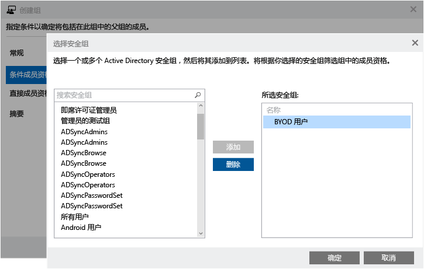

同样，你可以为组织中的 CO 设备用户创建组：

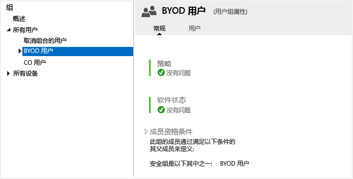

<!---START HERE--->

### 针对地理区域的组
如果你的组织需要针对特定区域的策略，则可以创建基于地理区域的组。 可以将已在 Active Directory 的实例中创建的区域组作为它们的基础，并将它们与 Azure Active Directory 服务同步。 还可以直接在 Azure Active Directory 中创建区域组。

接下来的屏幕截图演示了如何基于与本地 Active Directory 实例同步的组创建 Intune 组。 这些示例假定你已有一个名为“美国用户组”的 Active Directory 安全组。

首先，提供常规信息。

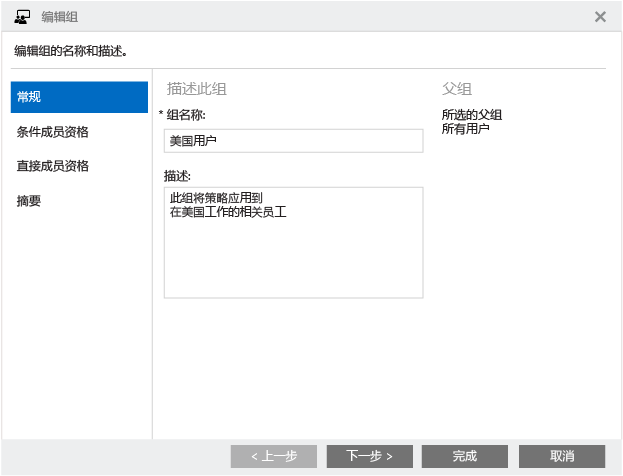

在“成员资格条件”下，选择与 Active Directory 同步的“美国用户组”作为在成员资格规则下使用的安全组。

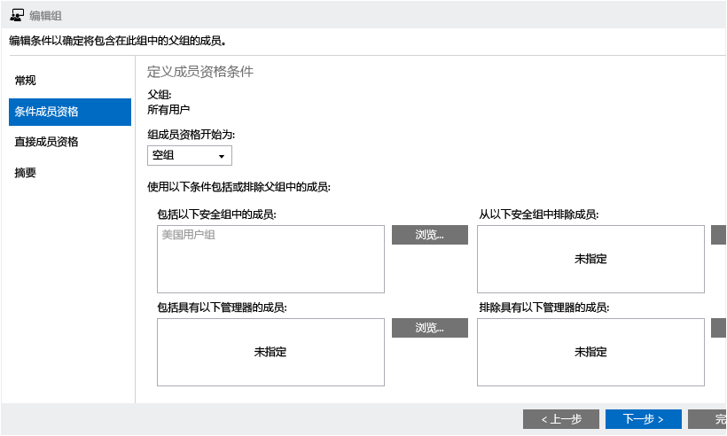

查看你的条目，然后选择“完成”以创建组。

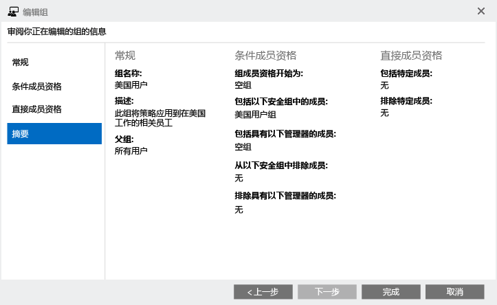

在我们的示例中，我们还为中东和亚洲创建了名为“MEA”的组。

> [!NOTE]
> 如果组成员身份不是基于安全组成员资格填充的，则确保已将 Intune 许可证分配给了这些组成员。

### 针对特定硬件的组
如果你的组织要求应用于特定硬件类型的策略，你可以创建基于此要求的组。 可以将已在 Active Directory 的本地实例中创建的特定组作为策略的基础，并将它们与 Azure Active Directory 同步。 还可以直接在 Azure Active Directory 中创建组。 在此示例中，我们使用“美国用户组”作为“笔记本电脑用户”组的父组。

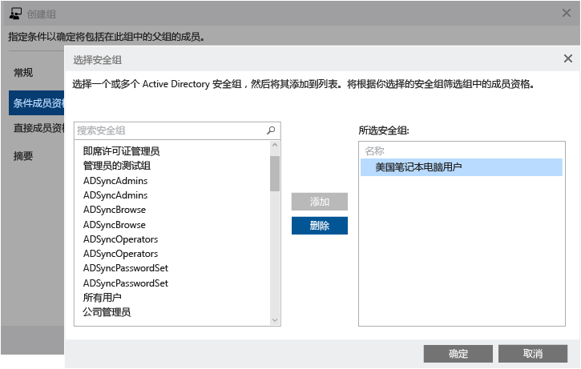

此时，你的组层次结构的外观应与下面的屏幕截图相似。 你可以看到现在 Intune 组“笔记本电脑用户”内有了成员。 任何应用到此组的策略将应用到来自美国地区的 BYOD 笔记本电脑用户。

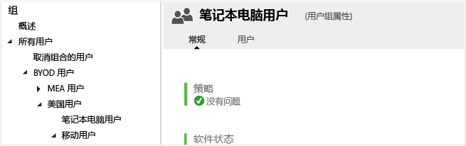

### 针对特定操作系统的组
如果你的组织要求应用于特定操作系统（如 Android、iOS 或 Windows）的策略，则可以基于此要求创建组。 与先前的示例相同，可以将已在 Active Directory 的实例中创建的特定于操作系统的组作为它们的基础，并将它们与 Azure Active Directory 同步。 还可以直接在 Azure Active Directory 的实例中创建它们。

通过使用先前示例中相同的方法，可以基于使用特定操作系统平台的用户 <!--devices?--> 创建组。

> [!NOTE]
> 如果有用户使用多个移动平台或操作系统且没有自动将用户分类为 Android 用户、iOS 用户或 Windows 用户的方法，那么请考虑在设备级别应用策略。 这将使你能够更加灵活地应用特定于操作系统的策略。
>
> 不能基于设备的操作系统动态预配组。 相反，可使用 Active Directory 或 Azure Active Directory 安全组执行此操作。

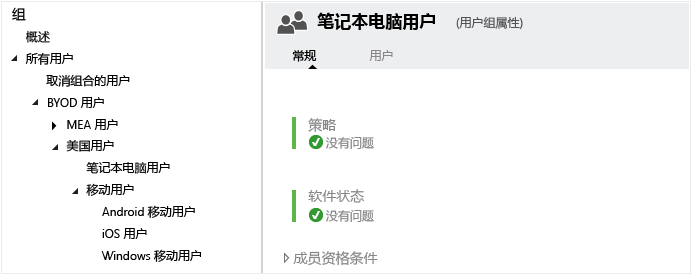

在所有的用户组都基于你的组织需求填充后，组层次结构应该如下所示：

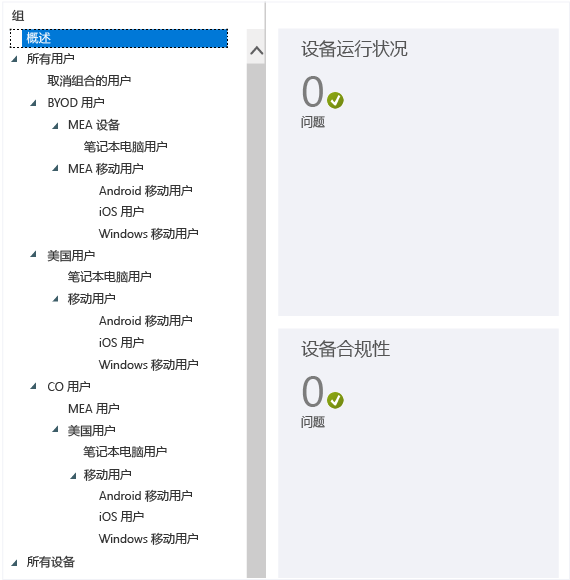

可以使用此层次结构应用组织的策略。

### 设备组
如下所示，还可以为设备创建相似的组，首先以一个针对 BYOD 方案、包括所有员工拥有的设备的广泛组为例。

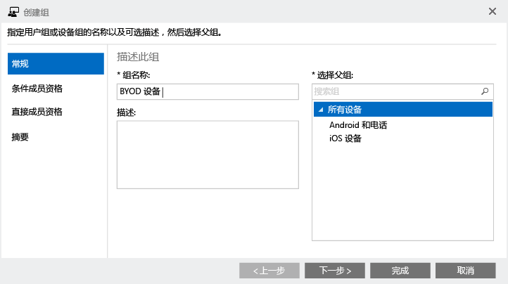

确保选择“所有设备(计算机和移动设备)”以使组包括所有 BYO 设备：

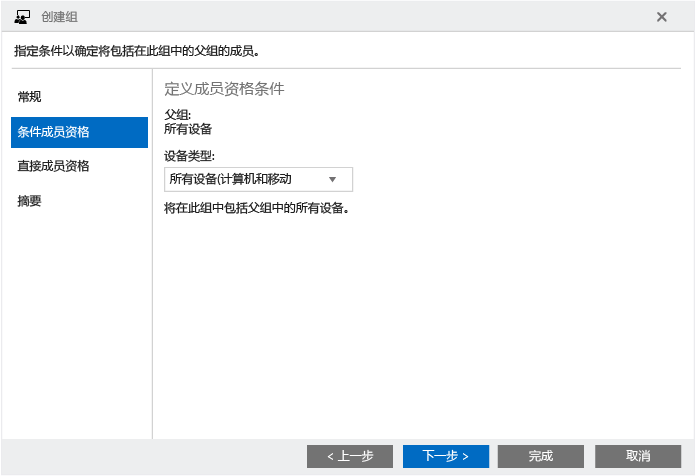

查看你的条目，然后选择“完成”以创建 BYOD 组。

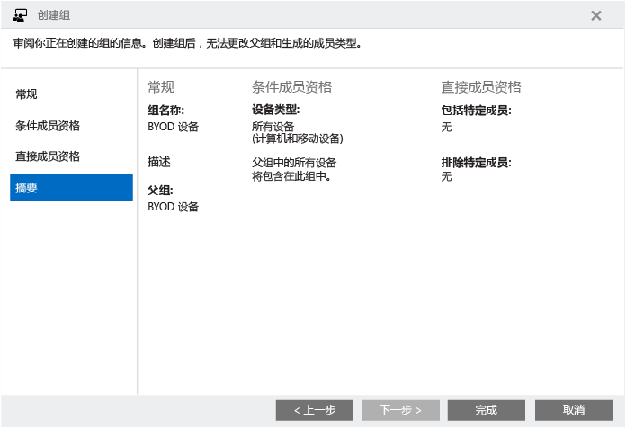

继续创建设备组，直到你的设备组层次结构与用户组层次结构相似。 在 Intune 控制台中你的组节点应该如下所示：

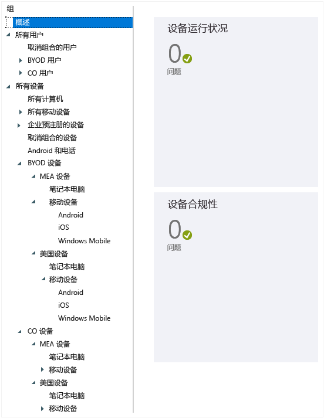

## 组层次结构和命名约定
为了使策略管理更轻松，我们建议根据用途、平台和应用范围来命名每个策略。 使用遵循在准备应用策略时创建的组结构的命名标准。

例如，对于在美国地区级别应用到所有企业、Android、移动设备的 Android 策略，可将该策略命名为 **CO_US_Mob_Android_General**。

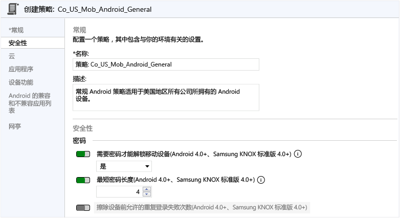

在通过这种方式命名策略时，你可以在“策略”节点中快速识别策略以其预期用途和应用范围，如下所示：

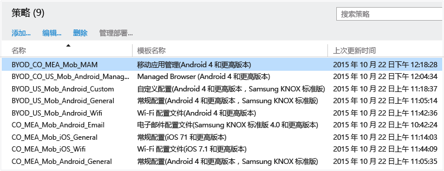

## 后续步骤
[创建组](use-groups-to-manage-users-and-devices-with-microsoft-intune.md)

<!--HONumber=Aug16_HO3-->

