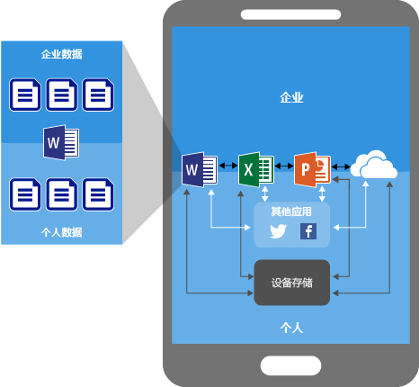
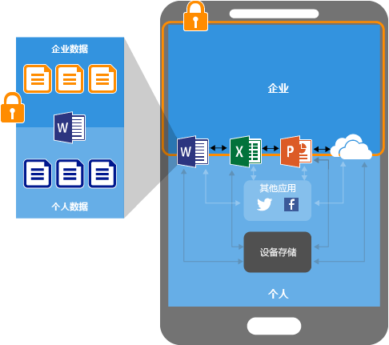
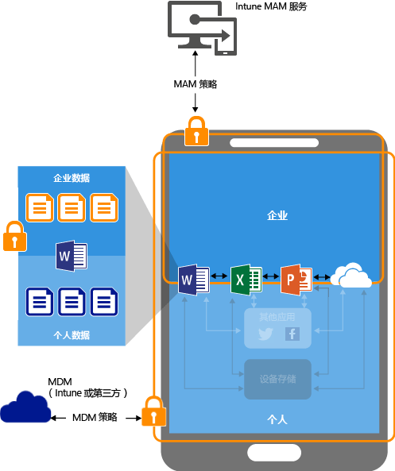
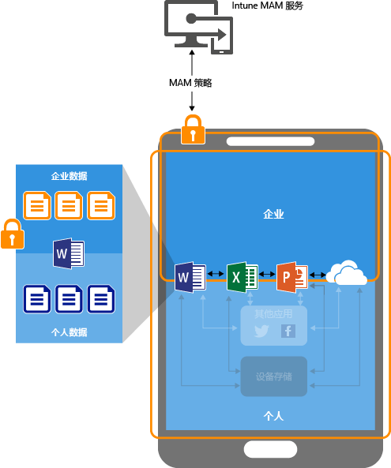

# 通过 Microsoft Intune 使用移动应用管理策略保护应用数据

## 如何保护应用数据
你的员工使用移动设备进行个人任务和工作任务。  你既要确保员工高效工作，又希望防止有意和无意的数据丢失。  此外，还想要具备保护设备（即使在该设备不由你管理的情况下）所访问的公司数据的能力。

可使用 Intune 移动应用管理 (MAM) 策略帮助保护公司数据。 由于 Intune MAM 策略可以**独立于任何移动设备管理 (MDM) 解决方案**使用，所以无论是否在设备管理解决方案中注册设备，都可用它保护公司的数据。 通过实现**应用级别策略**，即可限制对公司资源的访问，并让数据处于 IT 部门的监控范围之内。

可对运行在设备上的应用进行配置的 MAM 策略包括：

- **在 Microsoft Intune 中注册：**此类别中的设备通常是公司自有设备。

-   **在第三方移动设备管理 (MDM) 解决方案中注册：**该类别中的设备通常为公司自有设备。

  > [!NOTE]
  > 移动应用管理策略不应与第三方移动应用管理或安全容器解决方案一起使用。

-   **未在任何移动设备管理解决方案中注册：**该类别中的设备通常为员工自有设备，且未在 Intune 或其他 MDM 解决方案中托管或注册。

> [!IMPORTANT]
> 可为连接到 Office 365 服务的 Office 移动应用创建移动应用管理策略。 连接到本地 Exchange、Skype for Business 或 SharePoint 服务的应用不支持 MAM 策略。

**使用 MAM 策略的主要优点有**

-   在应用级别保护公司数据。  由于移动应用管理不需要设备管理，所以你可以在托管和非托管设备上保护公司数据。 管理以用户标识为中心，因而不再需要设备管理。

-   不会影响最终用户工作效率，且在个人环境中使用应用时不会应用策略。  这些策略仅应用于工作环境，让你能够保护公司数据而不接触个人数据。

使用具有 MAM 策略的 MDM 还有其他优点，公司可以同时使用具有和不具有 MAM 策略的 MDM。 例如，员工可能使用公司分发的手机和个人平板电脑。  在这种情况下，公司的手机在 MDM 中注册且受 MAM 策略保护，而个人设备仅受 MAM 策略保护。

- **MDM 确保该设备受到保护**。  例如，你可以要求使用 PIN 以访问设备，或将托管应用部署到设备。 还可通过 MDM 解决方案将应用部署到设备，以便更好地控制应用管理。

- **MAM 策略确保应用层保护措施到位**。 例如，你可以要求在工作环境中使用 PIN 打开应用，要求应用之间是否可以共享数据，或要求阻止将公司应用数据保存到个人存储位置。

### 当前以下设备支持 MAM 策略：
-   iOS 8.1 或更高版本

-   Android 4 或更高版本

目前不支持 Windows 设备。
##  MAM 策略如何保护应用数据

####  没有 MAM 策略的应用：

在无限制的情况下使用应用时，公司和个人数据可能混合。  公司数据可能最终位于个人存储空间等位置或传输到你监控范围外的应用中，导致数据丢失。 图中的箭头显示了（公司和个人）应用之间和移动到存储位置的无限制数据移动。

### 通过 MAM 策略的数据保护：

可以使用 MAM 策略来防止将公司数据保存到设备的本地存储器上，并限制将数据移动到不受 MAM 策略保护的其他应用中。 MAM 策略设置包括：
- 数据重定位策略，例如**阻止另存为**、**限制剪切、复制和粘贴**。
- 访问策略设置，例如**访问需要简单 PIN**、**阻止在已越狱或取得 root 权限的设备上运行托管应用**。

### MDM 解决方案管理的设备上通过 MDM 策略的数据保护：

**对于在 MDM 解决方案中注册的设备**-

上图显示了 MDM 和 MAM 策略共同提供的保护层。

MDM 解决方案：

-   注册设备

-   将应用部署到设备

-   提供持续的设备合规性和管理

**MAM 策略通过以下功能增添价值：**

-   帮助防止公司数据泄露到使用者应用和服务

-   将限制（另存为、剪贴板、PIN 等）应用到移动应用

-   从应用擦除公司数据而不从设备删除这些应用

### 用于未注册设备的通过 MAM 策略的数据保护

以上图示显示了在不没有 MDM 的情况下，数据保护策略如何在应用级别工作。

对于未在任何 MDM 解决方案中注册的 BYOD 设备，MAM 策略可在应用级别帮助保护公司数据。
但是，有一些限制需要注意，如：

-   无法将应用部署到设备。  最终用户必须从应用商店获取应用。

-   无法在这些设备上设置证书配置文件。

-   无法在这些设备上设置公司 Wi-Fi 和 VPN 设置。

## 多身份

在工作环境中使用应用时，支持多身份的应用使你能够使用不同的帐户（工作和个人）访问已在其中应用 MAM 策略的相同应用。  

例如，最终用户使用其工作帐户启动 OneDrive 应用时，无法将文件移动到个人存储区。 但是，最终用户通过其个人帐户使用 OneDrive 时，可以无限制地从个人 OneDrive 复制和移动数据。  

所有 Office 移动应用都支持多身份。

##  后续步骤
[准备好配置移动应用管理策略](get-ready-to-configure-mobile-app-management-policies-with-microsoft-intune.md)

[使用 Microsoft Intune 创建和部署移动应用管理策略](create-and-deploy-mobile-app-management-policies-with-microsoft-intune.md)

<!--HONumber=Oct16_HO3-->

