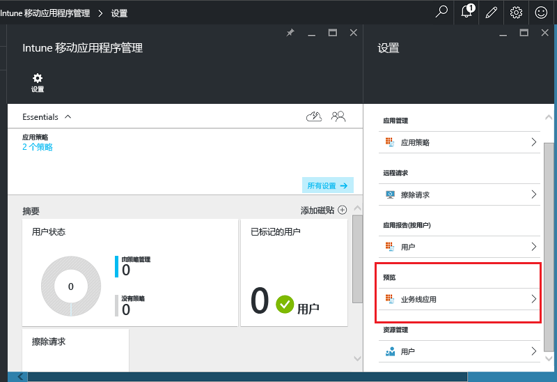
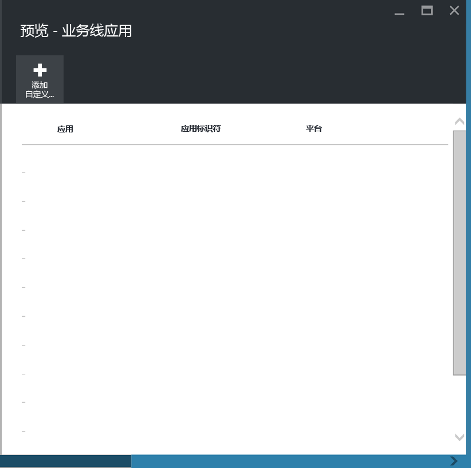
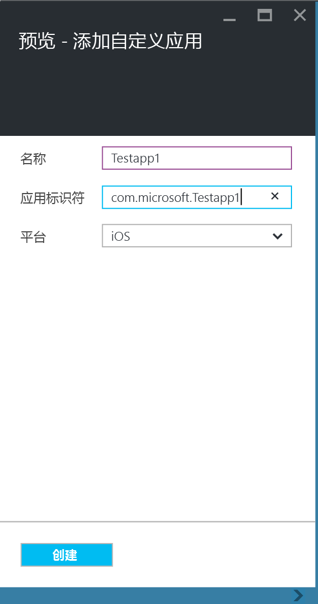
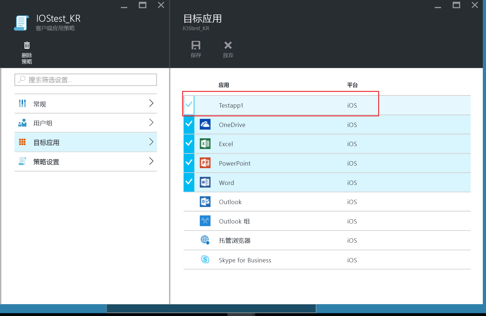
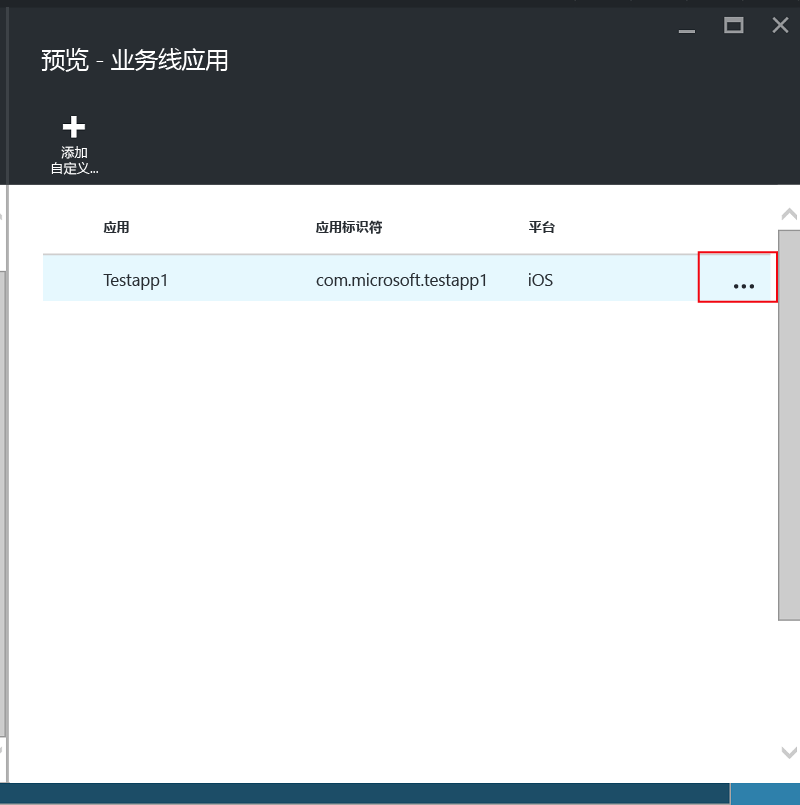
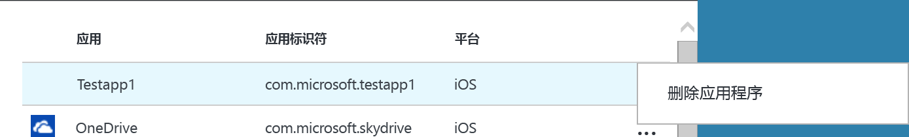

# 保护未在 Microsoft Intune 上注册的设备上的业务线应用及数据

通过限制复制和粘贴等数据移动或阻止用户将公司文件存至个人位置，移动应用管理 (MAM) 策略能帮助保护公司数据。   若要将 MAM 策略应用于 iOS 和/或 Android 业务线应用，首先必须使用 Microsoft Intune 应用包装工具包装此应用。  应用包装是一个将管理层应用于移动应用的过程，不要求对基础应用程序进行任何更改。  一旦应用包装完成，就可将 MAM 策略应用到其并将其分配到最终用户。  

这一主题解释了将 MAM 策略应用于**非托管员工所有设备**和由**第三方移动设备管理 (MDM) 解决方案**管理的设备上访问的应用所需的步骤。  若要准备**已在 Intune 中注册的设备**上运行的业务线应用，请参阅[决定如何使用 Microsoft Intune 为移动应用程序管理准备应用](decide-how-to-prepare-apps-for-mobile-application-management-with-microsoft-intune.md)。
##  步骤 1：准备应用
在可将 MAM 策略应用于应用之前，首先必须使用 Microsoft Intune 应用包装工具包装此应用。  下载中包含应用包装工具的安装和使用说明。  
>[!IMPORTANT]  
>此版本的应用包装工具（支持未在 Intune 上注册的设备）在此后几周将以个人预览版提供。 若有意参与，请发送邮件到 msintuneappsdk@microsoft.com 获取详细信息。

## 步骤 2：添加应用

若要将业务线应用与 MAM 策略关联，必须使用以下步骤将应用详细信息添加至 Intune 订阅/租户：

1. 在 [Azure 门户](https://portal.azure.com/)中，转到**Intune 移动应用程序管理 > 设置**，然后选择**业务线应用**。

  

2. 在 **业务线应用**边栏选项卡中，选择**添加自定义应用**。

  
3.  提供应用名称、应用标识符字段的捆绑标识符以及平台 （iOS 或 Android）。

  此步骤可帮助创建应用的唯一列表。  应用也会显示在租户 MAM 策略的目标应用列表中，如下一步中所述。

## 步骤 3：应用 MAM 策略
一旦应用元数据上传到服务，该应用将显示在应用列表中。  你现在可以[创建一个新策略或现有策略](create-and-deploy-mobile-app-management-policies-with-microsoft-intune.md)并将其应用于步骤 2 中添加的业务线应用。

>[!IMPORTANT]
>必须将 MAM 策略定位给要使用已包装应用的用户。  未部署此策略的用户将无法使用该应用。

  
## 步骤 4：分配应用
可通过以下方式将应用部署到最终用户：
* 对于在第三方 MDM 解决方案中注册的设备，可通过 MDM 解决方案分配应用。
* 对于不由任何 MDM 解决方案管理的设备，将需要自定义解决方案。 最终用户必须在其设备上下载并安装应用。

## 更改元数据
如果需要更改应用详细信息，如应用名或捆绑标识符，则必须[删除该应用](#remove-apps)，并[向其添加](#step-2-add-the-app)新的元数据。

##  删除应用
可从应用列表中删除业务线应用。  这会从列表中删除该应用及与 MAM 策略的关联，但不会从最终用户设备删除或卸载该应用。  

1.  在 [Azure 门户](https://portal.azure.com/)中，转到**Intune 移动应用管理 > 设置**。  在**设置**边栏选项卡上，选择**业务线**打开现有应用的列表。  
2.  选择要删除的应用，并选择 **(...) 上下文**菜单。

  
3.  选择**删除应用程序**以删除该应用。

  

  这会从业务线应用列表及 MAM 策略中的目标应用列表中删除该应用。

<!--HONumber=Jul16_HO3-->

