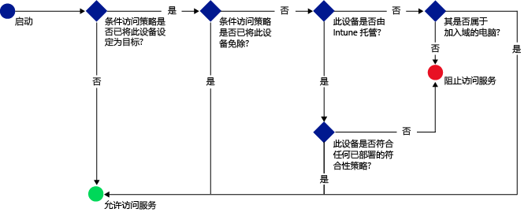

# 使用 Microsoft Intune 限制对电子邮件、O365 和其它服务的访问
可以使用 Intune 条件性访问限制对公司电子邮件和 O365 服务的访问。 Intune 的条件性访问功能使你能确保将对公司电子邮件和 O365 服务的访问限制在符合你设置的规则的设备。
## 条件性访问如何工作？
合规性策略设置用于评估设备的合规性。 条件性访问策略使用该评估来限制或允许对特定服务的访问。 当条件性访问策略与合规性策略结合使用时，将仅允许合规的设备访问该服务。 将合规性策略和条件访问策略部署到用户。 检查用户用于访问服务的任何设备是否符合策略。

请记住，使用该设备的用户必须将合规性策略部署到设备中，以便对其进行合规性评估。
如果没有将合规性策略部署到用户，则该设备将被视为合规且不会对其应用任何访问限制。

当设备不满足策略中设置的条件时，将指导最终用户完成注册设备并修复阻止设备合规问题的流程。

条件性访问的典型工作流：

## 如何配置条件性访问？
使用条件性访问管理对 Microsoft **Exchange 内部部署**、**Exchange Online**、**Exchange Online Dedicated**、**SharePoint Online** 和 **Skype for Business Online** 的访问。

若要设置条件性访问，请配置设备合规性策略和条件性访问策略。

合规性策略包括密码、加密以及设备是否已越狱等设置。 设备必须满足这些规则才能视为合规。

可以基于以下内容设置条件性访问策略以限制访问：
- 设备符合性状态。
- 在设备上运行的平台。
- 用于访问服务的应用类型。

与其他 Intune 策略不同，你无需部署条件性访问策略。 而是在配置策略并选择应该具有该策略的用户后，将向所有目标用户应用此策略。 如果将某个用户设定为策略的目标，则其使用的每个设备必须合规才能访问资源。

## 后续步骤
1. [了解设备合规性策略及其工作原理 ](introduction-to-device-compliance-policies-in-microsoft-intune.md)

2. [创建合规性策略](create-a-device-compliance-policy-in-microsoft-intune.md)

2.  为以下任一项创建条件性访问策略：
> [!div class="op_single_selector"]
  - [为 Exchange Online 创建条件性访问策略](restrict-access-to-exchange-online-with-microsoft-intune.md)
  - [为 Exchange 内部部署创建条件性访问策略](restrict-access-to-exchange-onpremises-with-microsoft-intune.md)
  - [为新版 Exchange Online Dedicated 创建条件性访问策略](restrict-access-to-exchange-online-with-microsoft-intune.md)
  - [为旧版 Exchange Online Dedicated 创建条件性访问策略](restrict-access-to-exchange-onpremises-with-microsoft-intune.md)
  - [为 SharePoint Online 创建条件性访问策略](restrict-access-to-sharepoint-online-with-microsoft-intune.md)
  - [为 Skype for Business Online 创建条件性访问策略](restrict-access-to-skype-for-business-online-with-microsoft-intune.md)
  - [为 Dynamics CRM Online 创建条件访问策略](restrict-access-to-dynamics-crm-online-with-microsoft-intune.md)

<!--HONumber=Sep16_HO3-->

