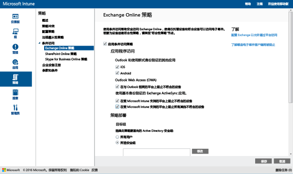

# 使用 Intune 限制对 Exchange Online 和新版 Exchange Online Dedicated 的电子邮件访问

如果你具有 Exchange Online Dedicated 环境并需要确定其采用的是新配置还是旧配置，请与帐户管理员联系。

若要控制对 Exchange Online 或新版 Exchange Online Dedicated 环境的电子邮件访问，请在 Intune 中配置 Exchange Online 的条件性访问。
若要了解有关条件访问如何工作的详细信息，请阅读文章[限制对电子邮件、O365 服务和其它服务的访问](restrict-access-to-email-and-o365-services-with-microsoft-intune.md)。

>[!IMPORTANT]
>具有使用新式验证的应用的 PC 和 Windows 10 移动设备的条件性访问当前不可用于所有的 Intune 客户。 如果你已在使用这些功能，则无需采取任何措施。 你可以继续使用它们。

>如果你还没有为使用新式验证的应用创建适用于电脑或 Windows 10 移动版的条件访问策略，并且想要执行此操作，可以注册 Azure Active Directory 公开预览版，其中包括针对 Intune 受管理设备或加入域的 Windows 电脑的基于设备的条件访问。 请阅读[此博客文章](https://blogs.technet.microsoft.com/enterprisemobility/2016/08/10/azuread-conditional-access-policies-for-ios-android-and-windows-are-in-preview/)以了解详细信息。  

在你可以配置条件性访问**之前**，必须：

-   拥有**包含 Exchange Online（例如 E3）的 Office 365 订阅**，并且用户必须获得 Exchange Online 许可。

-  请考虑配置可选的“Microsoft Intune 服务间连接器”，它将 [!INCLUDE[wit_nextref](../includes/wit_nextref_md.md)] 连接到 Microsoft Exchange Online，并通过 [!INCLUDE[wit_nextref](../includes/wit_nextref_md.md)] 控制台帮助你管理设备信息。 你不需要使用连接器来使用合规性策略或条件性访问策略，但要求你运行帮助评估条件性访问影响的报告。

   > [!NOTE]
   > 如果你要同时对 Exchange Online 和 Exchange 内部部署使用条件性访问，则不要配置服务间连接器

   有关如何配置连接器的说明，请参阅 [Intune service-to-service connector](intune-service-to-service-exchange-connector.md)（Intune 服务间连接器）

当配置条件性访问策略并将其面向用户时，在用户可以连接到其电子邮件前，他们使用的**设备**必须：

-   **已注册**到 [!INCLUDE[wit_nextref](../includes/wit_nextref_md.md)] 或者为已加入域的 PC。

-  **已在 Azure Active Directory 中注册**。 向 [!INCLUDE[wit_nextref](../includes/wit_nextref_md.md)] 注册设备时，会自动发生此情况。 此外，还必须向 Azure Active Directory 注册客户端 Exchange ActiveSync ID。

  AAD DRS 将对 Intune 和 Office 365 客户自动激活。 已经部署了 ADFS 设备注册服务的用户将不会在他们本地的 Active Directory 上看到已注册的设备。

-   **符合**任何已部署到该设备或已加入到本地域的域的 [!INCLUDE[wit_nextref](../includes/wit_nextref_md.md)] 合规性策略。

如果不满足某个条件性访问策略，则用户会在登录时会看到以下消息的其中一条：

- 如果未向 [!INCLUDE[wit_nextref](../includes/wit_nextref_md.md)] 注册设备，或未在 Azure Active Directory 中注册，则会显示一条消息，其中包含有关如何安装公司门户应用、注册设备和激活电子邮件的说明。 此过程也将设备的 Exchange ActiveSync ID 和 Azure Active Directory 中的记录相关联。

-   如果设备被评估为不符合合规性策略规则，会将最终用户将定向到 [!INCLUDE[wit_nextref](../includes/wit_nextref_md.md)] 公司门户网站或公司门户应用，从中他们可以找到有关问题以及其修正方法的信息。

下图显示了 Exchange Online 的条件性访问策略使用的流程。

## 对移动设备的支持
你可以从 **Outlook** 和其他**使用新式验证的应用**限制对 Exchange Online 电子邮件的访问：-

- Android 4.0 及更高版本、Samsung Knox 标准版 4.0 及更高版本
- iOS 8.0 及更高版本
- Windows Phone 8.1 及更高版本

**新式验证**将基于 Active Directory 身份验证库 (ADAL) 的登录引入到 Microsoft Office 客户端中。

-   基于 ADAL 的身份验证使 Office 客户端能够实现基于浏览器的身份验证（也称为被动身份验证）。  为了进行身份验证，用户将被导向登录网页。 此新的登录方法实现了诸如“多重身份验证”和“基于证书的身份验证”等更佳的安全性。
本[文](https://support.office.com/en-US/article/How-modern-authentication-works-for-Office-2013-and-Office-2016-client-apps-e4c45989-4b1a-462e-a81b-2a13191cf517)提供有关新式验证如何工作的更多详细信息。
安装 ADFS 声明规则以阻止非新式验证协议。 方案 3 中提供了详细的说明 - [阻止除了基于浏览器的应用程序之外的其他所有应用程序访问 O365](https://technet.microsoft.com/library/dn592182.aspx)。

当通过 **iOS** 和 **Android** 设备上的浏览器进行访问时，你可以限制对 Exchange Online 上的 **Outlook Web Access (OWA)** 的访问。  仅允许从合规设备上受支持的浏览器进行访问：

* Safari (iOS)
* Chrome (Android)
* 托管浏览器（iOS 和 Android）

**不受支持的浏览器将被阻止**。

不支持 iOS 和 Android 版 OWA 应用。  应通过 ADFS 声明规则进行阻止。

在以下平台上，你可以从内置的“Exchange ActiveSync 电子邮件客户端”限制对 Exchange 电子邮件的访问：

- Android 4.0 及更高版本、Samsung Knox 标准版 4.0 及更高版本

- iOS 8.0 及更高版本

- Windows Phone 8.1 及更高版本

## 对 PC 的支持

你可以设置 PC 的条件性访问以访问满足以下要求的 PC 的“Exchange Online”  和“SharePoint Online”  ，其中该 PC 运行 Office 桌面应用程序：

-   电脑必须运行 Windows 7.0 或 Windows 8.1。

-   PC 必须已加入域或符合合规性策略规则。

    为了被视为符合规范，PC 必须在 [!INCLUDE[wit_nextref](../includes/wit_nextref_md.md)] 中进行注册且符合相应的策略。

    对于加入域的电脑，必须将它设置为[自动向 Azure Active Directory 注册设备](https://azure.microsoft.com/documentation/articles/active-directory-conditional-access-automatic-device-registration/)。
    >[!NOTE]
    >运行 Intune 计算机客户端的电脑上不支持条件访问。

-   [Office 365 新式验证必须已启用](https://support.office.com/en-US/article/Using-Office-365-modern-authentication-with-Office-clients-776c0036-66fd-41cb-8928-5495c0f9168a)，且具有所有最新的 Office 更新。

    新式验证将基于 Active Directory 身份验证库 (ADAL) 的登录引入到 Office 2013 Windows 客户端中，并实现诸如“多重身份验证”和“基于证书的身份验证”等更佳的安全性。

-   设置 ADFS 声明规则以阻止“非新式验证”协议。 方案 3 中提供了详细的说明 - [阻止除了基于浏览器的应用程序之外的其他所有应用程序访问 O365](https://technet.microsoft.com/library/dn592182.aspx)。

## 配置条件性访问
### 步骤 1：配置和部署合规性策略
请确保[创建](create-a-device-compliance-policy-in-microsoft-intune.md)合规性策略并将其[部署](deploy-and-monitor-a-device-compliance-policy-in-microsoft-intune.md)到也将会获得条件性访问策略的用户组。

> [!IMPORTANT]
> 如果尚未部署合规性策略，那么设备将被视为合规并将获得允许访问 Exchange。

### 步骤 2：评估条件性访问策略的影响
在配置条件性访问策略后，你可以使用“移动设备清单报告”识别被阻止访问 Exchange 的设备。

为此，请使用 [Microsoft Intune 服务间连接器](intune-service-to-service-exchange-connector.md)配置 [!INCLUDE[wit_nextref](../includes/wit_nextref_md.md)] 和 Exchange 之间的连接。
1.  导航到“报告”->“移动设备清单报告”。

2.  在报表参数中，选择你想要评估的 [!INCLUDE[wit_nextref](../includes/wit_nextref_md.md)] 组，并根据需要选择策略将应用到的设备平台。
3.  选择符合组织需求的标准后，选择“查看报告”。
将在新窗口中打开报表查看器。

运行报表后，检查以下四列以确定是否将阻止用户：

-   **管理通道** – 指示设备是否由 Intune 和/或 Exchange ActiveSync 进行管理。

-   **已向 AAD 注册** – 指示是否已向 Azure Active Directory 注册设备（称为“工作区加入”）。

-   **合规** – 指示设备是否符合部署的任何合规性策略。

-   **Exchange ActiveSync ID** – iOS 和 Android 设备需要具有与 Azure Active Directory 中的设备注册记录相关联的 Exchange ActiveSync ID。 当用户选择隔离电子邮件中的“激活电子邮件”链接时可完成此操作。

    > [!NOTE]
    > Windows Phone 设备始终在此列中显示一个值。

对于属于目标组的设备，将阻止其访问 Exchange，除非列值与下表中列出的值匹配：

--------------------------
|管理通道|已向 ADD 注册|是否满足条件|Exchange ActiveSync ID|产生的操作|
|----------------------|------------------|-------------|--------------------------|--------------------|
|**由 Microsoft Intune 和 Exchange ActiveSync 管理**|是|是|显示一个值|允许电子邮件访问|
|任何其他值|否|否|不显示任何值|阻止电子邮件访问|
----------------------
你可以导出报告的内容，并使用“电子邮件地址”列来通知用户他们将会被阻止。

### 步骤 3：为条件性访问策略配置用户组
条件性访问策略针对不同的 Azure Active Directory 安全用户组。 你也可以将某些用户从此策略中免除。  如果将某个用户设定为策略的目标，则其使用的每个设备必须合规才能访问电子邮件。

你可以在 **“Office 365 管理中心”**，或 **“Intune 帐户门户”**中配置这些组。

你可以在每个策略中指定两种组类型：

-   **目标组** – 策略应用到的用户组。

-   **免除组** – 从策略中免除的用户组（可选）

如果用户位于两个组中，则会将其从策略中免除。

仅评估条件性访问策略针对的组。

### 步骤 4：配置条件访问策略

1.  在 [Microsoft Intune 管理控制台](https://manage.microsoft.com)中，选择“策略” > “条件性访问” > “Exchange Online 策略”。

2.  在“Exchange Online 策略”  页面上，选择“启用 Exchange Online 的条件访问策略” 。

    > [!NOTE]
    > 如果尚未部署合规性策略，那么设备将被视为合规。
    >
    > 无论遵从性状态如何，策略针对的所有用户都需要使用[!INCLUDE[wit_nextref](../includes/wit_nextref_md.md)]注册其设备。

3.  在“应用程序访问”下，对于使用新式验证的应用，你有两种方式选择策略应该应用到的平台。 受支持的平台包括 Android、iOS、Windows 和 Windows Phone。

    -   **所有平台**

        这将要求用于访问“Exchange Online”的任何设备已在 Intune 中注册且符合策略。  使用“新式验证”的任何客户端应用程序都应符合条件访问策略，如果 Intune 目前不支持该平台，则将阻止访问“Exchange Online”。

        选择“所有平台”选项意味着无论客户端应用程序报告的是什么平台，Azure Active Directory 都会将此策略应用于所有身份验证请求。  所有平台都需要已注册并合规，以下各项除外：
        *   Windows 设备需要已注册并合规，并且/或者域已加入本地 Active Directory 域
        * 不受支持的平台，如 Mac OS。  但是，仍将阻止使用来自这些平台的新式验证的应用。

        >[!TIP]
           如果你尚未使用 PC 的条件性访问，则可能不会看到此选项。  请改用“特定平台”。 针对 PC 的条件性访问当前不可用于所有的 Intune 客户。   你还可以在[此博客文章](https://blogs.technet.microsoft.com/enterprisemobility/2016/08/10/azuread-conditional-access-policies-for-ios-android-and-windows-are-in-preview/)中找到有关如何访问此功能的详细信息。

    -   **特定平台**

         条件性访问策略将应用到在你指定的设备平台上使用“新式验证”的任何客户端应用。

4. 在 **Outlook web access (OWA)** 下，你可以选择仅允许通过受支持的浏览器（Safari (iOS) 和 Chrome (Android)）来访问 Exchange Online。 将阻止从其它浏览器进行的访问。 为 Outlook 的应用程序访问选择的相同平台限制在此处同样适用。

  在 **Android** 设备上，用户必须启用浏览器访问。  若要执行此操作，最终用户必须在已注册的设备上启用“启用浏览器访问”选项，如下所示：
  1.    启动**公司门户应用**。
  2.    通过三个点 (…) 或硬件菜单按钮转到“设置”页面。
  3.    按“启用浏览器访问”按钮。
  4.    在 Chrome 浏览器中，从 Office 365 中注销并重启 Chrome。

  在 **iOS 和 Android** 平台上，为了识别用于访问服务的设备，Azure Active Directory 将向设备颁发一个传输层安全性 (TLS) 证书。  设备将显示证书，并提示最终用户选择证书，如下面的屏幕截图所示。 最终用户必须选先择此证书，然后才可以继续使用浏览器。

  **iOS**

  

  **Android**

  

5.  在“Exchange ActiveSync 应用”下，你可以选择阻止非合规的设备访问 Exchange Online。 当设备运行不受支持的平台时，你还可以选择是允许还是阻止访问电子邮件。 受支持的平台包括 Android、iOS、Windows 和 Windows Phone。

6.  在 **“目标组”**下，选择策略将应用到的 Active Directory 安全用户组。 你可以选择面向所有用户或面向选定的用户组列表。

    > [!NOTE]
    > 对于“目标组”中的用户，Intune 策略将替换 Exchange 规则和策略。
    >
    > 出现以下情况时，Exchange 将仅强制 Exchange 允许、阻止和隔离规则以及 Exchange 策略：
    >
    > -   用户未获 Intune 授权。
    > -   用户已获 Intune 授权，但不属于条件访问策略所针对的任何安全组。

6.  在 **“免除组”**下，选择将会从此策略中免除的 Active Directory 安全用户组。 如果用户同时处于目标组和免除组中，则会将其从策略中免除。

7.  完成后，选择“保存”。

-   不需要部署条件访问策略，它将立即生效。

-   用户创建电子邮件帐户后，设备将立即被阻止。

-   如果被阻止的用户向 [!INCLUDE[wit_nextref](../includes/wit_nextref_md.md)] 注册设备并修复任何非合规性的问题，将在 2 分钟内解除电子邮件访问阻止。

-   如果用户取消对其设备的注册，电子邮件将会在大约 6 小时后被阻止。

**若要查看如何配置条件性访问策略以限制设备访问的示例方案，请参阅[限制电子邮件访问的示例方案](restrict-email-access-example-scenarios.md)。**

## 监视遵从性和条件性访问策略

#### 查看被 Exchange 阻止的设备

在 [!INCLUDE[wit_nextref](../includes/wit_nextref_md.md)] 仪表板上，选择“被 Exchange 阻止的设备”磁贴，以显示被阻止设备的数目以及指向相关详细信息的链接。

## 后续步骤
[限制对 SharePoint Online 的访问](restrict-access-to-sharepoint-online-with-microsoft-intune.md)

[限制对 Skype for Business Online 的访问](restrict-access-to-skype-for-business-online-with-microsoft-intune.md)

<!--HONumber=Sep16_HO2-->

