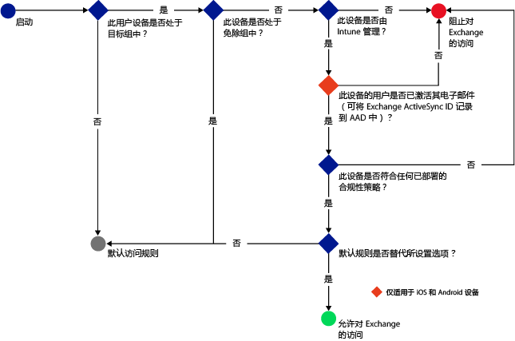
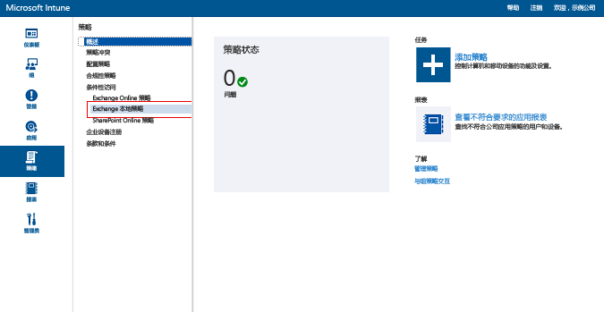
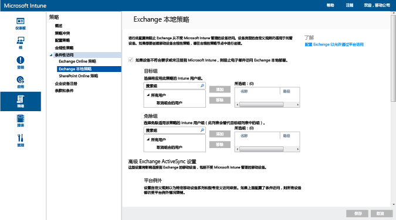

# 使用 Intune 限制对 Exchange 内部部署和旧版 Exchange Online Dedicated 的电子邮件访问

如果你具有 Exchange Online Dedicated 环境并需要确定其采用的是新配置还是旧配置，请与帐户管理员联系。

若要控制对 Exchange 内部部署或旧版 Exchange Online Dedicated 环境的电子邮件访问，请在 Intune 中配置 Exchange 内部部署的条件性访问。
若要了解有关条件性访问如何工作的详细信息，请阅读 [restrict access to email and O365 services]( restrict-access-to-email-and-o365-services-with-microsoft-intune.md)（限制对电子邮件和 O365 服务的访问）文章。

在你可以配置条件性访问**之前**，请先验证以下内容：

-   你的 Exchange 版本必须是 **Exchange 2010 或更高版本**。 支持 Exchange Server 客户端访问服务器 (CAS) 阵列。

-   必须使用**本地 Exchange 连接器**，它将 [!INCLUDE[wit_nextref](../includes/wit_nextref_md.md)] 连接到 Microsoft Exchange 内部部署。 这样就可以通过 [!INCLUDE[wit_nextref](../includes/wit_nextref_md.md)] 控制台管理设备。 有关连接器的详细信息，请参阅 [Intune 本地 Exchange 连接器](intune-on-premises-exchange-connector.md)。

    -   Intune 控制台中可供你使用的本地 Exchange 连接器特定于你的 Intune 租户，且不能用于其他任何租户。 还应确保**仅在一台计算机上**安装适用于你的租户的 Exchange 连接器。

        应从 Intune 管理控制台中下载此连接器。  有关如何配置本地 Exchange 连接器的演练，请参阅[为本地或托管 Exchange 配置 Exchange 本地连接器](intune-on-premises-exchange-connector.md)。

    -   可以在任何计算机上安装该连接器，只要该计算机能够与 Exchange 服务器通信。

    -   此连接器支持 **Exchange CAS 环境**。 如果愿意，你可以在 Exchange CAS 服务器上直接安装该连接器，但不建议这样做，因为这将增加服务器上的负荷。
    在配置连接器时，必须对其进行设置，以便与其中一个 Exchange CAS 服务器通信。

-   必须使用基于证书的身份验证或用户凭据条目来配置 **Exchange ActiveSync**。

当配置条件性访问策略并将其面向用户时，在用户可以连接到其电子邮件前，他们使用的**设备**必须：

-  **已注册**到 [!INCLUDE[wit_nextref](../includes/wit_nextref_md.md)] 或是已加入域的 PC。

-  **已在 Azure Active Directory 中注册**。 此外，还必须向 Azure Active Directory 注册客户端 Exchange ActiveSync ID。

  AAD DRS 将对 Intune 和 Office 365 客户自动激活。 已经部署了 ADFS 设备注册服务的用户将不会在他们本地的 Active Directory 上看到已注册的设备。 **这不适用于 Windows 电脑和 Windows Phone 设备**。

-   **符合**任何部署到该设备的 [!INCLUDE[wit_nextref](../includes/wit_nextref_md.md)] 合规性策略。

下图显示了 Exchange 内部部署的条件性访问策略用于评估是允许还是阻止设备的流程。

如果不满足某个条件性访问策略，则用户会在登录时看到下述某条消息：

- 如果未向 [!INCLUDE[wit_nextref](../includes/wit_nextref_md.md)] 注册设备，或未在 Azure Active Directory 中注册，则会显示一条消息，其中包含有关如何安装公司门户应用、注册设备和激活电子邮件的说明。 此过程也将设备的 Exchange ActiveSync ID 和 Azure Active Directory 中的设备记录相关联。

-   如果设备不合规，则显示一条消息，将用户定向到 [!INCLUDE[wit_nextref](../includes/wit_nextref_md.md)] 公司门户网站或公司门户应用，用户可从中找到有关相关问题及其修正方法的信息。

## 对移动设备的支持
-   Windows Phone 8 及更高版本

-   iOS 上的本机电子邮件应用。

-   Android 4 或更高版本上的本机电子邮件应用
> [!NOTE]
> 不支持 Android 和 iOS 上的 Microsoft Outlook 应用。

## 对 PC 的支持

Windows 8 和更高版本上的**邮件**应用程序（向 [!INCLUDE[wit_nextref](../includes/wit_nextref_md.md)] 注册时）

##  配置条件性访问策略

1.  在 [Microsoft Intune 管理控制台](https://manage.microsoft.com)中，选择**策略**  >  **条件性访问**  >  **Exchange 本地策略**。

2.  使用所需的设置来配置策略：

  - **如果设备不符合要求或未注册到 Microsoft Intune，则阻止电子邮件应用访问 Exchange 内部部署**：当你选择此选项时，则会阻止未受 [!INCLUDE[wit_nextref](../includes/wit_nextref_md.md)] 管理的设备或不符合合规性策略的设备访问 Exchange 服务。

  - **默认规则覆盖 - 始终允许已注册并符合要求的设备访问 Exchange**：当你选择此选项时，则允许已在 Intune 中注册并符合合规性策略的设备访问 Exchange。  
  此规则将覆盖“默认规则”，这意味着，即使将“默认规则”设置为隔离或阻止访问，已注册并符合要求的设备也仍然能够访问 Exchange。

  - **目标组**：选择 [!INCLUDE[wit_nextref](../includes/wit_nextref_md.md)] 用户组，这些用户组必须先向 [!INCLUDE[wit_nextref](../includes/wit_nextref_md.md)] 注册其设备，然后才能访问 Exchange。

  - **免除组**：选择将从条件性访问策略中免除的 [!INCLUDE[wit_nextref](../includes/wit_nextref_md.md)] 用户组。 此列表中的用户将会被免除，即使它们也位于“目标组”的列表中。

  - **平台例外**：选择“添加规则”配置一个规则：为指定的移动设备系列和模型定义访问级别。 因为这些设备可为任何类型，所以还可配置不受 [!INCLUDE[wit_nextref](../includes/wit_nextref_md.md)] 支持的设备类型。

  - **默认规则**：对于不受其他任何规则约束的设备，你可以选择允许或阻止其访问 Exchange，也可以隔离它。 对于已注册并合规的设备，如果将该规则设置为允许访问，将会自动向 iOS、Windows 和 Samsung KNOX 设备授予电子邮件访问权限。 最终用户不必执行任何过程即可获取其电子邮件。  在不运行 Samsung KNOX 的 Android 设备上，最终用户将收到一封包含指导性演练的隔离电子邮件，用于验证注册和合规性，验证后他们才能访问电子邮件。 如果将该规则设置为阻止或隔离访问，将阻止所有设备访问 Exchange，无论设备是否已在 Intune 中注册。 若要防止已注册并符合要求的设备受此规则影响，请选中“替代默认规则”。
>[!TIP]
>如果想在授予电子邮件访问权限之前先阻止所有设备，请选择“阻止访问或隔离”规则。 默认规则将适用于所有设备类型，因此你作为平台例外配置的设备类型以及不受 [!INCLUDE[wit_nextref](../includes/wit_nextref_md.md)] 支持的设备类型也会受到影响。

  - **用户通知**：除了从 Exchange 发送的通知电子邮件之外，Intune 还将发送一封包含取消阻止设备的步骤的电子邮件。 你可以根据需求来自定义编辑默认消息。 由于已将包含修正说明的 Intune 通知电子邮件发送到用户的 Exchange 邮箱，因此，如果用户的设备在接收电子邮件消息之前已被阻止，则用户可以使用取消阻止的设备或其他方法来访问 Exchange 并查看该消息。 当“默认规则”设置为阻止或隔离时尤其如此。  在这种情况下，最终用户必须转到其应用商店，下载 Microsoft 公司门户应用并注册其设备。 这适用于 iOS、Windows 和 Samsung KNOX 设备。  对于不运行 Samsung KNOX 的设备，你需要将隔离电子邮件发送到备用电子邮件帐户，然后，最终用户必须将其复制到被阻止的设备来完成注册和合规性流程。|
  > [!NOTE]
  > 若要让 Exchange 能够发送通知电子邮件，则必须指定应该用于发送通知电子邮件的帐户。
  >
  > 有关详细信息，请参阅[为本地或托管 Exchange 配置 Exchange 本地连接器](intune-on-premises-exchange-connector.md)。

3.  完成后，选择“保存”。

-   不需要部署条件访问策略，它将立即生效。

-   用户设置 Exchange ActiveSync 配置文件后，可能需要 1-3 小时设备才会被阻止（如果它不由 [!INCLUDE[wit_nextref](../includes/wit_nextref_md.md)] 管理）。

-   如果被阻止的用户向 [!INCLUDE[wit_nextref](../includes/wit_nextref_md.md)] 注册设备并更正非合规性），将在 2 分钟内解除电子邮件访问阻止。

-   如果用户取消对 [!INCLUDE[wit_nextref](../includes/wit_nextref_md.md)] 的注册，可能需要 1-3 小时设备才会被阻止。

**若要查看如何配置条件性访问策略以限制设备访问的示例方案，请参阅[限制电子邮件访问的示例方案](restrict-email-access-example-scenarios.md)。**

## 后续步骤
[限制对 SharePoint Online 的访问](restrict-access-to-sharepoint-online-with-microsoft-intune.md)

[限制对 Skype for Business Online 的访问](restrict-access-to-skype-for-business-online-with-microsoft-intune.md)

<!--HONumber=Jul16_HO3-->

