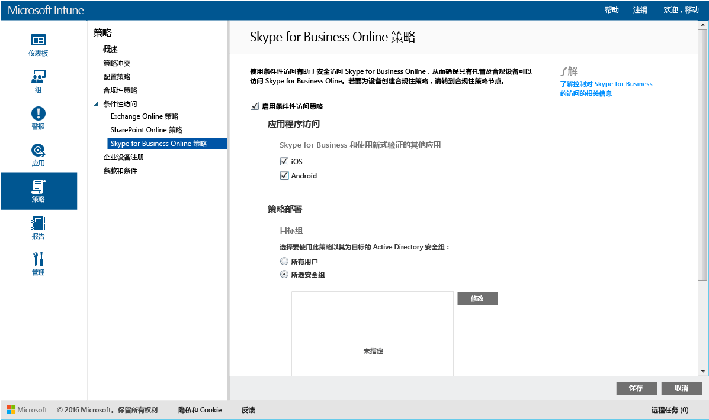

---
# required metadata

title: 限制对 Skype for Business Online 的访问 | Microsoft Intune
description:
keywords:
author: karthikaraman
manager: jeffgilb
ms.date: 04/28/2016
ms.topic: article
ms.prod:
ms.service: microsoft-intune
ms.technology:
ms.assetid: 1b2d7125-f63f-43cf-ac1e-94fbedf2a7e8

# optional metadata

#ROBOTS:
#audience:
#ms.devlang:
ms.reviewer: chrisgre
ms.suite: ems
#ms.tgt_pltfrm:
#ms.custom:

---

# 使用 Microsoft Intune 限制对 Skype for Business Online 的访问
使用 **Skype for Business Online** 的条件性访问策略控制对 Skype for Business Online 的访问。
条件性访问有两个组件：
- 设备合规性策略，设备必须符合该策略才能被视为合规。
- 条件性访问策略，你可以从中指定设备必须满足该策略才能访问服务的条件。
若要了解有关条件性访问如何工作的详细信息，请阅读 [restrict access to email and O365 services](restrict-access-to-email-and-o365-services-with-microsoft-intune.md)（限制对电子邮件和 O365 服务的访问）文章。

当目标用户尝试在其设备上使用 Skype for Business Online 时，会进行以下评估：

在配置 Skype for Business Online 的条件性访问策略**之前**，必须：
- 具有 **Skype for Business Online 订阅** 并将 Skype for Business Online 许可证分配给用户。
- 已订阅了**企业移动性套件**或 **Azure Active Directory Premium**。
-   为 Skype for Business Online **启用新式验证**。 登录到 Microsoft Connect 并填写[此表单](https://connect.microsoft.com/office/Survey/NominationSurvey.aspx?SurveyID=17299&ProgramID=8715)以注册新式验证计划。
-  所有的最终用户必须使用 **Skype for Business Online**。 如果你具有同时使用 Skype for Business Online 和 Skype for Business 本地部署进行的部署，那么条件性访问策略将不会应用到最终用户。

    需要访问 Skype for Business Online 的设备必须：

-   是 **Android** 或 **iOS** 设备。

-   **已注册**到 [!INCLUDE[wit_nextref](../includes/wit_nextref_md.md)]。

-   **符合**任何已部署的 [!INCLUDE[wit_nextref](../includes/wit_nextref_md.md)] 合规性策略。

基于指定的条件，设备状态存储在可授予或阻止访问权限的 Azure Active Directory 中。

如果不满足条件，则用户将在登录时看到以下消息的其中一条：

-   如果未向 [!INCLUDE[wit_nextref](../includes/wit_nextref_md.md)] 注册设备，或未在 Azure Active Directory 中注册，则会显示一条消息，其中包含有关如何安装公司门户应用和进行注册的说明。

-   如果设备不合规，则显示一条消息，将用户定向到 [!INCLUDE[wit_nextref](../includes/wit_nextref_md.md)] 公司门户网站或公司门户应用，用户可从中找到有关相关问题及其修正方法的信息。

## 配置 Skype for Business Online 的条件性访问

### 步骤 1：配置 Active Directory 安全组
在开始之前，针对条件访问策略配置 Azure Active Directory 安全组。 你可以在“Office 365 管理中心”中配置这些组。 这些组将用于以用户为目标或从策略中免除用户。 如果将某个用户设定为策略的目标，则其使用的每个设备必须合规才能访问资源。

你可以指定两种用于 Skype for Business 策略的组类型：

-   **目标组** – 包含将应用策略的用户组。

-   **免除组** – 包含从策略中免除的用户组。

如果用户位于两个组中，则会将其从策略中免除。

### 步骤 2：配置和部署合规性策略
[创建](create-a-device-compliance-policy-in-microsoft-intune.md)合规性策略并将其[部署](deploy-and-monitor-a-device-compliance-policy-in-microsoft-intune.md)到将受此策略影响的所有设备。 这些将是“目标组”中的用户所使用的所有设备。

> [!NOTE]将合规性策略部署到 [!INCLUDE[wit_nextref](../includes/wit_nextref_md.md)] 组，而条件性访问策略以 Azure Active Directory 安全组为目标。

> [!IMPORTANT]如果尚未部署合规性策略，那么设备将被视为合规。

准备就绪后，继续 **步骤 3**。

### 步骤 3：配置 Skype for Business Online 策略
接下来，配置策略以要求只有托管及合规的设备才能访问 Skype for Business Online。 此策略会存储在 Azure Active Directory 中。

####
1.  在 [Microsoft Intune 管理控制台](https://manage.microsoft.com)中，单击“策略” > “条件性访问” > “Skype for Business Online 策略”。

2.  选择“启用条件性访问策略”。

3.  在“应用程序访问”下，可以选择将条件性访问策略应用到：

    -   **iOS**

    -   **Android**

4.  在“目标组” 下，单击“修改”  以选择将应用策略的 Azure Active Directory 安全组。 你可以选择将此应用于所有用户或仅针对选择的用户组。

5.  在“免除组” 下，可以选择“修改”  以选择从此策略中免除的 Azure Active Directory 安全组。

6.  完成后，请单击“保存” 。

现在你已配置了 Skype for Business Online 的条件性访问。 不需要部署条件访问策略，它将立即生效。

## 监视遵从性和条件性访问策略
在“组”  工作区中，可以查看设备的条件访问状态。

选择任何移动设备组，然后在“设备”  选项卡上，选择以下“筛选器” 之一:

* **未向 AAD 注册的设备** – 从 Skype for Business Online 阻止这些设备。

* **不合规的设备** – 从 Skype for Business Online 阻止这些设备。

* **已向 AAD 注册并合规的设备** – 这些设备可以访问 Skype for Business Online。

<!--HONumber=Jun16_HO2-->

