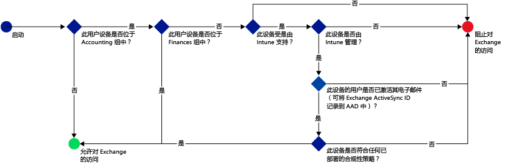
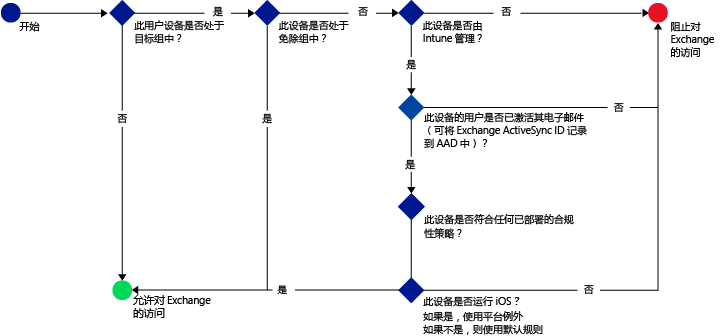
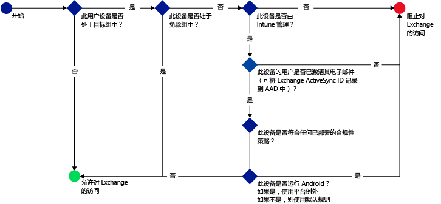

# 使用 Microsoft Intune 限制对电子邮件的访问：示例方案

## 阻止用户使用非合规的设备访问 Exchange Online。
### 方案要求
- 如果设备不符合部署的合规性策略，必须阻止“会计”Active Directory 安全组中的所有用户访问 Exchange Online。
- 如果任何属于此组的用户的设备不受 [!INCLUDE[wit_nextref](../includes/wit_nextref_md.md)] 支持，则必须阻止这些用户在该设备上访问 Exchange Online。
- “财务”Active Directory 安全组中的用户必须从策略中免除，即使它们也位于“会计”安全组中。

为此，请使用以下设置来配置 Exchange Online 的条件性访问：

-   选择“启用条件性访问策略”。

- 选择你想要允许从使用新式验证的应用访问的平台。
- 对于 Exchange ActiveSync 应用，请选择“阻止受 Microsoft Intune 支持的平台上的非合规设备”和“阻止不受 Microsoft Intune 支持的平台上的所有其他设备”。
-   在“目标组”部分的“所选安全组”下选择“会计”用户组。

-   在“免除组”部分的“所选安全组”下选择“财务”用户组。

以下流程用于决定哪些设备可以访问 Exchange Online：

## 访问 Exchange 内部部署的所有 iOS 设备必须由 Intune 进行管理
### 方案要求
- 仅应允许运行 iOS 的设备访问 Exchange 内部部署。
- 设备还必须在 Intune 中注册，并满足合规性策略规则才可用于访问 Exchange。

为此，请使用以下设置来配置 Exchange 内部部署的以下条件性访问策略：

-   选择选项“如果设备不符合要求或未在 Microsoft Intune 中注册，则阻止电子邮件应用访问 Exchange 内部部署”。 通过选择此选项，启用条件性访问策略，这要求所有的设备必须在 Microsoft Intune 中注册并且必须首先满足合规性策略规则才能使用它们访问 Exchange。

-   对于高级 Exchange Active Sync 设置，请创建一个：

  -   允许运行 iOS 的设备访问 Exchange 的平台异常。   

  -   默认规则，该规则指定当设备不受平台异常规则约束时，应阻止其访问 Exchange。 此规则可确保阻止不运行 iOS 的设备访问 Exchange。

以下的流用于确定可以访问 Exchange 的设备：

## 任何 Android 设备均不可访问 Exchange 内部部署。
### 方案要求
- 应阻止所有的 Android 设备访问 Exchange。
- 所有其他受支持的设备可以访问 Exchange，只要它们由 [!INCLUDE[wit_nextref](../includes/wit_nextref_md.md)] 管理。

为此，请使用以下设置来配置 Exchange 内部部署的条件性访问：

-   选择选项“如果设备不符合要求或未在 Microsoft Intune 中注册，则阻止电子邮件应用访问 Exchange 内部部署”。 通过选择此选项，要求任何设备必须在 Intune 中注册并符合合规性策略规则。

- 对于高级 Exchange Active Sync 设置，请创建一个：
  -   阻止运行 Android 的设备访问 Exchange 的平台异常。 此规则可确保 Android 设备不能用于访问 Exchange。

  -   默认规则，该规则指定设备不受其他规则约束时，应允许其访问 Exchange。 此默认规则可确保运行 Android 以外的平台，但受 Microsoft Intune 支持的设备可用于访问 Exchange。 但是它们必须在 Intune 中注册并符合合规性策略规则。

以下的流用于确定可以访问 Exchange 的设备：

<!--HONumber=Jul16_HO5-->

