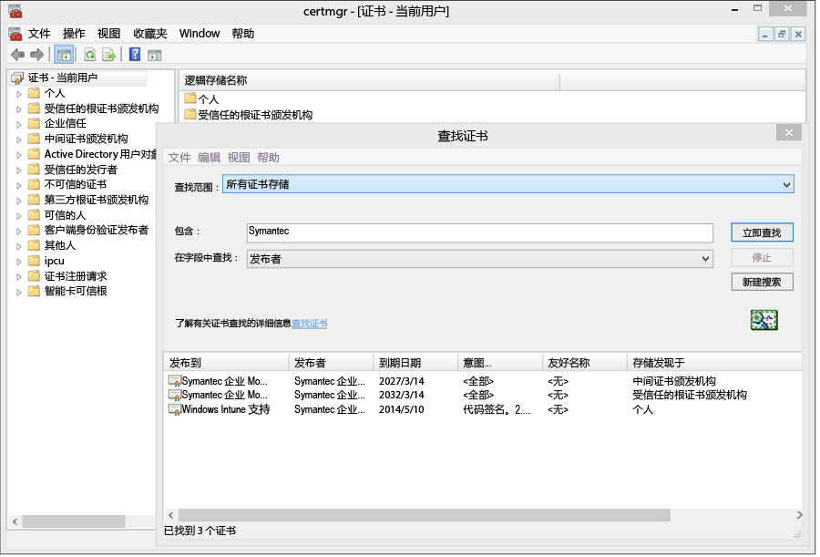
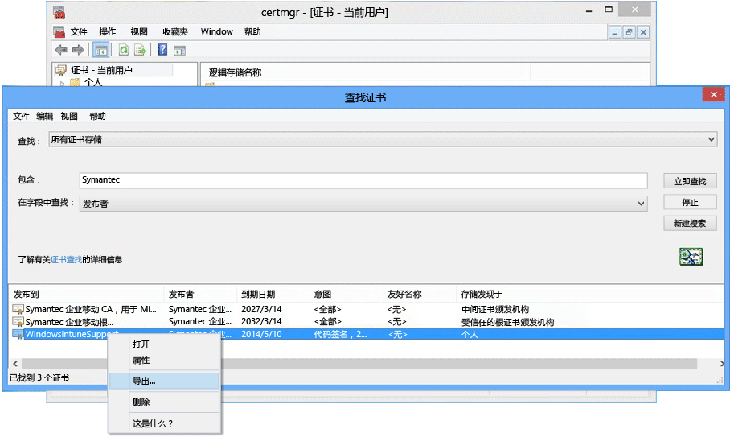

# 设置 Windows Phone 8.0 的设备管理

Windows Phone 8.0 安装 Intune 公司门户应用并允许设备管理需要 Symantec 证书。 还要求使用证书对业务线应用签名。 下面的主题项仅用于 Windows Phone 8.0。 若要管理 Windows Phone 8.1 或更高版本（包括 Windows 10 移动版），请参阅[设置 Windows Phone 注册](set-up-windows-phone-management-with-microsoft-intune.md)。

> [!IMPORTANT]
> 从 2016 年 9 月开始，适用于 Windows 8.0 和 Windows Phone 8.0 的公司门户应用将不再可下载。

-   **Windows Phone 8** - 所需证书
-   **Windows Phone 8.1 和 Windows 10 移动版**仅在以下情况下需要证书：

    -   你想要使用 Intune 部署公司门户应用

    -   你将部署业务线（即“端加载”）应用


  > [!IMPORTANT]
  > 用于管理某些 Windows 和 Windows Phone 移动设备的 Symantec 证书[必须定期续订](renew-a-symantec-code-signing-certificate.md)。

Window Phone 移动设备管理的设置要求取决于管理设备的方式。  在公司的 DNS 注册中设置两个 CNAME 可以更轻松地注册。 如果你的用户将从应用商店中下载公司门户应用，那么，配置 DNS 设置之后，你只需设置公司门户并告知用户如何注册。  对于将在其中部署公司门户的 Windows Phone 8.0 或 Windows Phone 8.1，则需要使用 Symntec 证书对应用进行代码签名。

## 配置安装程序要求以启用 Windows Phone 管理
1.  **设置 Intune** 如果你尚未设置，请将[移动设备管理机构](get-ready-to-enroll-devices-in-microsoft-intune.md#set-mobile-device-management-authority)设置为**Microsoft Intune**并设置 MDM，为管理移动设备做好准备。

2.  **为注册服务器地址设置 DNS 别名** （可选）

    使用 DNS 别名（CNAME 记录类型），用户可以通过在注册过程中自动填充服务器名称更加轻松地注册其设备。

    1.  在 [Intune 管理控制台](http://manage.microsoft.com)中，单击**管理** &gt; **移动设备管理** &gt; **Windows Phone**。

    2.  在**指定一个已验证的域名**框中键入公司网站结果验证的域的 URL，然后单击**测试自动检测**。

    3.  为公司的域创建 **CNAME** DNS 资源记录。 CNAME 资源记录必须包含以下信息：

        |主机名|指向|TTL|
        |-------------|-------------|-------|
        |enterpriseenrollment.company_domain.com|enterpriseenrollment-s.manage.microsoft.com |1 小时|
        |enterpriseregistration.company_domain.com|enterpriseregistration。windows。net|1 小时|
        例如，你的公司网站为 contoso.com，则你将在 DNS 中创建将 EnterpriseEnrollment.contoso.com 重定向到 manage.microsoft.com 的 CNAME。 如果存在多个经过验证的域，则为每个域创建一个 CNAME 记录。

        -   `enterpriseenrollment-s.manage.microsoft.com` – 支持从电子邮件的域名重定向到具有域识别的 Intune 服务

        -   `enterpriseregistration.windows.net` – 支持移动设备加入工作区。 它还支持 Windows 8.1 的条件访问

    

3.  **支持应用签名的证书管理**[不会访问 Windows Phone 应用商店和/或需要业务线应用的 Windows Phone 8.0 和 Windows Phone 8.1 的需要此管理。]

    若要支持 Windows Phone 8.0 的公司门户应用并将企业应用部署到 Windows Phone 8.1，必须获取 **Symantec 企业移动代码签名证书**。 不能使用自己的证书颁发机构所颁发的证书，因为 Windows Phone 设备仅信任 Symantec 证书。 此证书用于：

    -   对公司门户应用进行签名，以部署到 [!INCLUDE[winphone8_client_1](../includes/winphone8_client_1_md.md)] 进行注册和电话管理

    -   对公司业务线应用进行签名，以便 [!INCLUDE[wit_nextref](../includes/wit_nextref_md.md)] 可以将它们部署到 Windows Phone

    下列步骤将帮助你获取所需的证书并对公司门户应用进行签名。 你将需要 Windows Phone 开发人员中心帐户，然后需要购买 Symantec 证书。

    1.  **加入 Windows Phone 开发人员中心**登录时使用公司帐户信息加入 [Windows Phone 开发人员中心](http://go.microsoft.com/fwlink/?LinkId=268442)以购买你的公司帐户。 在你接收代码签名证书之前，此请求需获得公司主管授权。

    2.  **获取公司 Symantec 证书**使用你的 Symantec ID 从 [Symantec 网站](http://go.microsoft.com/fwlink/?LinkId=268441)购买证书。 购买证书后，在你 Windows Phone 开发人员帐户中指定的公司审批人将收到一封请求审批证书请求的电子邮件。 有关 Symantec 证书要求的详细信息，请参阅[为什么 Windows Phone 需要 Symantec 证书？](https://technet.microsoft.com/en-us/library/dn764959.aspx#BKMK_Symantec) Windows 设备注册常见问题。

    3.  **导入证书**批准请求后，你将收到一封包含导入证书说明的电子邮件。 按照电子邮件中的说明导入证书。

    4.  **验证导入的证书**若要验证是否已正确导入证书，请转到**证书**管理单元中，右键单击**证书**并选择**查找证书**。 在 **“包含”** 字段中输入“Symantec”，然后单击 **“立即查找”**。 导入的证书应出现在结果中。

        

    5.  **导出签名证书**验证证书是否存在后，可以导出 .pfx 文件以进行公司门户签名。 选择“预期目的”为“代码签名”的 Symantec 证书。 右键单击代码签名证书并选择**导出**。

        

        在 **“证书导出向导”**中，选择 **“是，导出私钥”** ，然后单击 **“下一步”**。 **选择“个人信息交换 - PKCS #12 (.PFX)”**，并选择**如果可能，在证书路径中包括所有证书**。 完成向导。 有关详细信息，请参阅 [How to Export a Certificate with the Private Key（如何导出带私钥的证书）](http://go.microsoft.com/fwlink/?LinkID=203031)。

    6.  **下载公司门户应用并对其进行签名**

        若要支持 Windows Phone 注册，需要对 Windows Phone 8.0 公司门户应用进行签名，并将该应用上载到 Intune。

        1.  **下载公司门户**从下载中心下载[适用于 Windows Phone 的 Intune 公司门户](http://go.microsoft.com/fwlink/?LinkId=268440)。 默认安装位置是 `C:\Program Files (x86)\Microsoft Corporation\Windows Intune Company Portal for Windows Phone`。

        2.  **下载 Windows Phone 8.0 SDK**下载 [Windows Phone SDK](http://go.microsoft.com/fwlink/?LinkId=615570)。

        3.  **对公司门户应用进行代码签名**使用与 SDK 一同下载的 XAPSignTool 应用，用从 Symantec 证书创建的 .pfx 文件对公司门户进行签名。 有关详细信息，请参阅 [How to sign a company app by using XapSignTool（如何使用 XapSignTool 对公司应用进行签名）](http://go.microsoft.com/fwlink/?LinkID=280195)。

    7.  **将公司门户应用上载到 Intune**上载已签名的公司门户应用文件和你的代码签名证书，以便最终用户可以使用此应用。

        1.  在 [Intune 管理控制台中](http://manage.microsoft.com)，单击**管理**&gt;**Windows Phone**。

        2.  单击“上传已签名的应用文件”并用 Intune 管理员 ID 进行签名。

        3.  在“软件安装程序”页上的“指定软件安装程序文件的位置”处，浏览到代码签名的公司门户应用（对于 Windows Phone 8.0 为 .xap，对于 Windows Phone 8.1 为 .appx）的位置。

            如果你要在试用版 Intune 帐户中评估 Intune 并上传代码签名的应用文件，则请取消选中“使用由示例 Symantec 代码签名证书签名的公司门户应用文件”复选框。

        4.  将导出的证书 (.pfx) 文件添加到“代码签名证书”并创建证书的密码。

        5.  在 **软件描述** 页上，完成记忆了“用户在他们的设备上浏览公司门户的应用的详细信息时查阅了此信息”的字段。

        6.  完成向导。 现在，注册 Windows Phone 8.0 设备的用户在注册过程中将在其设备上获得公司门户应用。 Windows Phone 8.1 用户可以安装公司门户应用商店版本的公司门户应用。  如果阻止 Windows Phone 8.1 设备访问 Windows Phone 应用商店，或要使用 Intune 来部署公司门户应用，则必须下载 Windows Phone 8.1 公司门户 (SSP.appx) 应用，并对其进行签名。

4.  **告知用户如何使用公司门户获取对公司资源的访问**你的用户将需要了解注册其设备的方式以及他们纳入管理之后会出现的情况。 [最终用户需要了解的有关 Microsoft Intune 使用的内容](what-to-tell-your-end-users-about-using-microsoft-intune.md)

## 部署 Windows Phone 8.1 公司门户应用
可以使用 Intune 将公司门户应用部署到 Windows Phone 8.1 设备，而不是从 Windows Phone 应用商店进行安装。 仍必须使用 Symantec 证书按照以上步骤启用 Windows Phone 设备注册。 然后必须下载 Windows Phone 8.1 公司门户应用，并使用 Symantec 证书对其进行签名。  只有在你的用户不会使用公司应用商店，并且你想要将公司门户部署到 Windows Phone 8.1 设备的情况下，此操作才有必要。


1.  **下载公司门户**

    从下载中心下载 [Microsoft Intune Company Portal App for Windows Phone 8.1](http://go.microsoft.com/fwlink/?LinkId=615799)（适用于 Windows Phone 8.1 的 Microsoft Intune 公司门户应用）并运行自解压缩 (.exe) 文件。 此文件包含两个文件：

    -   CompanyPortal.appx – 适用于 Windows Phone 8.1 的公司门户安装

    -   WinPhoneCompanyPortal.ps1 – 可用于对公司门户应用文件进行签名，以便将文件部署到 Windows Phone 8.1 设备的 PowerShell 脚本

2.  **下载 Windows Phone SDK**下载 [Windows Phone SDK 8.0](http://go.microsoft.com/fwlink/?LinkId=615570) (http://go.microsoft.com/fwlink/?LinkId=268439) 并将 SDK 安装到你的计算机。 需要此 SDK 来生成应用程序注册令牌。

3.  **生成 AETX 文件**通过使用 AETGenerator.exe（Windows Phone SDK 8.0 的一部分），从 Symantec PFX 文件生成应用程序注册令牌 (.aetx) 文件。 有关如何创建 AETX 文件的说明，请参阅 [如何为 Windows Phone 生成应用程序注册令牌](https://msdn.microsoft.com/library/windows/apps/jj735576.aspx)

4.  **下载适用于 Windows 8.1 的 Windows SDK**下载并安装 [Windows Phone SDK](http://go.microsoft.com/fwlink/?LinkId=613525) (http://go.microsoft.com/fwlink/?LinkId=613525)。 请注意，公司门户应用中包含的 PowerShell 脚本使用默认安装位置 `${env:ProgramFiles(x86)}\Windows Kits\8.1`。 如果安装到其他位置，则必须包括 cmdlet 参数中的位置。

5.  **使用 PowerShell 对应用进行代码签名**以管理员身份在主计算机上打开随 Windows SDK（Symantec 企业移动代码签名证书）一起安装的 **Windows PowerShell**，导航到 Sign-WinPhoneCompanyPortal.ps1 文件并运行该脚本。

    **示例 1**

    ```
    .\Sign-WinPhoneCompanyPortal.ps1 -InputAppx 'C:\temp\CompanyPortal.appx' -OutputAppx 'C:\temp\CompanyPortalEnterpriseSigned.appx' -PfxFilePath 'C:\signing\cert.pfx' -PfxPassword '1234' -AetxPath 'C:\signing\cert.aetx'
    ```
    此示例对 C:\temp\ 中的 CompanyPortal.appx 进行签名，并生成 CompanyPortalEnterpriseSigned.appx。 它将使用 PFX 密码 1234，并从 PFX 文件读取发布者 ID。 还将从 cert.aetx 文件读取企业 ID。

    **示例 2**

    ```
    .\Sign-WinPhoneCompanyPortal.ps1 -InputAppx 'C:\temp\CompanyPortal.appx' -OutputAppx 'C:\temp\CompanyPortalEnterpriseSigned.appx' -PfxFilePath 'C:\signing\cert.pfx' -PfxPassword '1234' -PublisherId 'OID.0.9.2342.19200300.100.1.1=1000000001, CN="Test, Inc.", OU=Test 1' -EnterpriseId 1000000001
    ```
    此示例对 C:\temp\ 中的 CompanyPortal.appx 进行签名，并生成 CompanyPortalEnterpriseSigned.appx。 它将使用 PFX 密码 1234，并使用指定的发布者 ID。

    **参数：**

    -   `-InputAppx` – CompanyPortal.appx 文件的本地路径（包含在单引号中）。 例如 'C:\temp\CompanyPortal.appx'

    -   `-OutputAppx` – 已签名公司门户应用的本地路径和文件名（包含在单引号中）。 例如 'C:\temp\CompanyPortalEnterpriseSigned.appx'

    -   `-PfxFilePath` – 已导出的 Symantec 证书的 PFX 文件的本地路径和文件名。 例如 'C:\signing\cert.pfx'

    -   `-PfxPassword` – 用于签署 PFX 文件的密码（包含在单引号中）。 例如 '1234'

    -   `-AetxPath` – 用于读取企业 ID 的 .aetx 文件的本地路径（如果未定义“EnterpriseId”参数。） 必须提供此参数或 EnterpriseId。 例如 'C:\signing\cert.aetx'

    -   `-PublisherId` - 企业的发布者 ID。 如果不存在，则使用 Symantec 企业移动代码签名证书的“使用者”字段。 例如 'OID.0.9.2342.19200300.100.1.1=1000000001, CN="Test, Inc.", OU=Test 1'

    -   `-SdkPath` - 适用于 Windows 8.1 的 Windows SDK 的根文件夹路径。 此参数是可选参数，默认值为 ${env:ProgramFiles(x86)}\Windows Kits\8.1。

    -   `-EnterpriseId` - 企业 ID。 必须提供此参数或“AetxPath”。 如果未提供此参数，则从 AETX 文件中读取企业 ID。 例如 1000000001

6.  部署 Windows Phone 8.1 公司门户 (SSP.appx) 应用。

    > [!IMPORTANT]
    > 可以从应用商店同时安装 ssp.xap 和公司门户，这可能会让用户感到困惑。 若要所有用户都使用 ssp.xap，则请创建用于阻止公司门户的应用商店版本的应用。 若要让所有的 Windows Phone 8.1 设备都只使用公司门户的应用商店版本，则有三个选择：
    >
    > -   如果不旁加载应用并且不需要支持 Windows Phone 8.0，则不用上载签名的 ssp.xap。
    > -   如果需要旁加载应用，并且没有注册 Windows Phone 8 设备，则将自动创建的 ssp.xap 部署从“可用”更改为“卸载”。
    > -   如果需要安装旁加载应用并且 Windows Phone 8.0 设备需要注册和接收 ssp.xap，则创建新的 ssp.xap 软件部署并通过 **“卸载”** 操作对其进行部署。 Windows Phone 8.0 设备不支持强制安装或卸载应用，因此它们将忽略该部署。 Windows Phone 8.1 设备支持卸载操作并且将删除 ssp.xap。


<!--HONumber=Jul16_HO4-->


