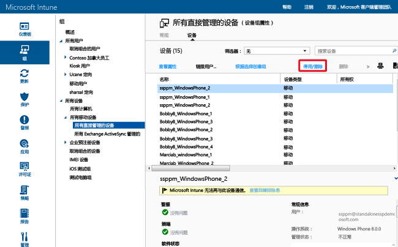

---
# required metadata

title: 使用远程擦除来帮助保护数据 |Microsoft Intune
description:
keywords:
author: NathBarn
manager: jeffgilb
ms.date: 04/28/2016
ms.topic: article
ms.prod:
ms.service: microsoft-intune
ms.technology:
ms.assetid: 8519e411-3d48-44eb-9b41-3e4fd6a93112

# optional metadata

#ROBOTS:
#audience:
#ms.devlang:
ms.reviewer: jeffgilb
ms.suite: ems
#ms.tgt_pltfrm:
#ms.custom:

---

# 使用 Microsoft Intune 的完全擦除或选择性擦除保护数据
对于设备，你有时想要或需要[停用应用](retire-apps-using-microsoft-intune.md)（已部署到电脑或移动设备），因为不再需要它们。 你可能还想要从设备中删除公司数据。 若要执行此操作，Intune 将提供选择性擦除和完全擦除功能。 由于移动设备可能存储敏感公司数据并提供对许多公司资源的访问，因此，你可以从 Intune 中发出远程设备擦除命令以擦除遗失或被盗的设备。 此外，对于在 Intune 中注册的私人所有设备，用户可从 Intune 中发出远程设备擦除命令。

  > [!NOTE]
  > 本主题仅涉及擦除通过 Intune 管理的设备。 还可使用 [Azure 预览版门户](https://portal.azure.com)[从应用中擦除公司数据](wipe-managed-company-app-data-with-microsoft-intune.md)。

## 完全擦除

“完全擦除”将设备还原为其出厂默认设置，同时删除所有公司和用户数据和设置。 设备从 Intune 删除。 完全擦除可用于将设备授予新用户前或在设备丢失或被盗的情况下，对设备进行重置。  **请谨慎选择完全擦除。无法恢复设备上的数据**。

## “选择性擦除”

**选择性擦除**将删除公司数据，包括设备中适用的移动应用管理 (MAM) 数据、设置和电子邮件配置文件。 选择性擦除会将用户的个人数据保留在设备上。 设备从 Intune 删除。 下表按平台描述了将删除什么数据，以及在选择性擦除之后对设备上保留的数据的影响。

**iOS**

|数据类型|iOS|
|-------------|-------|
|Intune 安装的公司应用和关联数据。|卸载应用。 删除公司应用数据。  来自使用移动应用程序管理的 Microsoft 应用程序的应用程序数据被删除。 应用程序不会删除。|
|设置|不再强制实施通过 Intune 策略设置的配置，用户可以更改设置。|
|Wi-Fi 和 VPN 配置文件设置|已删除|
|证书配置文件设置|已删除并吊销证书。|
|管理代理|删除管理配置文件。|
|Email|已删除通过 Intune 设置的电子邮件配置文件并删除设备上缓存的电子邮件。|
|Azure Active Directory (AAD) 脱离|AAD 记录删除|
|联系人 | 将删除从应用直接同步到本机通讯簿的联系人。  无法擦除从本机通讯簿同步到另一个外部源中的任何联系人。    目前仅支持 Outlook 应用。

**Android**

|数据类型|Android|Android Samsung KNOX|
|-------------|-----------|------------------------|
|Web 链接|删除。|已删除|
|非托管的 Google Play 应用|保留已安装的应用和数据|保留已安装的应用和数据|
|非托管的业务线应用|保留已安装的应用和数据|卸载应用并由此删除应用的本地数据。 不会删除除应用（SD 卡等）之外的数据。|
|托管的 Google Play 应用|删除应用数据。 不删除应用。 应用（SD 卡等）外由 MAM 加密保护的数据仍然进行加密处理且不可用，但不删除。|删除应用数据。 不删除应用。 应用（SD 卡等）外由 MAM 加密保护的数据仍然进行加密处理，但不删除。|
|托管的业务线应用|删除应用数据。 不删除应用。 应用（SD 卡等）外由 MAM 加密保护的数据仍然进行加密处理且不可用，但不删除。|删除应用数据。 不删除应用。 应用（SD 卡等）外由 MAM 加密保护的数据仍然进行加密处理，但不删除。|
|设置|不再强制实施通过 Intune 策略设置的配置，用户可以更改设置。|不再强制实施通过 Intune 策略设置的配置，用户可以更改设置。|
|Wi-Fi 和 VPN 配置文件设置|已删除|已删除|
|证书配置文件设置|已吊销证书，但未删除。|已删除并吊销证书。|
|管理代理|撤销设备管理员权限。|撤销设备管理员权限。|
|Email|已删除适用于 Android 的 Microsoft Outlook 应用接收到的电子邮件。|已删除通过 Intune 设置的电子邮件配置文件并删除设备上缓存的电子邮件。|
|Azure Active Directory (AAD) 脱离|AAD 记录删除|AAD 记录删除|
|联系人 | 将删除从应用直接同步到本机通讯簿的联系人。  无法擦除从本机通讯簿同步到另一个外部源中的任何联系人。    目前仅支持 Outlook 应用。|将删除从应用直接同步到本机通讯簿的联系人。  无法擦除从本机通讯簿同步到另一个外部源中的任何联系人。    目前仅支持 Outlook 应用。

**Windows**

|数据类型|Windows 8.1 (MDM) 和 Windows RT 8.1|Windows RT|Windows Phone 8 和 Windows Phone 8.1|Windows 10|
|-------------|----------------------------------------------------------------|--------------|-----------------------------------------|--------|
|Intune 安装的公司应用和关联数据。|通过 EFS 保护的文件的密钥将被吊销，用户将无法打开文件。|不会删除公司应用。|卸载最初通过公司门户安装的应用。 删除公司应用数据。|将卸载应用并删除旁加载密钥。|
|设置|不再强制实施通过 Intune 策略设置的配置，用户可以更改设置。|不再强制实施通过 Intune 策略设置的配置，用户可以更改设置。|不再强制实施通过 Intune 策略设置的配置，用户可以更改设置。|不再强制实施通过 Intune 策略设置的配置，用户可以更改设置。|
|Wi-Fi 和 VPN 配置文件设置|已删除|已删除|不支持|已删除|
|证书配置文件设置|已删除并吊销证书。|已删除并吊销证书。|不支持|已删除并吊销证书。|
|Email|删除启用了 EFS 的电子邮件，包括 Windows 电子邮件的邮件应用以及附件。|不支持|已删除通过 Intune 设置的电子邮件配置文件并删除设备上缓存的电子邮件。|删除启用了 EFS 的电子邮件，包括 Windows 电子邮件的邮件应用以及附件。 删除由 Intune 预配的邮件帐户。|
|Azure Active Directory (AAD) 脱离|否|否|AAD 记录删除|不适用。 Windows 10 不支持对已加入 Azure Active Directory 的设备使用选择性擦除|

### 从 Intune 管理员控制台远程擦除设备

1.  选择要擦除的设备。 你可以按用户或设备进行查找。

    -   **按用户：**

        1.  在 [Intune 管理员控制台](https://manage.microsoft.com/)中，依次选择**组**&gt;**所有用户**。

        2.  选择要擦除其移动设备的用户的名称。 选择**查看属性**。

        3.  在用户的“属性”页，选择“设备”，然后选择要擦除的移动设备的名称。 按下 Ctrl 并点击以选择多个设备。

    -   **按设备：**

        1.  在 [Intune 管理员控制台](https://manage.microsoft.com/)中，依次选择**组**&gt;**所有移动设备**。

      

        2.  选择“设备”，然后选择要擦除的移动设备的名称。 按下 Ctrl 并点击以选择多个设备。

2.  选择**停用/擦除**。

3.  此时将出现一条消息，提示你确认是否要停用设备。

    -   若要执行仅删除公司应用和数据的**选择性擦除**，请选择**是**。

    -   要执行将擦除所有应用和数据并将设备返回到出厂默认设置的**完全擦除**，请选择“在停用之前擦除设备”。 此操作适用于除 Windows 8.1 外的所有平台。 “无法恢复通过完全擦除删除的数据”。

擦除在所有设备类型之间传播的时间不超过 15 分钟。

## 擦除启用了加密文件系统 (EFS) 的内容
Windows 8.1 和 Windows RT 8.1 支持选择性擦除 EFS 加密内容。 下列各项适用于启用 EFS 的内容的选择性擦除：

-   仅选择性擦除使用同一 Internet 域作为 Intune 帐户通过 EFS 保护的应用和数据。 有关详细信息，请参阅[设备数据管理的 Windows 选择性擦除](http://technet.microsoft.com/library/dn486874.aspx)。

-   如果对与 EFS 关联的域进行了任何更改，则更改可能要花费长达 48 小时，之后才能对使用新域的应用和数据进行选择性擦除。

-   将擦除向 Intune 注册的每个域。

EFS 选择性擦除当前支持下列数据和应用：

-   Windows 相关邮件应用程序

-   工作文件夹

-   使用 EFS 加密的文件和文件夹。 有关详细信息，请参阅[加密文件系统的最佳方案](http://support.microsoft.com/kb/223316)。

-   如果你的组织维护其在 Active Directory 中的标识，它必须使用目录同步工具 (DirSync) 同步信息到 EFS 选择性擦除的 AAD 才能正常工作。  有关目录同步的详细信息，请参阅 Azure Active Directory 文档中的[目录同步方案](http://technet.microsoft.com/library/dn441212.aspx)。

## 监视器停用、擦除和删除操作
若要获取已停用、擦除或删除的设备以及执行该操作的人员的报告：

1.  在 [Intune 管理员控制台](https://manage.microsoft.com/)中，依次选择**报表**&gt;**设备历史记录报表**。

2.  为报表提供开始和结束日期，然后选择**查看报表**。

### 另请参阅
[停用设备](retire-devices-from-microsoft-intune-management.md)

[设备数据管理的 Windows 选择性擦除](http://technet.microsoft.com/library/dn486874.aspx)

<!--HONumber=May16_HO4-->

