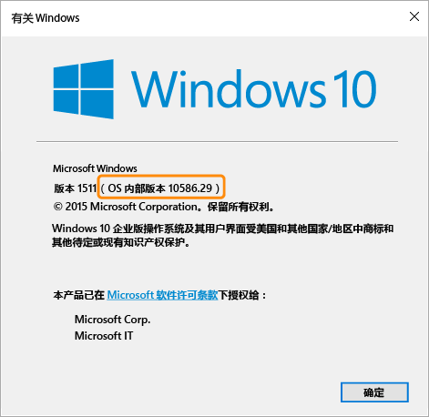

# Microsoft Intune 中的适用于 Windows 设备的合规性策略设置

本主题中描述的策略设置适用于运行 Windows 操作系统的设备。 以下各节列出了支持的特定 Windows 版本。

如果你要查找有关其他平台的信息，请选择以下选项之一：
> [!div class="op_single_selector"]
- [适用于 iOS 设备的合规性策略设置](ios-compliance-policy-settings-in-microsoft-intune.md)
- [适用于 Android 设备的合规性策略设置](android-compliance-policy-settings-in-microsoft-intune.md)

## 适用于 Windows Phone 设备的合规性策略设置
本节中列出的设置支持 Windows Phone 8.1 及更高版本。

## 系统安全设置
### Password
- **需要密码才可解锁移动设备：**将此选项设置为“是”，以要求用户在访问其设备之前输入密码。

- **允许简单密码：**将此选项设置为“是”，以允许用户创建简单密码，如“1234”或“1111”。

-  **最短密码长度：**指定用户密码必须包含的最小位数或最小字符数。
- **所需的密码类型：**指定用户是要创建“字母数字”还是“数字”密码。

  对于运行 Windows 且通过 Microsoft 帐户访问的设备，如果最短密码长度超过 8 个字符或者最小字符集数大于 2，则将无法正确评估合规性策略。

- **最小字符集数：**如果“所需的密码类型”设置为“字母数字”，此设置将指定密码必须包含的最小字符集数。 四个字符集为：
  -   小写字母
  -   大写字母
  -   符号
  -   数字

  为此设置设置较大的数字将要求用户创建更复杂的密码。 对于运行 Windows 且通过 Microsoft 帐户访问的设备，如果最短密码长度超过 8 个字符或者最小字符集数大于 2，则将无法正确评估合规性策略。
- **需要提供密码之前须经历的无活动分钟数：**指定用户必须重新输入其密码前的空闲时间。

- **密码过期(天)：**选择用户的密码过期之前的天数，而且他们必须创建一个新的密码。

- **记住密码历史记录：**将此设置与“防止重用旧密码”结合使用，以限制用户使用以前创建的密码。

- **防止重用以前的密码：**如果选择了“记住密码历史记录”，请指定不能重用的以前用过的密码数量。
- **当设备从空闲状态返回时需要密码：**此设置应该与**“需要提供密码之前处于非活动状态的分钟数”**设置一起使用。 设备在**“需要提供密码之前处于非活动状态的分钟数”**设置指定的时间内处于非活动状态时，将提示最终用户输入密码才能访问设备。

  **此设置仅适用于 Windows 10 移动设备。**
### 加密
- **需要对移动设备进行加密：**将此选项设置为“是”，要求对移动设备进行加密以连接到资源。

## 设备运行状况设置
- **要求设备被报告为正常：**你可以在新的或现有的合规性策略中设置规则，要求 **Windows 10 移动版**设备必须被报告为正常。  如果启用此设置，将通过运行状况证明服务 (HAS) 评估 Windows 10 设备的下列数据点：
  -  **启用 BitLocker：**Bitlocker 打开的情况下，当系统关闭或进入休眠状态时，设备能够保护存储在驱动器上的数据，防止未经授权的访问。 Windows BitLocker 驱动器加密可以加密所有存储在 Windows 操作系统卷上的数据。 BitLocker 使用 TPM 来保护 Windows 操作系统和用户数据，并确保即使计算机无人管理、丢失或被盗，计算机也不会被篡改。 如果计算机装有兼容的 TPM，BitLocker 将使用 TPM 来锁定保护数据的加密密钥。 这样，在 TPM 验证计算机状态之前则无法访问密钥
  -  **启用代码完整性：**代码完整性是一种功能，可用于在每次将驱动器或系统文件载入内存时，验证它们的完整性。 代码完整性还可用于检测是否有未签名的驱动器或系统文件被载入到内核，或者系统文件是否被恶意软件（由具有管理员权限的用户帐户运行）修改。
  - **启用安全启动：**启用安全启动后，系统会被强制启动到出厂信任状态。 此外，启用安全启动后，用于启动设备的核心组件必须具有制造设备的组织所信任的正确加密签名。 UEFI 固件会在允许设备启动前确认这一点。 如果有任何文件被篡改或破坏了签名，系统将不会启动。

  有关 HAS 服务工作方式的信息，请参阅[运行状况证明 CSP](https://msdn.microsoft.com/library/dn934876.aspx)。
##  设备属性设置
- **所需的最低 OS 版本：**当设备不满足最低 OS 版本要求时，它将被报告为不符合要求。
    将显示一个链接，链接中包含有关如何升级的信息。 最终用户可以选择升级其设备，升级后他们可以访问公司资源。

- **允许的最高 OS 版本：**当设备使用的 OS 版本高于规则中指定的版本时，将阻止访问公司资源，并要求用户联系其 IT 管理员。 除非变更规则以允许该操作系统版本，否则该设备将不能用于访问公司资源。

## 适用于 Windows PC 的合规性策略设置
此节中列出的设置在 Windows PC 上受支持。
## 系统安全设置
### Password
- **最短密码长度：** - 在 Windows 8.1 上受支持。

  指定用户密码必须包含的最小位数或最小字符数。

  对于通过 Microsoft 帐户访问的设备，如果**最短密码长度**超过 8 个字符或者如果**最小字符集数**大于 2 个字符，则将无法正确评估合规性策略。

- **所需密码类型：** - 在 Windows RT、Windows RT 8.1 和 Windows 8.1 上受支持

  指定用户是否必须创建**字母数字**或**数字**密码。

- **最小字符集数：**- 在 Windows RT、Windows RT 8.1 和 Windows 8.1 上受支持。 如果**所需的密码类型**设置为**字母数字**，此设置指定密码必须包含的字符集的最小数字。 四个字符集为：
  -   小写字母
  -   大写字母
  -   符号
  -   数字：为此设置设置较大的数字将要求用户创建更复杂的密码。

  对于通过 Microsoft 帐户访问的设备，如果**最短密码长度**超过 8 个字符或者如果**最小字符集数**大于 2 个字符，则将无法正确评估合规性策略。
- **需要提供密码之前处于非活动状态的分钟数：** - 在 Windows RT、Windows RT 8.1 和 Windows 8.1 上受支持

  指定用户必须重新输入密码前的空闲时间。

- **密码过期（天数）：**-在 Windows RT、Windows RT 8.1 和 Windows 8.1 上受支持。

  选择用户的密码过期之前的天数，而且他们必须创建一个新的密码。

- **记住密码历史记录：** - 在 Windows RT、Windows RT 8.1 和 Windows 8.1 上受支持

  将此设置与“防止重用旧密码”结合使用，以限制用户使用以前创建的密码。
- **防止重用以前的密码：** - 在 Windows RT、Windows RT 8.1 和 Windows 8.1 上受支持

  如果选择了**记住密码历史记录：**，请指定不能重用的以前用过的密码数量。

## 设备运行状况设置
- **需要设备被报告为正常：** - 在 Windows 10 设备上受支持。
你可以在新的或现有的合规性策略中设置规则，要求 Windows 10 设备必需被报告为正常。  如果启用此设置，将通过运行状况证明服务 (HAS) 评估 Windows 10 设备的下列数据点：
  -  **启用 BitLocker：**Bitlocker 打开的情况下，当系统关闭或进入休眠状态时，设备能够保护存储在驱动器上的数据，防止未经授权的访问。 Windows BitLocker 驱动器加密可以加密所有存储在 Windows 操作系统卷上的数据。 BitLocker 使用 TPM 来保护 Windows 操作系统和用户数据，并确保即使计算机无人管理、丢失或被盗，计算机也不会被篡改。 如果计算机装有兼容的 TPM，BitLocker 将使用 TPM 来锁定保护数据的加密密钥。 这样，在 TPM 验证计算机状态之前则无法访问密钥
  -  **启用代码完整性：**代码完整性是一种功能，可用于在每次将驱动器或系统文件载入内存时，验证它们的完整性。 代码完整性还可用于检测是否有未签名的驱动器或系统文件被载入到内核，或者系统文件是否被恶意软件（由具有管理员权限的用户帐户运行）修改。
  - **启用安全启动：**启用安全启动后，系统会被强制启动到出厂信任状态。 此外，启用安全启动后，用于启动设备的核心组件必须具有制造设备的组织所信任的正确加密签名。 UEFI 固件会在允许设备启动前确认这一点。 如果有任何文件被篡改或破坏了签名，系统将不会启动。
  - **启用开机初期启动的反恶意软件：**开机初期启动的反恶意软件 (ELAM) 在计算机启动时和第三方驱动器初始化之前，对你网络中的计算机提供保护。

  有关 HAS 服务工作方式的信息，请参阅[运行状况证明 CSP](https://msdn.microsoft.com/library/dn934876.aspx)。

## 设备属性设置
- **所需的最低操作系统：** - 在 Windows 8.1 和 Windows 10 上受支持。

  在此处指定 major.minor.build 编号。 版本号必须与 winver 命令返回的版本一致。

  如果设备的操作系统版本比指定的版本低，它将被报告为不兼容。 将显示一个链接，链接中包含有关如何升级的信息。 最终用户可以选择升级其设备，升级后他们可以访问公司资源。

- **允许的最高操作系统版本：** - 在 Windows 8.1 和 Windows 10 上受支持。

  当设备使用的操作系统版本高于规则中指定的版本时，将阻止访问公司资源，并要求用户联系其 IT 管理员。 除非变更规则以允许该操作系统版本，否则该设备将不能用于访问公司资源。

若要查找要用于**所需的最低操作系统**和**允许的最高操作系统版本**设置的操作系统版本，请从命令提示符处运行 **winver** 命令。 Winver 命令返回报告的操作系统版本。
- Windows 8.1 PC 返回版本 **6.3**。    对于 Windows，如果操作系统版本规则设置为 Windows 8.1，则该设备将报告为不符合要求，即使该设备具有 Windows 8.1 也是如此。
- 运行 Windows 10 的 PC 的版本应设置为 "10.0"+ winver 命令返回的 OS 内部版本号。 例如，可以为与 10.0.10586 类似的版本号。
> 

<!--HONumber=Jul16_HO5-->

