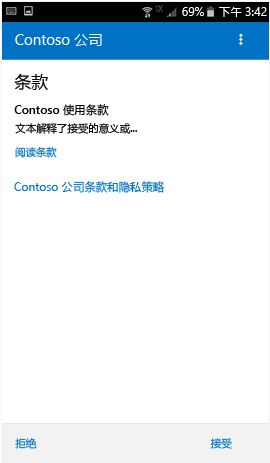
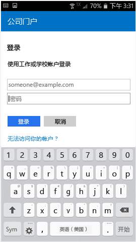
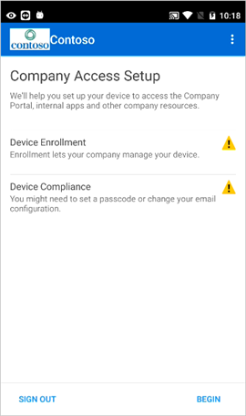
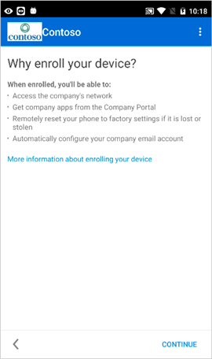
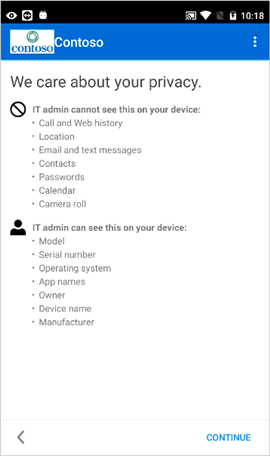
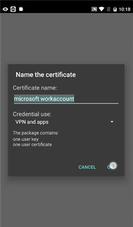

# 在 Intune 中注册 Android 设备

如果你的公司或学校使用 Microsoft Intune，则可以注册 Android 设备以获取对公司电子邮件、文件和其他资源的访问权限。 通过注册设备可以让 IT 部门来管理这些工作或学校资源和使其保持安全，同时使你可以自由地使用首选设备来完成工作。 若要了解有关注册的详细信息，请参阅[安装公司门户应用并注册设备后会发生什么情况？](what-happens-if-you-install-the-Company-Portal-app-and-enroll-your-device-in-intune-android.md)。

这些注册说明适用于 Samsung Knox Android 设备和“本机”（非 Samsung Knox）Android 设备。 若要确定你是否拥有 Samsung Knox 设备，请转到“**设置**”&gt;“**关于设备**”。 如果未在此处看到列出了“KNOX 版本”，则你具有本机 Android 设备。

注册前/后，系统可能会要求你选择最恰当地描述了你使用设备的方式的类别。 IT 管理员将使用此类别来帮助确定你有权访问哪些应用。

如果尝试在 Intune 中注册设备时遇到错误，则可以[将注册错误消息发送给 IT 管理员](send-enrollment-errors-to-your-it-administrator-android.md)。

**注册 Android 设备：**

1.  从 [Google Play](http://play.google.com/store/apps/details?id=com.microsoft.windowsintune.companyportal) 安装免费的 Intune 公司门户应用。

2.  打开 Microsoft Intune 公司门户应用。

3.  在公司门户的“欢迎”屏幕上，点击“登录”，然后使用你的工作或学校帐户登录。

       

4.  如果 IT 管理员设置了公司条款和条件，请点击“接受”接受这些条款。

    

5.  如果在使用 Android 6.0 或更高版本，则执行此步骤。 ·сФт，ЗлЧЄЦБПВТ»ІЅЦи。 

    如果 IT 管理员设置了特定策略，则你可能会看到以下消息：
    -   **“是否允许公司门户发起和管理电话呼叫?”**

    

    如果看到此消息，请点击“允许”。 点击“允许”是安全的，因为**Microsoft 绝不会发起或管理电话呼叫！** 消息文本由 Google 管控，Microsoft 无法更改。 允许访问就意味着允许你的设备将数据日志写入设备的 SD 卡中，这进而使你可以使用 USB 电缆移动这些日志。

    如果拒绝访问，下次登录到公司门户时将再次出现此消息，但是你可以点击“不再询问”复选框关闭以后接收此消息。  如果你稍后决定允许访问，请转到**设置** &gt; **应用** &gt; **公司门户** &gt; **权限** &gt; **手机**，然后开启权限。

    -   **是否允许公司门户访问你的联系人？**

    

    如果看到此消息，请点击“允许”。 点击“允许”是安全的，因为**Microsoft 绝不会访问你的联系人！** 消息文本由 Google 管控，Microsoft 无法更改。 当你允许访问时，它只允许公司门户应用创建、使用和管理你的工作账户。

    如果拒绝访问，下次点击“发送数据”时将再次出现此消息，但是你可以点击“不再询问”复选框关闭以后接收此消息。 如果你稍后决定允许访问，请转到**设置** &gt; **应用** &gt; **公司门户** &gt; **权限** &gt; **存储**，然后开启权限。

6.  使用你的工作或学校帐户和密码登录公司门户应用，然后点击**登录**。

    

7.  在“公司访问设置”屏幕上，点击“开始”。

    

8.  在**为什么要注册设备？**屏幕上，阅读注册设备时你可以执行的操作，然后点击**继续**。

    

9.  查看 IT 管理员在你的设备上可以看到和不可以看到的内容的列表，然后点击**继续**。

    

10.  在“接下来会发生的情况”屏幕上，阅读注册期间会发生的情况，然后点击“注册”。

    

11.  在“激活设备管理员”屏幕上，点击“激活”。

    

12.  按照提示输入 PIN 或密码。 如果已经在此设备上设置 PIN 或密码，将不会显示此屏幕或要求你输入新的 PIN 或密码。

    

13.  按照以下与所使用的设备类型（本机 Android 或 Samsung Knox）匹配的说明进行操作。 若要确定你是否拥有 Samsung Knox 设备，请转到“**设置**”&gt;“**关于设备**”。 如果未在此处看到列出了“KNOX 版本”，则你具有本机 Android 设备。

    -   本机（非 Samsung Knox）设备：在“对证书命名”屏幕上，点击“确定”接受默认证书。

    

    -   Samsung Knox 设备：接受 Samsung Knox 隐私策略并点击**确认**。

    

    在 Intune 注册设备时，你会看到以下消息显示在屏幕上。

    

14. “公司访问设置”屏幕出现时，点击“继续”。 如果收到表明你的设备不兼容的消息，请按照说明修复该问题，然后点击“继续”。

      

11. 在“公司访问设置完成”屏幕上，点击“完成”。 你的设备现已注册。

    

你需转到**设置** &gt; **安全**，然后打开**未知源**才能尝试安装公司应用。 如果你在尝试安装应用前未打开此选项，则会看到消息“已阻止安装。 出于安全性考虑，你的设置已被设置为阻止安装未知来源的应用。” 你可点击错误对话框上的“设置”以转到“未知来源”选项。

仍需要帮助？ 请联系你的 IT 管理员（访问[公司门户网站](http://portal.manage.microsoft.com)获取联系信息），或写邮件给 Microsoft Android 团队（发送至 wintunedroidfbk@microsoft.com）。

### 另请参阅
[通过 Intune 使用 Android 设备](using-your-android-device-with-intune.md)

<!--HONumber=Jul16_HO3-->

