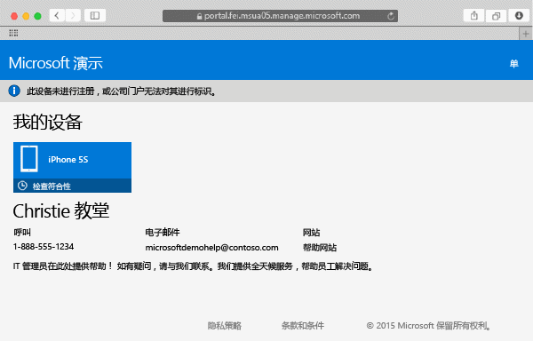

# 在 Intune 中注册 Mac OS X 设备

在 Intune 中注册 Mac OS X 设备后，你可以访问公司网络、你的工作电子邮件和工作文件，并获取公司应用。 有关注册设备后所发生情况的详细信息，请参阅[安装公司门户应用并在 Intune 中注册设备后会发生什么情况？](what-happens-if-you-install-the-company-portal-app-and-enroll-your-device-in-intune-ios.md)。

如果在尝试注册 iOS 设备，请参阅[在 Intune 中注册 iOS 设备](enroll-your-device-in-intune-ios.md)。

注册 Mac OS X 设备：

1.  使用 Safari 浏览器，打开[公司门户网站](https://portal.manage.microsoft.com)，然后点击通知栏。

2.  点击“未注册此设备，或公司门户无法对其进行识别”。

     

3.  点击“安装”以开始注册你的设备。

     

4.  在“安装管理配置文件”对话框中，点击“安装”。 如果出现要求你输入凭据的对话框，请输入用户名和密码，然后点击**继续** &gt; **安装**。

     

    完成注册后，将出现“管理配置文件”页，显示你的配置文件已通过验证。

     

仍需要帮助？ 请与你的 IT 管理员联系。 有关他们的联系信息，请查看[公司门户网站](http://portal.manage.microsoft.com)。

### 另请参阅
[Using your iOS or Mac OS X device with Intune](using-your-ios-or-mac-os-x-device-with-intune.md)

<!--HONumber=Jun16_HO4-->

