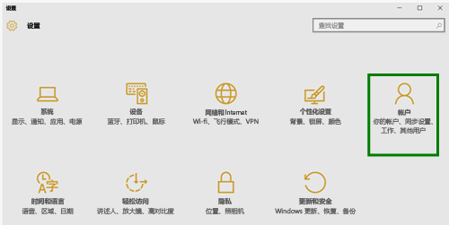
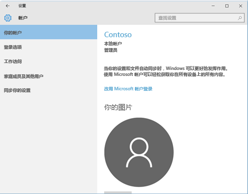
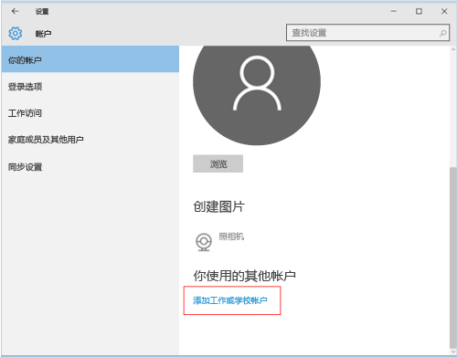
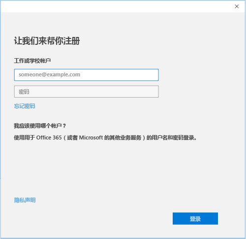

---
# required metadata

title: 在 Intune 中注册 Windows 10 移动版或 Windows 10 桌面版设备 | Microsoft Intune
description:
keywords:
author: Staciebarker
manager: jeffgilb
ms.date: 05/11/2016
ms.topic: article
ms.prod:
ms.service: microsoft-intune
ms.technology:
ms.assetid: 36250832-c6fd-4e8d-b681-de735023ebc3

# optional metadata

#ROBOTS:
#audience:
#ms.devlang:
ms.reviewer: priyar
ms.suite: ems
#ms.tgt_pltfrm:
#ms.custom:

---

# 在 Intune 中注册 Windows 10 移动版或 Windows 10 桌面版设备

如果你的公司或学校使用 Microsoft Intune，则可以注册设备以获取对公司电子邮件、文件和其他资源的访问权限。 通过注册设备可以使组织保护公司数据的安全。 若要了解有关注册的详细信息，请参阅[安装公司门户应用并在 Intune 中注册设备后会发生什么？](what-happens-if-you-install-the-company-portal-app-and-enroll-your-device-in-intune-windows.md)和 [IT 管理员在你的设备上可以看到和不可以看到的内容](what-can-your-it-administrator-see-when-you-enroll-your-device-in-intune-windows.md)。

注册 Windows 10 移动版或 Windows 10 桌面版设备：

1.  转到 Windows“设置”，然后点击“帐户”。

    

2.  点击“你的帐户”。

    

3.  点击“添加工作单位或学校帐户”。

    

4.  使用工作单位或学校凭据登录。

    

如果遵循了以上步骤，但仍不能访问你的工作单位或学校电子邮件、文件和其他数据，请返回到“帐户”并点击“工作单位访问”。

-   如果你看到你的工作单位或学校帐户，那么恭喜你。 你已连接。

-   如果看不到工作单位或学校帐户，请点击“连接”，然后使用工作单位或学校凭据登录。

我们还建议你安装公司门户应用，通过该应用，你可以轻松地识别和获取与你和你的角色相关的公司应用。 根据公司配置 Intune 的方式，公司门户应用可能已在注册过程中安装。 若要检查你是否具有该应用，请在应用列表中查找“公司门户”。 如果未在应用列表中看到“公司门户”，请按照这些步骤安装它。

1.  点击**开始** &gt; **应用商店**。

2.  点击“搜索”，然后输入“公司门户”。

3.  在结果列表中，点击**公司门户** &gt; **安装**。

4.  点击“安装”或“释放”。 显示的选项取决于公司配置该应用的方式。

仍需要帮助？ 请与你的 IT 管理员联系。 有关他们的联系信息，请查看[公司门户网站](http://portal.manage.microsoft.com)。

### 另请参阅
[在 Intune 中注册 Windows 设备](enroll-your-device-in-intune-windows.md) 
[通过 Intune 使用 Windows 设备](using-your-windows-device-with-intune.md)

<!--HONumber=Jun16_HO2-->

