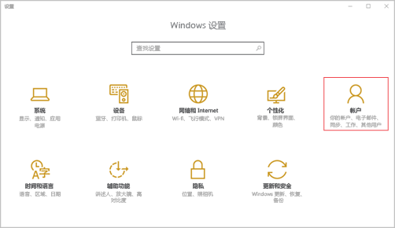
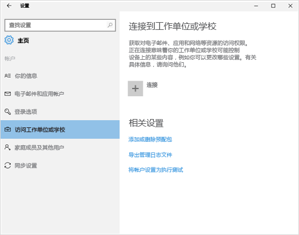
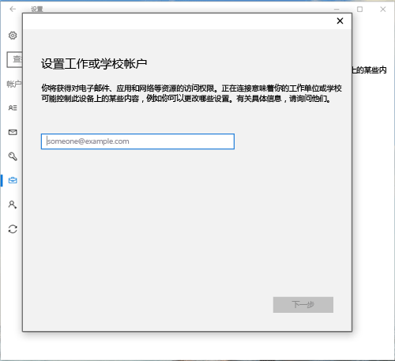
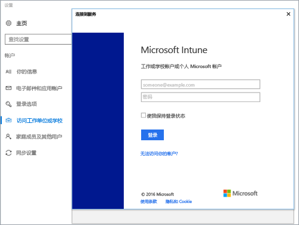
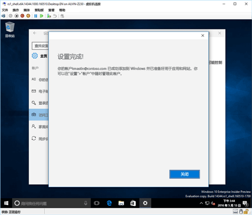
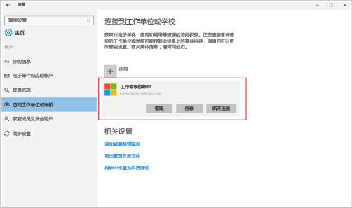

# 在 Intune 中注册 Windows 10 移动版或 Windows 10 桌面版设备

如果你的公司或学校使用 Microsoft Intune，则可以注册设备以获取对公司电子邮件、文件和其他资源的访问权限。 通过注册设备可以使组织保护公司数据的安全。 若要了解有关注册的详细信息，请参阅[安装公司门户应用并在 Intune 中注册设备后会发生什么？](what-happens-if-you-install-the-company-portal-app-and-enroll-your-device-in-intune-windows.md)和 [IT 管理员在你的设备上可以看到和不可以看到的内容](what-can-your-it-administrator-see-when-you-enroll-your-device-in-intune-windows.md)。

注册 Windows 10 移动版或 Windows 10 桌面版设备：

1.  转到 Windows “**设置**”，然后点击“**帐户**”。

    

2.  查看接下来的两个屏幕，并找到与你在设备上看到的屏幕相似的屏幕。 按照与你在设备上看到的屏幕相匹配的步骤操作。

    如果你看到此屏幕，请按照[看到“访问工作单位或学校”时要执行的步骤](#steps-to-follow-if-you-see-access-work-or-school)中的说明操作。

    

    如果你看到此屏幕，请按照[看到“你的帐户”时要执行的步骤](#steps-to-follow-if-you-see-your-account)中的步骤操作。

    

## 看到“访问工作单位或学校”时要执行的步骤

1.  点击“访问工作或学校”，然后点击“连接”。

    

2.  输入你的工作或学校电子邮件地址，然后点击“**下一步**”。

    

3. 使用你的工作或学校帐户登录 Intune。

    

    你将看到指示你的公司或学校正在注册你的设备的消息。

4. 当你看到**设置完成!** 屏幕时，点击“**关闭**”。 大功告成。

  

5. 如果要再次确认是否已正确连接，请返回到“**设置**”，现在应该可以看到列出的工作或学校帐户。

    

如果执行了之前的步骤，但仍无法访问你的工作或学校电子邮件帐户和文件，请按照[看到“访问工作单位或学校”时要执行的故障排除步骤](troubleshoot-your-windows-10-device-windows.md#troubleshooting-steps-to-follow-if-you-see-access-work-or-school)中的步骤操作。

## 看到“你的帐户”时要执行的步骤

1.  转到 Windows“**设置**”，然后点击“**帐户**”。

    

2.  点击“你的帐户”。

    

3.  点击“添加工作单位或学校帐户”。

    

4.  使用工作单位或学校凭据登录。

    

如果执行了之前的步骤，但仍无法访问你的工作或学校电子邮件地址、文件或其他数据，则尝试执行[看到“你的帐户”时要执行的故障排除步骤](troubleshoot-your-windows-10-device-windows.md#troubleshooting-steps-to-follow-if-you-see-your-account)中的说明。

我们还建议你安装公司门户应用，通过该应用，你可以轻松地识别和获取与你和你的角色相关的公司应用。 根据公司配置 Intune 的方式，公司门户应用可能已在注册过程中安装。

若要验证你是否具有该应用，请在应用列表中查找“**公司门户**”。 如果未在应用列表中看到“公司门户”，请按照这些步骤安装它。

1.  点击**开始** &gt; **应用商店**。

2.  点击“**搜索**”，然后键入“**公司门户**”。

3.  在结果列表中，点击**公司门户** &gt; **安装**。

4.  点击“安装”或“释放”。 显示的选项取决于公司配置该应用的方式。

仍需要帮助？ 请与你的 IT 管理员联系。 有关他们的联系信息，请查看[公司门户网站](http://portal.manage.microsoft.com)。

<!--HONumber=Oct16_HO1-->

