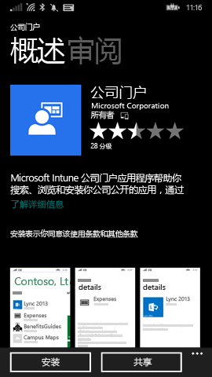
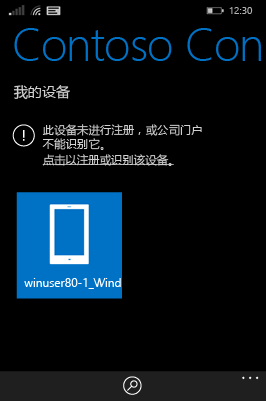

# 在 Intune 中注册 Windows Phone 8.1 设备

如果你的公司或学校使用 Microsoft Intune，则可以注册设备以获取对公司电子邮件、文件和其他资源的访问权限。 通过注册设备可以使组织保护公司数据的安全。 若要了解有关注册的详细信息，请参阅[安装公司门户应用并在 Intune 中注册设备后会发生什么？](what-happens-if-you-install-the-company-portal-app-and-enroll-your-device-in-intune-windows.md)和 [IT 管理员在你的设备上可以看到和不可以看到的内容](what-can-your-it-administrator-see-when-you-enroll-your-device-in-intune-windows.md)。

若要在 Intune 中注册 Phone 8.1 设备，请按照适用于你公司或学校的说明进行操作：

-   [如果公司允许你从 Windows 应用商店使用公司门户](#if-your-company-lets-you-use-the-company-portal-from-the-windows-store)

-   [如果不允许你从 Windows Phone 访问 Windows 应用商店或者你没有 Microsoft 帐户](#if-you-are-not-allowed-to-access-the-windows-store-from-your-windows-phone-or-if-you-do-not-have-a-microsoft-account)

## 如果公司允许你从 Windows 应用商店使用公司门户
在设备上安装公司门户应用：

1.  点击**开始** &gt; **应用商店**。

2.  点击“搜索”，然后输入“公司门户”。

3.  在结果列表中，点击“公司门户”。

    

4.  点击**公司门户** &gt; **安装**。

    

注册设备：

1.  在设备上，打开“Microsoft Intune 公司门户”应用。

2.  提供你的凭据。 可能会要求你接受公司的条款和条件（如果适用）。

3.  轻扫到“我的设备”。

4.  点击“点击以注册或识别该设备”。

    

5.  点击“注册此设备”。

    

6.  点击“添加帐户”。

    

7.  按照请求输入其他信息，然后点击“登录”完成注册。 现在你应该可以在**设置** &gt; **工作区**页面上看到你的工作区帐户。

    

## 如果不允许你从 Windows Phone 访问 Windows 应用商店或者你没有 Microsoft 帐户

1.  点击**设置** &gt; **工作区**。

2.  点击“添加帐户”，然后使用工作单位帐户登录。

3.  按照请求输入其他信息，然后点击“登录”完成注册。

4.  如果提示安装企业应用或中心，请确保选中相关复选框，然后点击“完成”。

如果你的 IT 管理员已将公司门户配置为在注册过程中进行安装，则你的应用列表中将显示公司门户。

仍需要帮助？ 请与你的 IT 管理员联系。 有关他们的联系信息，请查看[公司门户网站](http://portal.manage.microsoft.com)。

<!--HONumber=Aug16_HO5-->

