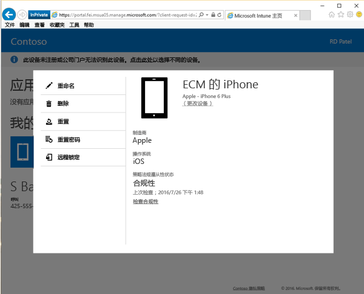
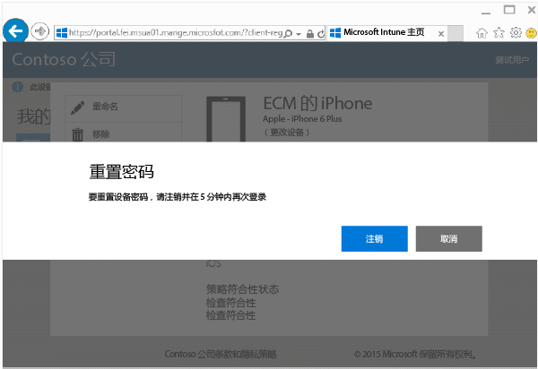
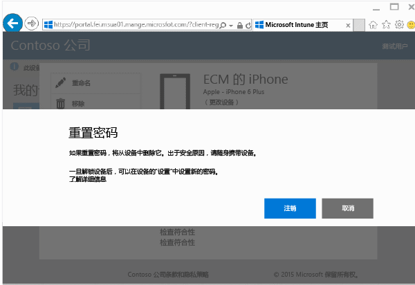

# 从公司门户网站重置设备密码

如果丢失了设备 PIN 或在 Intune 中注册的设备的密码，则可以使用[公司门户网站](http://portal.manage.microsoft.com)进行重置。 公司门户网站是一个网页，可以用于管理计算机和在 Intune 中注册的设备，还可以在使用公司门户应用时用它来处理你可以执行的大多数相同任务。

> [!NOTE]
> 公司门户网站上可能不会显示“重置密码”按钮，这具体取决于 IT 管理员配置 Intune 的方式。 Windows 8.1 和 Windows RT 设备不支持密码重置。

重置密码：

1.  打开[公司门户网站](http://portal.manage.microsoft.com)，然后点击要重置其密码的设备。

2.  点击**重置密码**。

    

3.  点击“注销”，然后使用工作或学校凭据重新登录。 必须在五分钟内重新登录。

    

4.  点击**重置密码**。

    

    检查此表以了解“重置密码”在设备上的工作方式。

    |平台|Support|
    |------------|-----------|
    |Android|创建新的临时字母数字密码。|
    |iOS|从设备删除密码且不会创建新的临时密码。 如果使用的是 Touch ID，则需要在设备上对其进行重新设置，因为重置密码时会将其删除。|
    |Windows 10（仅适用于移动设备）|创建新的临时字母数字密码。 支持 Windows Hello。|
    |Windows Phone 8.1|创建新的临时数字密码。|
    解锁设备后，可以转到设备上的“设置”来设置新密码。

5.  解锁设备，然后通过转到设备上的“设置”来设置新密码或更改临时密码。

    若要查看确认密码已重置成功的通知，请单击公司门户网站右上角的通知标志。

仍需要帮助？ 请与你的 IT 管理员联系。 有关他们的联系信息，请查看[公司门户网站](http://portal.manage.microsoft.com)。

<!--HONumber=Sep16_HO3-->

