---
# required metadata

title: 手动同步设备 | Microsoft Intune
description:
keywords:
author: Staciebarker
manager: jeffgilb
ms.date: 05/18/2016
ms.topic: article
ms.prod:
ms.service: microsoft-intune
ms.technology:
ms.assetid: 443c6de7-5187-4dc4-b844-6085a0c659bd

# optional metadata

#ROBOTS:
#audience:
#ms.devlang:
ms.reviewer: priyar
ms.suite: ems
#ms.tgt_pltfrm:
#ms.custom:

---

# 手动同步设备
如果你的应用安装时间过长，请按照以下说明手动同步你的 Windows 设备，这可能有助于加快安装速度。 仅支持列出的版本。 使用以上“本文内容”部分中所示且与你正在使用的设备类型匹配的链接：

* [Windows 10 移动版](#windows-10-mobile)
* [Windows 10 桌面版](#windows-10-desktop)
* [Windows Phone 8.1](#windows-phone-8-1)

## Windows 10 移动版
若要手动同步你的 Windows 10 移动设备，以加快较慢的应用安装的速度：

1. 请转到**所有应用**  >  **设置**  >  **帐户**。

    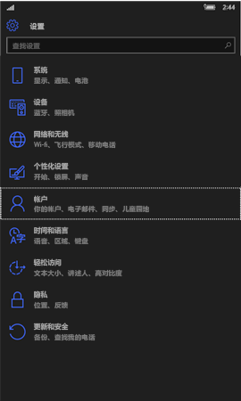
    
2. 点击**工作单位访问**。

    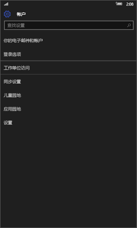
    
3. 在**注册到设备管理**下，点击你的公司名称，如下所示。

    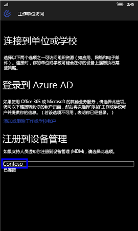
    
4. 点击“同步”图标。

    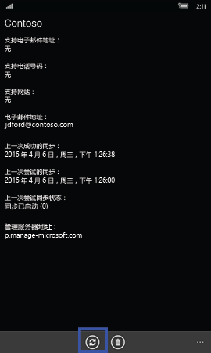
    
    屏幕顶部将显示“我们正在同步你的帐户”消息。 设备完成同步前，“同步”按钮将灰显。

## Windows 10 桌面版
若要手动同步你的 Windows 10 桌面设备，以加快较慢的应用安装的速度：

1. 选择**启动**按钮，如下所示，然后选择**设置**。

    
    
2. 在**设置**页上，选择**帐户**。
 
    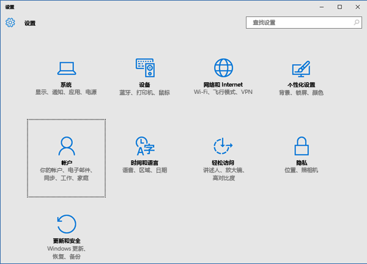
    
3. 在**帐户**页上，选择**工作单位访问**。
    
    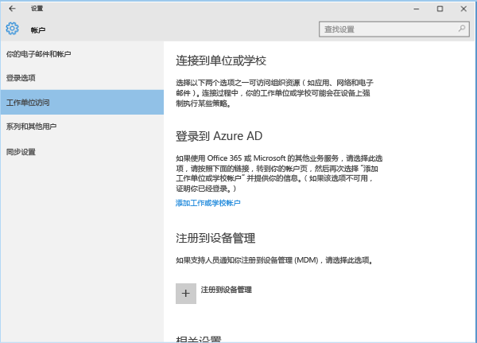
    
4. 在**注册到设备管理**部分下，单击你的公司名称，如以下蓝色突出所示。
    
    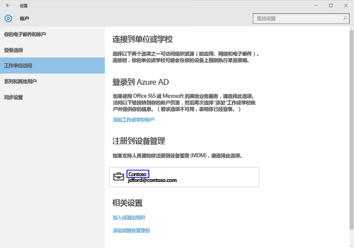
   
5. 选择“同步”按钮。
    
    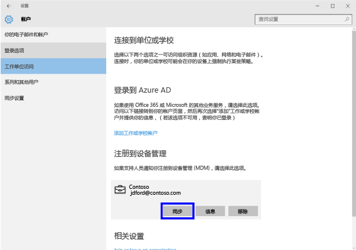
   
   在同步完成之前，按钮将变为灰显。

## Windows Phone 8.1
若要手动同步你的 Windows Phone 8.1 设备，以加快较慢的应用安装的速度：

1. 请转到**所有应用**  >  **设置**  >  **工作区**。

    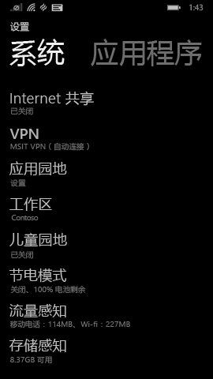
    
2. 点击你公司的名称，如下面的蓝色突出所示。

    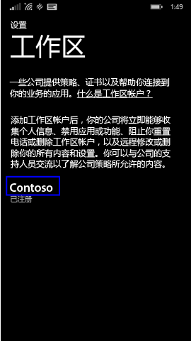
   
3. 点击“同步”图标。

    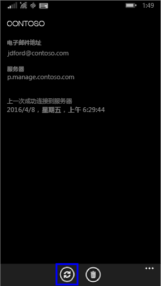
    
   设备完成同步前，屏幕顶部将显示“我们正在同步你的帐户”消息。

### 另请参阅
[通过 Intune 使用 Windows 设备](using-your-windows-device-with-intune.md)

<!--HONumber=Jun16_HO1-->

