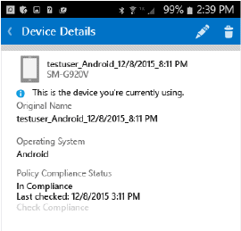

# 从 Intune 取消注册 Android 设备

当从 Intune 取消注册你的 Android 设备时，该设备无法再访问公司资源。  若要了解取消注册设备后会发生什么情况，请参阅[从 Intune 取消注册设备会发生什么情况？](what-happens-if-you-unenroll-your-device-from-intune-android.md)。

若要从 Intune 取消注册设备并卸载公司门户应用，请按照下列步骤操作或观看此视频：

<iframe width="675" height="379" src="https://www.youtube.com/embed/K-Vi7lNfaMk" frameborder="0" allowfullscreen></iframe>

1.  登录到公司门户应用。

2.  点击“我的设备”，然后选择要取消注册的设备。

    

3.  点击回收站图标。

    

4.  在警告页上，点击“确定”以取消注册你的设备。

    

仍需要帮助？ 请与 IT 管理员联系。 有关联系信息，请查看[公司门户网站](http://portal.manage.microsoft.com)。

<!--HONumber=Dec16_HO3-->

