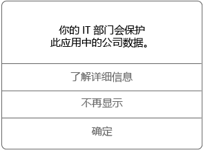

# 在 Android 设备上使用托管应用

托管应用是这样的应用，你的 IT 管理员可对其进行配置以帮助保护你在该应用中可访问的公司数据。 在 Android 设备的托管应用中访问公司数据时，你可能会注意到此应用与你预期的运作方式有些许不同。 例如，你可能无法复制和粘贴受保护的公司数据，或者你可能无法将该数据保存到特定位置。

不同的托管应用也可以在设备上协同工作，使你能在处理日常任务的同时始终保护公司数据。 例如，如果你在一托管应用中打开了一份公司文件，但是需打开另一托管应用才能查看该文件，则系统会自动打开后者以允许你查看该文件。 如果所需应用不可用，则某些特定操作（如打开文档或从托管文档中访问 Web 链接）可能不可用。

在托管应用中访问公司数据时，你会看到如下所示的消息，告知你将打开的应用是托管应用。

## 如何获取托管应用？
你可通过以下几种不同的方式获取托管应用：

-   如果已在 Microsoft Intune 中注册设备，则你可以从公司门户应用或公司门户网站安装应用，或者可由 IT 管理员将其安装到你的设备。 若要了解相关注册信息，请参阅[在 Intune 中注册设备](enroll-your-device-in-Intune-android.md)。

-   从 Play Store 安装应用，然后使用由 Intune 管理的公司用户帐户登录该应用。

## IT 管理员可以管理应用中的哪些内容？
以下是 IT 管理员可管理的应用中的一些选项示例，它们可影响你与你设备上公司数据的交互：

-   对特定网站的访问

-   应用程序之间的数据传输

-   保存文件

-   复制和粘贴操作

-   PIN 访问要求

-   使用公司凭据登录

-   将数据备份到云的能力

-   截取屏幕截图的能力

-   数据加密要求

IT 部门可能管理的常见应用程序有：

-   Intune 托管浏览器

-   Intune 图像查看器

-   Intune PDF 查看器

-   Intune AV 播放器

-   Microsoft Word、Excel、PowerPoint

有关设备上的托管应用的详细信息，请联系你的 IT 部门。 有关他们的联系信息，请查看[公司门户网站](http://portal.manage.microsoft.com)。

### 另请参阅
[通过 Intune 使用 Android 设备](using-your-android-device-with-intune.md)

<!--HONumber=Aug16_HO4-->

