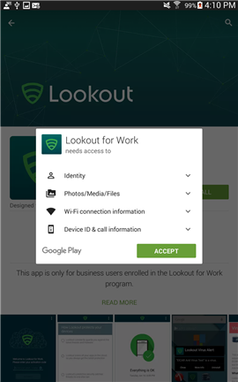

# 系统会提示你安装 Lookout for Work

在可访问工作之前，IT 管理员要求你安装 Lookout for Work 应用，该应用会查找潜在安全威胁来帮助保护你的设备。

如果遇到安装问题，请尝试本主题末尾的疑难解答步骤。

**需要执行的操作：**

1.  从屏幕顶部向下拖动以打开“通知”栏，然后点击“所需应用程序 — 从 Play Store 安装 Lookout for Work”。

    

    将转至 Play Store 中的 Lookout for Work 安装页。

2.  安装 Lookout for Work，然后点击“接受”以便 Lookout for Work 可访问设备。

    

3. 打开 Lookout for Work，然后点击“激活”。

    

4. 点击“使用 Azure Active Directory 登录”，然后输入用于访问工作/学校电子邮件和文件的帐户。

    

5. 选择用于访问工作或学校电子邮件和文件的帐户，然后点击“添加帐户”。

    

6. 点击“接受”以授予 Lookout for Work 让你登录并读取个人资料的权限。

    

    屏幕将显示 Lookout for Work 正在连接到 Lookout 安全云。

7. 查看关于 Lookout 如何保护设备的项，然后点击“确定”。

    

    看到以下屏幕时，Lookout 当前已安装完毕且处于连接状态。

    

    Lookout for Work 将立即开始检查设备上的安全威胁。 如果未找到任何威胁，将看到以下屏幕。

    

    公司门户中的“设备详细信息”屏幕将显示你当前符合你公司的安全要求。

    

    如果 Lookout for Work 在设备上找到安全威胁，那么你将看到有关如何解决此问题的说明。

**如果安装不成功**

有时安装可能会因不可控的技术问题而失败。 如果发生这种情况，请尝试从 Play Store [https://play.google.com/store/apps/details?id=com.lookout.enterprise](https://play.google.com/store/apps/details?id=com.lookout.enterprise) 手动安装 Lookout for Work 

仍需要帮助？ 请与 IT 管理员联系。 有关联系信息，请查看[公司门户网站](http://portal.manage.microsoft.com)。

<!--HONumber=Nov16_HO1-->

