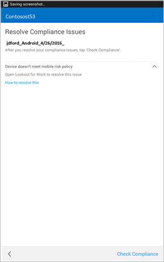

# 需要解决 Lookout for Work 发现的威胁

Lookout for Work 在设备上发现潜在威胁，必须解决该问题才能重新获取电子邮件和工作的访问权限。

## 如果已注册设备在访问电子邮件或文件时受阻，你可能会收到什么提示

如果已注册设备上存在病毒或其他安全威胁，并且你尝试访问公司或学校电子邮件或文件，可能会看到如下消息：

点击“**设备管理门户**”链接转到[公司门户网站](http://portal.manage.microsoft.com)，在该网站上你将会看到有关如何修复此问题的说明。

## Lookout for Work 将其视为威胁的应用示例

若安装了 Lookout for Work 视为威胁的应用，则将看到类似如下的屏幕：

卸载该应用后，你能立即重新访问电子邮件和其他公司或学校数据。 如果忽略卸载该应用的请求，你将无法对电子邮件和数据进行访问，直到卸载该应用。

仍需要帮助？ 请与你的 IT 管理员联系。 有关他们的联系信息，请查看[公司门户网站](http://portal.manage.microsoft.com)。

<!--HONumber=Sep16_HO2-->

