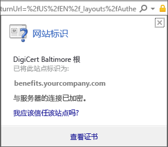
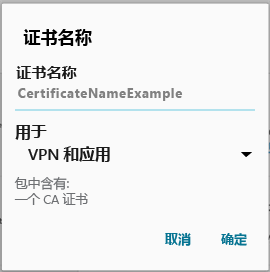

# 你的 Android 设备缺少 IT 管理员所需的证书

如果设备未在 Intune 中注册，并且缺少 IT 管理员所需的特定证书，则无法登录到公司门户应用。 在尝试登录时，你将看到以下消息：

若要解决此问题并获取所需的证书，需要执行两个主要步骤：

- 通过查看公司或学校的电脑来标识缺少的证书。
- 使用你的设备从 Internet 下载缺少的证书。

## 通过查看公司或学校的电脑来标识缺少的证书

1. 在电脑上，打开 Internet Explorer。 如果没有用于此目的的电脑，请与 IT 管理员联系。 若要查找 IT 管理员的联系信息，请查看[公司门户网站](http://portal.manage.microsoft.com)。

2. 转到[公司门户网站](http://portal.manage.microsoft.com)，并使用你的工作或学校凭据登录。

3. 在浏览器地址栏的最右侧，选择类似于挂锁的符号，如下面的屏幕截图所示。

    

    如果未看到挂锁符号，请停止操作并与 IT 管理员联系。 锁意味着你已安全登录，所以在没有看到该符号前请不要继续进行操作。

4. 选择“查看证书”。

    

5. 在“证书”对话框中，选择“证书路径”选项卡，然后标识需要从 Internet 获取的证书。 所需证书的名称将显示在与上一示例屏幕截图中突出显示的位置相同的位置上。

## 在你的 Android 移动设备上下载并安装缺少的证书。

1. 使用搜索引擎（如必应或 Google），搜索你在之前部分标识的所缺少证书的名称。 该证书可能以不同的扩展名结尾，如“.crt”或“.pem”等。

2. 从网站下载根证书。

3. 证书下载后，从你的设备顶部向下拖动以打开你的通知，然后在通知列表中点击证书的名称。

4. 在如下面的屏幕截图中所示的“命名证书”对话框中，接受默认的证书名称。

5. 确保**凭据使用**设置为**用于 VPN 和应用**，然后点击**确定**。

    

6. 关闭公司门户应用。

7. 重新打开公司门户应用。 现在应能够登录到公司门户应用。 如果需要帮助，请与 IT 管理员联系。

如果看到相同的“缺少证书”消息（如之前所示），且已经按照步骤执行了操作，说明可能存在另一个需要 IT 管理员帮助你安装的证书。 请使用[公司门户网站](http://portal.manage.microsoft.com)上可用的联系信息，联系 IT 管理员获取帮助。

