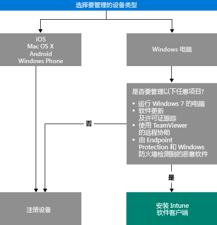

# 选择如何管理设备

若要利用 Intune 提供的各种功能（如应用部署和设备设置控制），设备必须处于被*管理*。 如何管理设备取决于你想要使用的 Intune 功能。
本主题将帮助你选择所需方法。

若要管理运行 iOS、Mac OS X、Android 或 Windows Phone 的设备，必须*注册*这些设备。

管理 Windows 电脑有两种方式可供选择：

1. 注册设备**或**
2. 安装 *Intune 软件客户端*。

## 确定使用哪种方法
使用此决策流确定如何管理设备。

注册 Windows 电脑以获取尽可能多的功能。 但是，在下列情况下，Intune 软件客户端可能更适合你的需求：

- 电脑运行的是 Windows 7 系统
- 你想要管理 Windows 软件更新和许可证使用情况
- 你想要使用 Endpoint Protection 和 Windows 防火墙来管理恶意软件
- 你想要使用 TeamViewer 软件为用户提供远程协助

有关每种方法提供的管理功能的详细列表，请参阅[移动设备管理功能](mobile-device-management-capabilities-in-microsoft-intune.md)和 [Intune 电脑软件客户端功能](windows-pc-management-capabilities-in-microsoft-intune.md)。
有关 Intune 支持的设备和电脑的信息，请参阅[支持的移动设备和电脑](/intune/get-started/supported-mobile-devices-and-computers)

## Exchange ActiveSync 管理
除了注册设备或安装 Intune 软件客户端外，还可以[使用 Exchange ActiveSync](/intune/deploy-use/mobile-device-management-with-exchange-activesync-and-microsoft-intune) 来管理设备。 若要使用 Exchange ActiveSync 管理设备，此方法需要你安装本地连接器或使用内置服务间连接器来连接到 Exchange Server。
尽管这是管理设备的第三种方法，但与其他方法相比，它提供了一组有限的管理功能。

## 后续步骤

- [选择如何注册移动设备](/intune/get-started/choose-how-to-enroll-devices1)
- [使用 Intune 电脑客户端软件管理 Windows 电脑](/intune/deploy-use/manage-windows-pcs-with-microsoft-intune)

- [使用 Microsoft Intune 管理 Exchange ActiveSync 移动设备](/intune/deploy-use/mobile-device-management-with-exchange-activesync-and-microsoft-intune)。

<!--HONumber=Nov16_HO1-->

