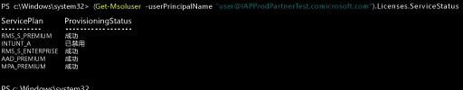

# 管理 Intune 许可证
在用户登录以使用 Intune 服务或将设备注册到管理组件之前，你必须先使用 [Office 365 门户](http://go.microsoft.com/fwlink/p/?LinkId=698854)为每个用户分配一个你的 Intune 订阅的许可证。 分配许可证后，用户的名称将显示在 Intune 管理控制台中。 然后，用户最多可以注册十五个设备。

使用 Microsoft 的企业移动性套件 (EMS) 的组织可能会有只需要 Azure Active Directory Premium 或 EMS 包中的 Intune 服务的用户。 你可以使用 [Azure Active Directory PowerShell cmdlet](https://msdn.microsoft.com/library/jj151815.aspx) 分配一个或一部分服务。 有关详细信息，请参阅 [Manage Intune licenses using PowerShell](start-with-a-paid-subscription-to-microsoft-intune-step-4-posh.md)（使用 PowerShell 管理 Intune 许可证）。

## 如何分配 Intune 许可证
当从本地上 Active Directory 同步用户帐户或通过 [Office 365 门户](http://go.microsoft.com/fwlink/p/?LinkId=698854)将用户帐户手动添加到云服务订阅时，将不会为用户帐户自动分配 Intune 许可证。 相反，Intune 租户管理员必须稍后编辑用户帐户才能从 Office 365 门户中向用户分配许可证。

如果你的订阅与订阅的其他关联云服务共享 Azure AD，则你可以访问已添加到那些服务的用户。 在你为每个用户分配许可证之前，这些用户将没有 [!INCLUDE[wit_nextref](../includes/wit_nextref_md.md)] 的许可证。

> [!TIP]
> 如果禁用了用于分配或吊销 [!INCLUDE[wit_nextref](../includes/wit_nextref_md.md)] 许可证的选项，则你的订阅可能包括批量许可选项，例如在使用[企业移动性套件](https://www.microsoft.com/en-us/server-cloud/enterprise-mobility/overview.aspx)时可用的选项。 有关如何分配或吊销许可证的信息，请参阅你的许可选项的文档。

## 分配 Intune 用户许可证

使用 [Office 365 门户](http://go.microsoft.com/fwlink/p/?LinkId=698854)手动添加基于云的用户并将许可证分配给基于云的用户帐户和从本地 Active Directory 同步到 Azure AD 的帐户。

1.  使用你的租户管理员凭据登录到 [Office 365 门户](http://go.microsoft.com/fwlink/p/?LinkId=698854)，然后选择“人员” > “所有用户”。

2.  选择你想要为其分配 Intune 用户许可证的用户帐户，然后选择 **Microsoft Intune**（独立版）或**企业移动性套件**。

3.  现在，该用户帐户拥有所需的权限，可以使用该服务并在管理组件中注册设备。

### 使用 PowerShell 来选择性地管理 EMS 用户许可证
使用 Microsoft 的企业移动性套件 (EMS) 的组织可能会有只需要 Azure Active Directory Premium 或 EMS 包中的 Intune 服务的用户。 你可以使用 [Azure Active Directory PowerShell cmdlet](https://msdn.microsoft.com/library/jj151815.aspx) 分配一个或一部分服务。

若要有选择性地为 EMS 服务分配用户许可证，请使用已安装的[用于 Windows PowerShell 的 Azure Active Directory 模块](https://msdn.microsoft.com/library/jj151815.aspx#bkmk_installmodule)在计算机上以管理员身份打开 PowerShell。 你可以在本地计算机或 ADFS 服务器上安装 PowerShell。

必须创建仅应用于所需服务计划的新许可证 SKU 定义。 若要执行此操作，请禁用不想应用的计划。 例如，你可以创建一个不分配 Intune 许可证的许可证 SKU 定义。 若要查看从可用服务的列表，请键入：

    (Get-MsolAccountSku | Where {$_.SkuPartNumber -eq "EMS"}).ServiceStatus

你可以运行下面的命令来排除 Intune 服务计划。 你可以使用相同的方法来扩展整个安全组，或者使用更精细的筛选器。

**示例 1** 在命令行上创建一个新用户，并在不启用许可证的 Intune 部分的情况下分配一个 EMS 许可证：

    Connect-MsolService

    New-MsolUser -DisplayName “Test User” -FirstName FName -LastName LName -UserPrincipalName user@<TenantName>.onmicrosoft.com –Department DName -UsageLocation US

    $CustomEMS = New-MsolLicenseOptions -AccountSkuId "<TenantName>:EMS" -DisabledPlans INTUNE_A
    Set-MsolUserLicense -UserPrincipalName user@<TenantName>.onmicrosoft.com -AddLicenses <TenantName>:EMS -LicenseOptions $CustomEMS

验证方式：

    (Get-MsolUser -UserPrincipalName "user@<TenantName>.onmicrosoft.com").Licenses.ServiceStatus

**示例 2** 为已获得许可证的用户禁用 EMS 许可证的 Intune 部分：

    Connect-MsolService

    Set-MsolUserLicense -UserPrincipalName user@<TenantName>.onmicrosoft.com -RemoveLicenses IAPProdPartnerTest:EMS

    $CustomEMS = New-MsolLicenseOptions -AccountSkuId "<TenantName>:EMS" -DisabledPlans INTUNE_A
    Set-MsolUserLicense -UserPrincipalName user@<TenantName>.onmicrosoft.com -AddLicenses <TenantName>:EMS -LicenseOptions $CustomEMS

验证方式：

    (Get-MsolUser -UserPrincipalName "user@<TenantName>.onmicrosoft.com" .Licenses.ServiceStatus

### 后续步骤
祝贺你！ 你刚刚完成了 *Intune 快速入门指南*的步骤 4。
>[!div class="step-by-step"]

>[&larr; **将用户同步到 Intune**](.\start-with-a-paid-subscription-to-microsoft-intune-step-2.md)     [**组织用户和设备** &rarr;](.\start-with-a-paid-subscription-to-microsoft-intune-step-5.md)  

<!--HONumber=Jul16_HO5-->

