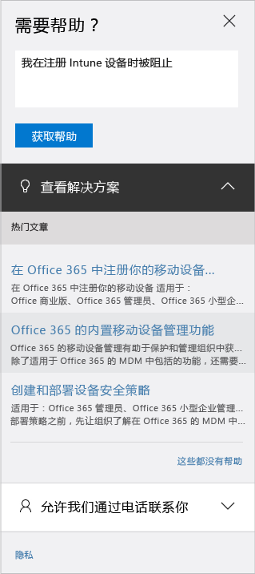

# 如何获取对 Microsoft Intune 的管理支持

[!INCLUDE[classic-portal](../includes/classic-portal.md)]

Microsoft 对 Microsoft Intune 提供全球技术、售前、帐单和订阅支持。 对于付费订阅和试用订阅，均通过在线和电话两种方式提供支持。 在线技术支持可通过英语和日语提供。 电话支持和联机帐单支持可使用其他语言。

Intune 支持，以及通过 Configuration Manager 进行的 Intune 支持都免费。 顶级支持客户需要支付程序问题（例如，如何配置 Intune 功能）方面的费用。

## 创建在线服务票证

1.  使用你的 Intune 凭据登录到 [Office 365 管理中心](https://portal.office.com)。
    >[!NOTE]
    >
    >顶级支持客户可在[顶级支持页](https://support.microsoft.com/en-us/premier/contacts)上打开 Intune 支持票证。

2.  选择“管理员”磁贴。
3.  在左侧的“支持”下，选择“支持”创建票证。

    

    >[!NOTE]
    >  拥有或曾经拥有 O365 帐户且许可证数不超过 100 的客户将看到此消息。 如果看到此消息，请参阅[通过备用方法创建支持票证](#create-a-support-ticket-with-alternate-methods)。

    > 

    -   对于帐单、授权和帐户问题，请选择“帐单和产品信息”。

    -   对于所有其他 Intune 问题，请选择“移动设备管理”。

    > [!NOTE]
    > 若要查看所有类别，可能需选择列表底部的“更多”。

3.  按照说明打开请求。

### 通过备用方法创建支持票证

如果支持页外观是如下所示，请执行以下步骤：

1. 选择“需要帮助”。
2. 在文本框中，填写问题说明，然后选择“获取帮助”。

    

3. 查看建议的联机资源，或选择“呼叫服务”获取 Microsoft 技术支持的呼叫服务。

## 获取电话支持
请参阅[联系 Microsoft Intune 的辅助电话支持](contact-assisted-phone-support-for-microsoft-intune.md)了解各个国家和地区的支持电话号码、支持时间和各个地区所支持的语言。

## 跟踪服务请求
1.  使用你的 Intune 凭据登录到 [Office 365 管理中心](https://portal.office.com)。
2.  选择“管理员”磁贴。
3.  在左侧的“支持”下，选择“服务请求”。 然后即可查看请求。

我们对服务请求的初始响取决于问题的严重程度。 对专业客户非常严重的问题，会在两小时内做出初始响应。 对于顶级支持客户，响应时间根据支持协议而有所不同。 下面是一些示例：

- 一个或多个服务无法访问或不可用。
- 生产、操作或部署截止时间受到严重影响，或者将会对生产或盈利能力产生严重影响。
- 多个用户或服务受到影响。

对专业客户较严重的问题，会在四小时内做出初始响应。 对于顶级支持客户，响应时间根据支持协议而有所不同。  下面是一些示例：

- 该服务可用，但无法像往常一样正常工作。
- 情况会对业务产生中等程度的影响，并可在营业时间内得到处理。
- 单一用户、客户或服务受到部分影响。

对专业客户的其他问题，会在八小时内做出初始响应。 对于顶级支持客户，响应时间根据支持协议而有所不同。  下面是一些示例：

- 情况对业务的影响很小。
- 问题很重要，但不会对客户的当前服务或工作效率产生明显影响。
- 单一用户会体验到部分中断情况，但有可接受的解决方法。

> [!NOTE]
> **如果使用 Microsoft System Center Configuration Manager** 或 **Microsoft System Center Endpoint Protection：**有关 Configuration Manager 或 Endpoint Protection 的技术支持，请与合作伙伴联系，或访问 [Microsoft System Center Configuration Manager 和 System Center Endpoint Protection 解决方案中心](http://www.microsoft.com/en-us/server-cloud/products/system-center-2012-r2/resources.aspx)查找丰富的自助式材料。 它还提供通过在线方式或通过电话创建支持请求的选项。
>
> System Center Configuration Manager 或 System Center Endpoint Protection 的技术支持需要付款，或者它将计为你现有的许可协议或顶级支持协议的递减。

## 不创建支持票证解决问题

可能无需创建支持票证自己就可以解决问题。

有关 Intune 的自助式服务，请参阅[有关 Microsoft Intune 的常规疑难解答提示](general-troubleshooting-tips-for-microsoft-intune.md)或针对特定问题的任何疑难解答主题。 此外，你可以搜索解决方法，或在 [Intune 论坛](https://social.technet.microsoft.com/Forums/en-US/home?forum=microsoftintuneprod)上发布你的问题。

## 查找批量许可支持
如果已通过批量许可计划向 Microsoft 购买了许可证，请使用下列资源获得支持：

-   要获得与许可证相关的支持以及查找密钥，请参阅[批量许可服务中心](http://go.microsoft.com/fwlink/p/?LinkID=282016)。

-   对于帐单问题，请参阅[帐单和订阅管理支持](http://support.microsoft.com/oas/default.aspx?prid=15371)。

-   有关批量许可的一般信息，请参阅[批量许可](http://go.microsoft.com/fwlink/p/?LinkID=282015)。

<!--HONumber=Dec16_HO2-->

