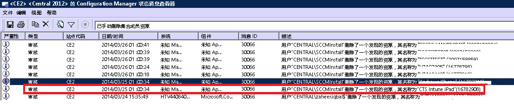

# 排查 Intune 中的设备注册问题

本主题提供有关设备注册问题故障排除的建议。 如果此信息未解决你的问题，请参阅[如何获取对 Microsoft Intune 的支持](how-to-get-support-for-microsoft-intune.md)，了解更多获得帮助的方法。

## 初始故障排除步骤

开始故障排除之前，请检查确保你已正确配置 Intune 以启用注册。 可以在此处了解这些配置要求：

-   [为在 Microsoft Intune 中注册设备做好准备](/intune/deploy-use/get-ready-to-enroll-devices-in-microsoft-intune)
-   [设置 iOS 和 Mac 设备管理](/intune/deploy-use/set-up-ios-and-mac-management-with-microsoft-intune)
-   [使用 Microsoft Intune 设置 Windows Phone 和 Windows 10 移动版管理](/intune/deploy-use/set-up-windows-phone-management-with-microsoft-intune)
-   [设置 Windows 设备管理](/intune/deploy-use/set-up-windows-device-management-with-microsoft-intune)

托管的设备用户可收集注册和诊断日志以供你查看。 以下提供了有关收集日志的用户说明：

- [使用 USB 电缆将 Android 诊断数据日志发送给 IT 管理员](/intune/enduser/send-diagnostic-data-logs-to-your-it-administrator-using-a-usb-cable-android)
- [使用电子邮件将 Android 诊断数据日志发送给 IT 管理员](/intune/enduser/send-diagnostic-data-logs-to-your-it-administrator-using-email-android)
- [将 Android 注册错误发送给 IT 管理员](/intune/enduser/send-enrollment-errors-to-your-it-administrator-android)
- [将 iOS 注册错误发送给 IT 管理员](/intune/enduser/send-errors-to-your-it-admin-ios)

## 常规注册问题
所有设备平台上都可能发生这些问题。

### 已达到设备上限
**问题：**注册期间，用户在设备上收到一个错误，例如 iOS 设备上的“公司门户暂时不可用”错误，并且 Configuration Manager 上的 DMPdownloader.log 包含错误“DeviceCapReached”。

**解决方法：** 根据设计，用户注册的设备不能超过 5 台。

#### 检查已注册的和允许的设备数量

1.  在 Intune 管理门户中，确保用户分配的设备不超过 5 台

2.  在 Intune 管理门户中的“管理\移动设备管理\注册规则”下，确保设备注册限制设置为 5

移动设备用户可以在以下 URL 中删除设备： [https://byodtestservice.azurewebsites.net/](https://byodtestservice.azurewebsites.net/)。

管理员可以在 Azure Active Directory 门户中删除设备。

#### 在 Azure Active Directory 门户中删除设备

1.  浏览到 [http://aka.ms/accessaad](http://aka.ms/accessaad) 或从 [https://portal.office.com](https://portal.office.com) 选择**管理**&gt; **Azure AD**。

2.  单击页面左侧的链接，使用组织 ID 登录。

3.  创建 Azure 订阅（如果没有）。 如果有付费帐户，应该不会要求提供信用卡或付款（请选择**注册免费的 Azure Active Directory**订阅链接）。

4.  选择“Active Directory”  ，然后选择你的组织。

5.  选择“用户”  选项卡。

6.  选择要删除其设备的用户。

7.  选择**设备**。

8.  根据需要删除设备，例如那些不再使用的设备或者定义不准确的设备。

> [!NOTE]

> 可通过使用设备注册管理器来避免达到设备注册上限，如[使用 Microsoft Intune 中的设备注册管理器注册企业自有设备](/intune/deploy-use/enroll-corporate-owned-devices-with-the-device-enrollment-manager-in-microsoft-intune)中所述。
>
> 如果对添加到设备注册管理器组的用户帐户强制实施条件访问策略，该特定用户登录将无法完成注册。

### 公司门户暂时不可用
**问题：**用户的设备上收到“公司门户暂时不可用”错误。

#### 排查“公司门户暂时不可用”错误

1.  从设备中删除 Intune 公司门户应用。

2.  在设备上，打开浏览器，浏览到 [https://portal.manage.microsoft.com](https://portal.manage.microsoft.com)，然后尝试用户登录。

3.  如果用户无法登录，则让他们尝试另一个网络。

4.  如果仍然失败，请确保用户的凭据已与 Azure Active Directory 正确同步。

5.  如果用户成功登录，iOS 设备将提示你安装 Intune 公司门户应用并注册。 在 Android 设备上，你需要手动安装 Intune 公司门户应用，之后才能重试注册。

### 未定义 MDM 机构
**问题：**用户收到“未定义 MDM 机构”错误。

#### 排查“未定义 MDM 机构”错误

1.  确保已针对你在使用的 Intune 服务版本（即 Intune、O365 MDM 或 System Center Configuration Manager with Intune）正确设置 MDM 机构。 对于 Intune，在**管理员** &gt; **移动设备管理**中设置 MDM 机构。 对于 Configuration Manager with Intune，则在配置 Intune 连接器时对其进行设置，在 O365 中则对**移动设备**进行设置。

    > [!NOTE]
    > 设置 MDM 机构后，只能通过联系支持人员对其进行更改，如[如何获取对 Microsoft Intune 的支持](how-to-get-support-for-microsoft-intune.md)中所述。

2.  确保该用户的凭据已与 Azure Active Directory 正确同步，方法是检查其 UPN 是否与帐户门户中的 Active Directory 信息匹配。
    如果 UPN 与 Active Directory 信息不匹配：

    1.  关闭本地服务器上的目录同步。

    2.  从“Intune 帐户门户”  用户列表中删除不匹配的用户。

    3.  等待大约一小时，让 Azure 服务删除不正确的数据。

    4.  再次打开目录同步，并检查该用户现在是否已正确同步。

3.  如果使用的是 System Center Configuration Manager with Intune，请确保该用户具有有效的云用户 ID：

    1.  打开 SQL Management Studio。

    2.  连接到相应的数据库。

    3.  打开数据库文件夹，找到并打开 **CM_DBName** 文件夹，其中 DBName 是客户数据库的名称。

    4.  在顶部选择**新建查询**并执行以下查询：

        -   查看所有用户：`select * from [CM_ DBName].[dbo].[User_DISC]`

        -   若要查看特定用户，请使用下面的查询，其中 %testuser1% 表示要查找的用户的 username@domain.com：`select * from [CM_ DBName].[dbo].[User_DISC] where User_Principal_Name0 like '%testuser1%'`

        编写查询后，选择**!执行**。
        返回结果后，即可查找云用户 ID。  如果找不到任何 ID，则表示未授权该用户使用 Intune。

### 如果公司名称包含特殊字符，则无法创建策略或注册设备
**问题：**无法创建策略或注册设备。

**解决方法：**在 [Office 365 管理中心](https://portal.office.com/)，删除公司名称中的特殊字符并保存公司信息。

### 如果有多个已验证的域，则无法登录或注册设备
**问题：**向 ADFS 添加第二个已验证的域时，具有第二个域的用户主体名称 (UPN) 后缀的用户可能无法登录门户或注册设备。 

**解决方法：**对于通过 AD FS 2.0 使用单一登录 (SSO) 且其组织中拥有用户 UPN 后缀的多个顶级域（如 @contoso.com 或 @fabrikam.com）的 Microsoft Office 365 客户，他们需要为每个后缀部署 AD FS 2.0 联合身份验证服务的一个单独实例。  现在有了 [AD FS 2.0 汇总](http://support.microsoft.com/kb/2607496)，其与**SupportMultipleDomain** 切换结合使用可启用 AD FS 服务器，以在无需其他 AD FS 2.0 服务器的情况下支持此方案。 有关详细信息，请参阅[此博客](https://blogs.technet.microsoft.com/abizerh/2013/02/05/supportmultipledomain-switch-when-managing-sso-to-office-365/)。

## Android 的问题
### 配置文件安装失败
**问题：**用户在 Android 设备上收到**配置文件安装失败**错误。

### 失败配置文件安装的故障排除步骤

1.  确认针对你在使用的 Intune 服务版本，该用户分配有适当的许可证。

2.  确认尚未向另一个 MDM 提供程序注册该设备，或者该设备尚未安装管理配置文件。

4.  确认默认浏览器为适用于 Android 的 Chrome，并且已启用 Cookie。

### Android 证书问题

**问题**：用户在其设备上收到以下消息：*无法登录，因为设备缺少必需的证书。*

**解决方法**： 

- 用户也许能够按照[这些说明](/intune/enduser/your-device-is-missing-a-required-certificate-android#your-device-is-missing-a-certificate-required-by-your-it-administrator)检索缺少的证书。
- 如果用户无法检索该证书，你可能在 ADFS 服务器上缺少中间证书。 Android 需要中间证书才信任该服务器。 

你可以将证书导入到 ADFS 服务器或代理服务器上的中间存储中，如下所示：

1.  在 ADFS 服务器上，启动“**Microsoft 管理控制台**”并向“**计算机帐户**”添加证书管理单元。 
5.  查找 ADFS 服务正在使用的证书并查看其父证书。
6.  复制该父证书并将其粘贴在 **Computer\Intermediate Certification Authorities\Certificates** 下。
7.  复制 ADFS 证书、ADFS 解密证书和 ADFS 签名证书并将它们粘贴在 ADFS 服务的个人存储中。
8.  重启 ADFS 服务器。

现在用户应能够在 Android 设备上登录到公司门户。

## iOS 的问题
### 配置文件安装失败
**问题：**用户的 iOS 设备上收到**配置文件安装失败**错误。

### 失败配置文件安装的故障排除步骤

1.  确认针对你在使用的 Intune 服务版本，该用户分配有适当的许可证。

2.  确认尚未向另一个 MDM 提供程序注册该设备，或者该设备尚未安装管理配置文件。

3.  导航到 [https://portal.manage.microsoft.com](https://portal.manage.microsoft.com)，并根据提示尝试安装配置文件。

4.  确认默认浏览器为适用于 iOS 的 Safari，并且已启用 Cookie。

### 通过 Intune 使用 System Center Configuration Manager 时，注册的 iOS 设备不会在控制台中显示
**问题：**用户注册了 iOS 设备，但它未出现在 Configuration Manager 管理控制台中。 该设备未指示已注册。 可能的原因：

- 你可能已向某个帐户注册了 Intune 连接器，然后又将其注册到其他帐户。 
- 你可能已从某个帐户下载了 MDM 证书，而在其他帐户上使用了它。

**解决方法：**执行以下步骤：

1. 禁用 Windows Intune 连接器内部的 iOS。 
    1. 右键单击 Intune 订阅，然后选择**属性**。
    1. 在“iOS”选项卡上，取消选中“启用 iOS 注册”。

1. 在 SQL 中的 CAS 数据库上运行以下步骤
  
    1. 更新 SC_ClientComponent_Property 设置 Value2 = ''，其中名称类似“%APNS%” 
    1. 从 MDMPolicy（其中 PolicyType = 7）中删除 
    1. 从 MDMPolicyAssignment（其中 PolicyType = 7）中删除
    1. 更新 SC_ClientComponent_Property 设置 Value2 = ''，其中名称类似“%APNS%” 
    1. 从 MDMPolicy（其中 PolicyType = 11）中删除 
    1. 从 MDMPolicyAssignment（其中 PolicyType = 11）中删除 
    1. 删除 Drs_Signals
1. 重启 SMS Executive 服务或 CM 服务器 

1. 获取新 APN 证书并将其上传：右键单击 Configuration Manager 左侧窗格中的“Intune 订阅”。 选择“创建 APNs 证书请求”，并按照说明进行操作。
## 使用 System Center Configuration Manager with Intune 时的问题
### 移动设备消失 
**问题：** 在向 Configuration Manager 成功注册移动设备后，它从移动设备集合中消失，但该设备仍然具有管理配置文件，并且列示在 CSS 网关中。

**解决方法：**这可能是因为你有一个自定义进程用于删除未加入域的设备，或者是因为该用户已从订阅停用该设备。 若要验证并检查从 Configuration Manager 控制台中删除了该设备的是哪个进程或用户帐户，请执行以下步骤。

#### 检查设备的删除途径

1.  在 Configuration Manager 管理控制台中，选择**监视** &gt; **系统状态** &gt; **状态消息查询**。

2.  右键单击“已手动删除的集合成员资源”，并选择“显示消息”。

3.  选取适当的时间/日期或过去 12 小时。

4.  找到有问题的设备，并查看该设备的删除途径。 下面的示例显示帐户 SCCMInstall 是通过某个未知应用程序删除设备的。

    

5.  确保 Configuration Manager 没有计划的任务、脚本或其他可能自动清除非域设备、移动设备或相关设备的进程。

### 其他 iOS 注册错误
有关 iOS 注册错误的列表，请查看我们的设备用户文档中的[尝试在 Intune 中注册设备时遇到错误](/intune/enduser/using-your-ios-or-mac-os-x-device-with-intune)。

## PC 问题

### 该计算机已注册 - 错误 hr 0x8007064c
**问题：**注册失败，出现“该计算机已注册”错误。 注册日志显示错误 **hr 0x8007064c**。
  
可能的原因是计算机先前已注册，或具有某台已注册的计算机的克隆映像。 先前帐户的帐户证书仍在此计算机上。

**解决方法：** 

1. 从**开始**菜单中，选择**运行**  ->  **MMC**。 
1. **文件**  ->  **添加/删除管理单元**。
1. 双击**证书**，依次选择**计算机帐户**和**下一步**，然后选择**本地计算机**。
1. 双击**证书(本地计算机)**，再选择**个人/证书**。 
1. 查找 Sc_Online_Issuing 发布的 Intune 证书，并将其删除（若存在）
1. 删除注册表项 **HKEY_LOCAL_MACHINE\SOFTWARE\Microsoft\OnlineManagement regkey**（若存在）及所有子项。
1. 尝试重新注册。 
1. 如果仍无法注册计算机，请查找并删除以下项（若存在）：**KEY_CLASSES_ROOT\Installer\Products\6985F0077D3EEB44AB6849B5D7913E95**。 
1. 尝试重新注册。 

    > [!IMPORTANT]
    > 此部分、方法或任务包含教你如何修改注册表的步骤。 但是，如果注册表修改不正确，可能会发生严重问题。 因此，请确保认真遵循这些步骤。 为提高保护程度，请在修改之前备份注册表。 那么，如果发生问题，你也可以恢复注册表。
    > 有关如何备份和还原注册表的详细信息，请参阅 [如何在 Windows 中备份和还原注册表](https://support.microsoft.com/en-us/kb/322756)

## 常规注册错误代码

|错误代码|可能的问题|建议的解决方法|
|--------------|--------------------|----------------------------------------|
|0x80CF0437 |未将客户端计算机上的时钟设置为正确的时间。|确保将客户端计算机上的时钟和时区设置为正确的时间和时区。|
|0x80240438、0x80CF0438、0x80CF402C|无法连接到 Intune 服务。 检查客户端代理设置。|验证 Intune 是否支持客户端计算机上的代理配置，以及客户端计算机是否能够访问 Internet。|
|0x80240438，0x80CF0438|未配置 Internet Explorer 和本地系统中的代理设置。|无法连接到 Intune 服务。 检查客户端代理设置，确认客户端计算机的代理配置受 Intune 支持，且客户端计算机拥有 Internet 访问。|
|0x80043001،¢0x80CF3001،¢0x80043004،¢0x80CF3004|注册程序包过期。|从“管理”工作区中下载并安装最新的客户端软件包。|
|0x80043002£¬0x80CF3002|帐户处于维护模式。|当帐户处于维护模式时，你无法注册新客户端计算机。 若要查看帐户设置，请登录到你的帐户。|
|0x80043003£¬0x80CF3003|帐户被删除。|验证你的帐户和 Intune 订阅是否仍处于活动状态。 若要查看帐户设置，请登录到你的帐户。|
|0x80043005£¬0x80CF3005|ТСЧўПъїН»§¶ЛјЖЛг»ъ،£|等几个小时并从计算机中删除任何较旧版本的客户端软件，然后重试客户端软件安装。|
|0x80043006£¬0x80CF3006|ТСґпµЅХК»§ЛщФКРнµДЧоґуЧщО»Кэ،£|贵组织必须购买附加的座位，你才能在服务中注册更多客户端计算机。|
|0x80043007£¬0x80CF3007|在安装程序所在的文件夹中找不到证书文件。|在开始安装之前提取所有文件。 请不要重命名或重新定位任何提取的文件：所有文件必须位于同一文件夹中，否则安装将失败。|
|0x8024D015、0x00240005、0x80070BC2、0x80070BC9、0x80CFD015|无法安装软件，因为客户端计算机的重启处于挂起状态。|重启计算机，然后重试客户端软件安装。|
|0x80070032|在客户端计算机上未找到用于安装客户端软件的一个或多个先决条件。|确保所有必需的更新都已安装在客户端计算机上，然后重试客户端软件安装。|
|0x80043008£¬0x80CF3008|ОґДЬЖф¶Ї Microsoft Online Management Updates ·юОс،£|请联系 Microsoft 支持部门，如[如何获取对 Microsoft Intune 的支持](how-to-get-support-for-microsoft-intune.md)中所述。|
|0x80043009£¬0x80CF3009|已在服务中注册客户端计算机。|你必须先停用客户端计算机，然后才能在服务中重新注册该客户端计算机。|
|0x8004300B£¬0x80CF300B|无法运行客户端软件安装包，因为不支持客户端上运行的 Windows 的版本。|Intune 不支持客户端计算机上运行的 Windows 的版本。|
|0xAB2|Windows Installer 无法针对自定义操作访问 VBScript 运行时。|此错误是由基于动态链接库 (DLL) 的自定义操作引起的。 对 DLL 进行疑难解答时，可能必须使用 [Microsoft 支持 KB198038：用于打包和部署问题的有用工具](https://support.microsoft.com/en-us/kb/198038)中描述的工具。|
|0x80cf0440|到服务终结点的连接已终止。|试用或付费帐户处于挂起状态。 创建一个新的试用或付费帐户，并重新注册。|

### 后续步骤
如果此疑难解答信息没有帮助到你，请联系 Microsoft 支持部门，如[如何获取对 Microsoft Intune 的支持](how-to-get-support-for-microsoft-intune.md)中所述。

<!--HONumber=Jul16_HO3-->

