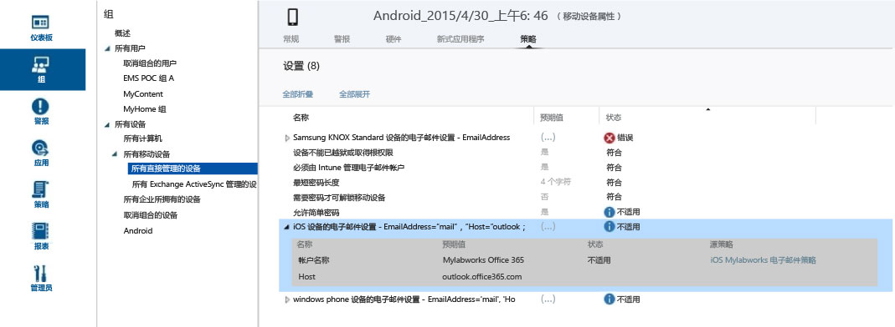

---
# required metadata

title: 策略疑难解答 | Microsoft Intune
description:
keywords:
author: Nbigman
manager: jeffgilb
ms.date: 05/26/2016
ms.topic: article
ms.prod:
ms.service: microsoft-intune
ms.technology:
ms.assetid: 99fb6db6-21c5-46cd-980d-50f063ab8ab8

# optional metadata

#ROBOTS:
#audience:
#ms.devlang:
ms.reviewer: jeffgilb
ms.suite: ems
#ms.tgt_pltfrm:
#ms.custom:

---

# 排查 Microsoft Intune 中的策略问题

下面列出了你的 Microsoft Intune 策略配置可能导致的一些问题以及这些问题的故障排除建议。

如果此信息未解决你的问题，请参阅[如何获取对 Microsoft Intune 的支持](how-to-get-support-for-microsoft-intune.md)，了解更多获得帮助的方法。

## 是否向设备应用了策略？
**问题：** 不清楚是否向设备应用了特定的策略，或者设备的行为是否违反了策略。

检查可用于每个设备的策略信息，了解策略如何影响特定设备。

在 Intune 管理控制台中，每个设备的“设备属性”下都有一个策略选项卡 。 如果没有，则表示该设备可能仍在进行注册，或者可能未应用策略。 每个策略都有 **“预期值”** 和 **“状态”**。 预期值是指在分配策略时想要获得的值。 状态是指综合考虑应用于设备的所有策略，以及硬件和操作系统的限制及要求时，实际获得的内容。 可能的状态为：

-   **符合**：设备已收到策略，并向服务报告该策略符合设置。

-   **不适用**：策略设置不适用。 例如，iOS 设备的电子邮件设置不适用于 Android 设备。

-   **挂起**：策略已发送到设备，但尚未将状态报告给服务。 例如，Android 上的加密需要用户启用加密，因此可能会处于挂起状态。

在下面的屏幕截图中，你可以看到两个清晰的示例：

-   **“允许简单密码”** 设置为 **“是”**（如 **“预期值”** 列中所示），但其 **“状态”** 为 **“不适用”**。 这是因为 Android 设备不支持简单密码。

-   同样，扩展的策略项“iOS 设备的电子邮件设置”不适用于此设备，因为这是 Android 设备。

> [!NOTE] 请记住，当具有不同限制级别的两个策略应用于同一个设备或用户时，实际会使用限制更严格的策略。

## 策略刷新和更新间隔
请注意，策略将定期刷新和更新。 一般情况下，应在进行更改后 15 分钟内在设备上注册策略。 以下是有关策略定期刷新的详细信息：

-   **针对 MDM 注册的 Windows 设备**：每天在当地时间上午 3:00 由计划的任务在设备上触发。

-   **Windows Phone**：每 8 小时更新一次策略。 这可以通过在“设置”下的“公司门户”中刷新来强制进行。

-   **iOS**：每天以随机时间间隔更新一次策略。 也可以通过打开公司门户、选择设备，然后选择**同步**强制进行。

-   **Android**：每天以随机时间间隔更新一次策略。 也可以通过打开公司门户、选择设备，然后选择**同步**强制进行。

## policyplatform.log 中与 Microsoft Intune 策略相关的错误
对于非 MDM Windows 设备，policyplatform.log 文件中的策略错误可能是因设备上 Windows 用户帐户控制 (UAC) 中的非默认设置导致的。 某些非默认 UAC 设置会影响 Microsoft Intune 客户端安装和策略执行。

### 解决 UAC 问题

1.  停用计算机，如[从 Microsoft Intune 管理停用设备](/intune/deploy-use/retire-devices-from-microsoft-intune-management)中所述。

2.  等待 20 分钟，以便删除客户端软件。

    > [!NOTE]请勿尝试从“程序和功能”中删除客户端。

3.  在开始菜单上，键入 **UAC** 以打开用户帐户控制设置。

4.  将通知滑块移动到默认设置。

## KNOX 设备的错误 0x87D1FDE8
**问题**：为各种 Android 设备创建并部署适用于 Samsung KNOX 的 Exchange Active Sync 电子邮件配置文件后，它们在设备的“属性”&gt;“策略”选项卡中报告错误**0x87D1FDE8**或**修正失败**。

请查看适用于 Samsung KNOX 的 EAS 配置文件的配置以及源策略。 Samsung Notes 同步选项不再受支持，因此，不应该在配置文件中选择此选项。 确保设备有足够的时间处理策略，最多为 24 小时。

## 警报：将访问规则保存到 Exchange 中的操作失败
**问题**：你在管理控制台中收到警报“将访问规则保存到 Exchange 中的操作失败”   。

如果在管理控制台下的 Exchange 内部部署策略工作区中创建了策略，但使用的是 O365，则 Intune 不会强制实施所配置的策略设置。 记下警报中的策略源。  在 Exchange 内部部署策略工作区下删除旧规则，因为这些是 Intune 中用于内部部署 Exchange 的全局 Exchange 规则，与 O365 不相关。 然后，为 O365 创建新策略。

## 错误：无法从计算机中获取值，0x80041013
如果本地系统上的时间不同步达到或超过五分钟或更多，则会出现此问题。 如果本地计算机上的时间不同步，安全事务将因时间戳无效而失败。

若要解决此问题，请使设置的本地系统时间尽可能地接近 Internet 时间，或接近网络中域控制器上设置的时间。

## 无法更改各种 MDM 设备的安全策略
Windows Phone 和 Windows RT 设备不允许通过 MDM 或 EAS 设置安全策略后降低其安全性。 例如，将“最小字符密码数”  设置为 8，然后尝试将其减少到 4。 已向设备应用更严格的策略。

如果要将策略更改为安全级别较低的值，可能需要重置安全策略，具体视设备平台而定。
例如，在 Windows RT 中，在桌面上从右轻扫打开**超级按钮**栏并选择**设置**&gt;**控制面板**。  选择“用户帐户”  小程序。
在左侧导航菜单底部有一个“重置安全策略”  链接。 选中它，然后选择**重置策略**按钮。
对于其他 MDM 设备（例如 Android、Windows Phone 8.1 及更高版本以及 iOS），可能需要将其停用并重新注册回服务，这样才能应用限制较少的策略。

## Android 设备在最终用户未接受时不强制实施安全策略更改
与其他平台不同，Android MDM 不允许服务在设备上强制实施初始策略更改。 这是由于 Android 功能的原因，与 Intune 服务无关。 Android 设备将通过相关策略更改（即密码、加密等）的通知窗口提示最终用户。  最终用户必须响应该提示，一旦接受，即应用策略。

## 如果公司名称包含特殊字符，则无法创建策略或注册客户端
**问题：**无法创建策略或注册客户端。

**解决方法：**在 [Office 365 管理中心](https://portal.office.com/)，删除公司名称中的特殊字符并保存公司信息。

### 后续步骤
如果此疑难解答信息没有帮助到你，请联系 Microsoft 支持部门，如[如何获取对 Microsoft Intune 的支持](how-to-get-support-for-microsoft-intune.md)中所述。

<!--HONumber=May16_HO4-->

