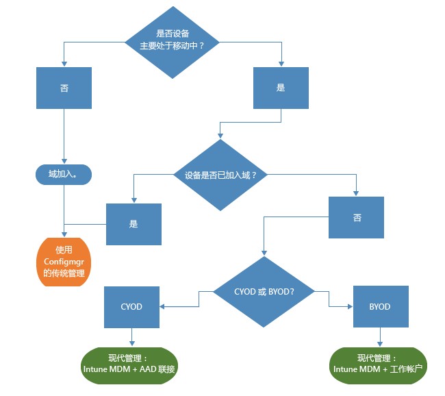

# Microsoft Intune 的新式 Windows 管理之路

个人设备用于工作、员工在办公室外办公，使组织管理设备的方式发生改变。 某些组织的某些部分可能需要对设备进行深入、精细的控制，而其他组织则倾向于采用更轻型的、基于方案的管理支持员工以新方式工作。

Windows 10 继续发扬 Windows 的传统，为组织提供管理至善的操作系统。 借助组策略、Active Directory 和 System Center Configuration Manager 等技术，Windows 支持深入的可管理性和安全性。 它还使用 Microsoft 企业移动性套件 (EMS) 等基于云的设备管理解决方案，提供“移动优先、云优先”的简化新式管理方法。 未来将通过 Windows 即服务提供 Windows 创新，并由 Microsoft Intune、Azure Active Directory，Azure 权限管理服务、Office 365 和适用于企业的 Windows 应用商店等快速发展的云服务补充完善。

IT 组织更加灵活，有机会受益于创新和节约成本。 本文档提供了部署和管理 Windows 10 的策略指南。 还剖析了 Microsoft 在设备管理工具方面的战略思想。 考虑管理基础及将其部署到各设备的方式时，请考虑设备生命周期的以下四个阶段：

## 部署和设置

与需要复杂 IT 操作的传统 OS 部署不同，新式设备管理开“即用管理”之先河。 IT 人员希望将新设备轻松转换为配置完善的、可完全托管的设备，而无需重置映像。  动态设置比以往更简单，可通过基于云的设备管理服务启动（如 Microsoft Intune）。 还可以创建内置 Windows 映像和配置设计器 (ICD) 的自包含设置包。 当然，为使组织能使用 System Center Configuration Manager 部署自定义映像，我们仍支持传统的映像技术。

## 标识和身份验验证

Windows 10 和 Azure Active Directory 等服务为基于云的标识、身份验证和管理带来了新的可能。 由于 BYOD 和 CYOD 等方案的应用，企业开始重新思考用户如何访问公司资源和应用。 可将用户和设备管理设想为以下两类：

- 移动用户用于 SaaS 应用（如 Office 365）的企业 (CYOD) 或个人 (BYOD) 设备。

  Windows 10 可允许员工自行设置设备。 可通过 Azure AD 加入为企业设备轻松设置企业访问。 同样，用户可通过全新精简 BYOD 体验，将工作帐户添加到 Windows 并在个人设备上访问工作资源。 结合 Azure AD 加入和自动化 Intune MDM 注册，通过[一个简单步骤](https://blogs.technet.microsoft.com/ad/2015/08/14/windows-10-azure-ad-and-microsoft-intune-automatic-mdm-enrollment-powered-by-the-cloud/)即可让设备收到企业管理。 Azure AD 加入也是临时雇员、合作伙伴或其他兼职员工的优秀解决方案。 可使这些帐户与本地 AD 域分开，而仍可访问所需企业资源。
- 加入域的电脑和平板电脑使用需要身份验证的传统应用程序和资源，及访问高度敏感或本地已分类资源

  加入本地 Active Directory 域的 Windows 10 设备将自动注册 Azure AD，让用户能够享受 Windows 10 体验的额外优势，例如从任意地点单一登录到云和本地资源、企业漫游设置、Microsoft Passport for Work 和 Windows Hello。 加入域的电脑和平板电脑应继续由 System Center Configuration Manager 客户端或组策略管理。

审核组织中的角色。 确定需要域加入的用户或设备，并考虑将其他用户或设备切换到 Azure AD。 [本文](https://azure.microsoft.com/en-us/documentation/articles/active-directory-azureadjoin-windows10-devices/)详细介绍了 Windows 10 和 Azure AD 如何将设备和方案结合，优化对工作资源的访问。

通用决策树类似如下。 当然，某些情况下可能会有例外。

## 设置和配置

所需管理级别、托管设备和数据及行业要求均可定义配置要求。 与此同时，员工常担心 IT 人员会对其个人设备运用严格的策略，但他们又想访问企业电子邮件和文件。 Windows 10 通过通用 MDM 层为电脑、平板电脑和手机提供一组一致的配置。 MDM 方法希望设置在实现管理员意图的同时，不公开其他可能的设置。 与此相反，组策略将公开由管理员独立控制的精细设置。 MDM 的优点之一是管理员可使用更轻型、更高效的工具应用更广泛的隐私、安全和应用程序管理设置。 对持续运行的设备而言，MDM 是最佳选择。

许多组织仍需精细管理加入域的计算机，如 Internet Explorer 的 1,500 项可配置 GP 设置或非常具体的 Windows 防火墙规则。 这些情况下，组策略和 System Center Configuration Manager 仍是最佳管理选择。 要精细配置通过基于 Windows 的工具连接到企业网络的加入域的 Windows 电脑或平板电脑，组策略是最好的选择。 Microsoft 将持续向 Windows 的每个新版本添加组策略设置。 对于精细配置稳定软件部署，仍建议使用 Windows 更新、OS 部署和 Configuration Manager。

## 更新 Windows 设备

通过 Windows 即服务，IT 组织不再需要为每个 Windows 新版本执行复杂的映像（擦除并加载）过程。 无论使用 Current Branch (CB) 还是 Current Branch For Business (CBB)，设备都可通过简单的（且通常是自动的）修补过程接收最新功能和质量更新。 MDM 与 Intune 提供了可将 Windows 更新应用到企业客户端计算机的工具。 Configuration Manager 可对这些更新进行多种管理和跟踪，包括维护 Windows 和自动部署规则。

## “摘要”

考虑在组织中开始实行新式设备管理时，请考虑可用的启动步骤。

1. **现在就可以进行投资。** 需要保留哪些传统设备管理组件？可在何处实行新式管理？ 无论最小化自定义映像、重新评估设置管理还是重新评估身份验证和合规性，都会有立竿见影的收益。

2. **评估环境中的不同用例。** 是否有设备组可受益于更轻、更简的管理？ 例如，BYOD 设备是基于云的管理的自然之选。 处理高度管制数据的用户或设备可能需要本地 AD 域进行身份验证。 Configuration Manager 和 EMS 允许用户灵活地分批执行新式管理方案，以最符合企业需求的方式设定目标设备。 选择权在你手中。

## 后续操作

- **评估环境中的管理需求。** 根据人员、其移动性和设备及其所访问数据，固定方案可能无法满足所有需求。
- **考虑需求。** 使用 Windows 10、Configuration Manager 和企业移动性套件，可以灵活地处理任意方案的映像、身份验证、设置和管理工具。
- **循序渐进。** 不一定要一次性完成新式设备管理的转换。
- **优化现有投资。** 从传统的本地管理转换到基于云的新式管理时，请利用 Configuration Manager 和 Intune 灵活的混合体系结构。 在其他功能也可用于云标识/MDM 模型后，Microsoft 将致力于提供将传统管理转化为新式管理的明确方法。

<!--HONumber=Sep16_HO2-->

