# 开始试用 Microsoft Intune 试用版并部署 iOS PIN 策略
这些分步说明将帮助你进行 Intune 试用版的设置，并为 iOS 设备配置 PIN 策略。 有关可以尝试的一系列其他常见 Intune 评估任务，请参阅[常见 Microsoft Intune 评估任务](common-microsoft-intune-evaluation-tasks.md)。

## 查看此任务的先决条件

-   带有 Internet Explorer 的 Windows 电脑 - 用于进行管理任务

-   iOS 7.1 或更高版本的设备，用于测试用户策略验证

-   试用版注册时进行身份验证的电话

## 创建免费的 Intune 试用帐户
> [!NOTE]
> 如果你已经订阅了 Intune，请跳过这部分进入下一部分。

1.  使用 Windows 电脑，右键单击“Internet Explorer”(IE)，选择“InPrivate 浏览”。

    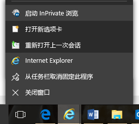

2.  转到 [Intune 注册门户](https://portal.office.com/Signup/Signup.aspx?OfferId=40BE278A-DFD1-470a-9EF7-9F2596EA7FF9&dl=INTUNE_A&ali=1)，提供所需信息，然后单击“下一步”。

    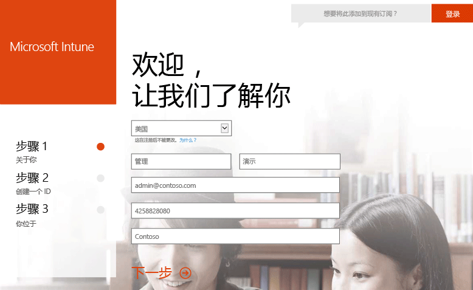

3.  输入管理帐户的用户 ID 和密码，然后单击“下一步”。 登录 Intune 门户进行管理任务时需要使用此 ID。

    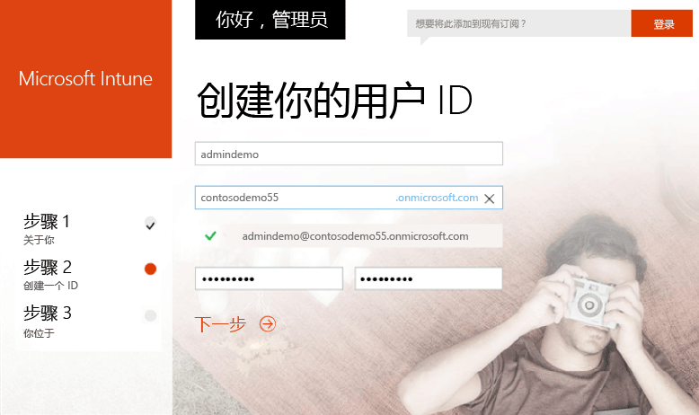

4.  输入你的移动电话号码，然后单击“发短信给我”以验证号码。

    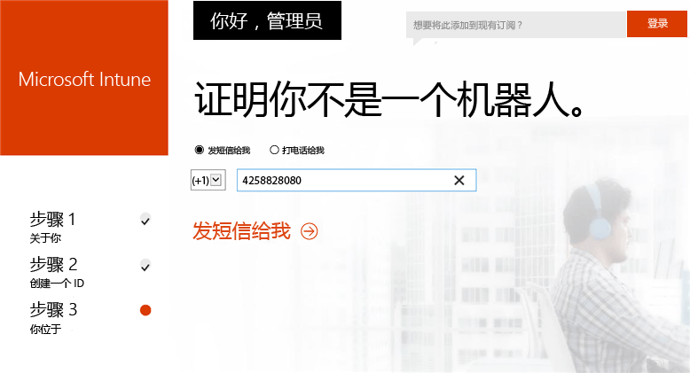

5.  保存屏幕上的信息，然后单击“你可以转到...”。

    

## 创建测试用户

1.  使用 Windows 电脑，单击“开始”转到用户管理页面。

    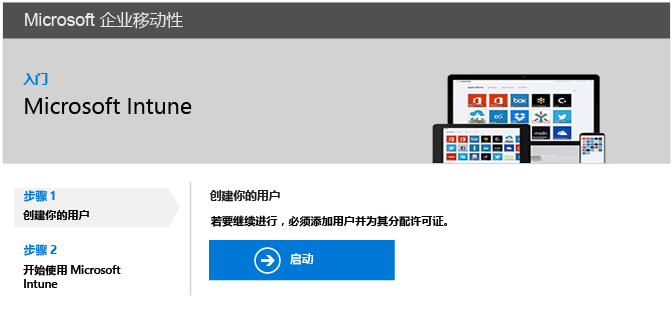

2.  单击 **+** 按钮添加用户。

    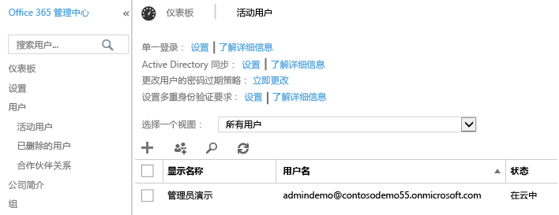

3.  在“新建用户帐户”页面：

    1.  提供测试用户信息。

    2.  选择“键入密码”选项。

    3.  清除“用户下次登录时须更改密码”复选框。

    4.  单击“创建”。

    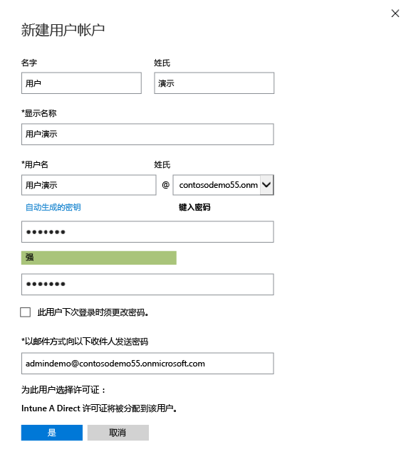

4.  在用户创建确认页面上，单击“关闭”。

    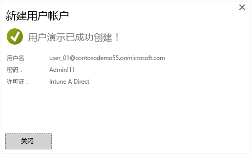

5.  单击“刷新”按钮查看所创建的测试用户。

    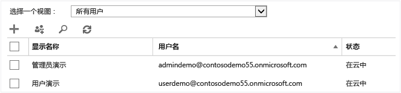

## 为测试用户配置 iOS PIN 策略

1.  使用 Windows 电脑，将 MDM 机构设置为 Intune：

    1.  转到 [Intune 管理控制台](http://manage.microsoft.com/)，使用你的管理帐户登录，然后单击“开始管理移动设备”。 将打开移动设备管理机构页面。

        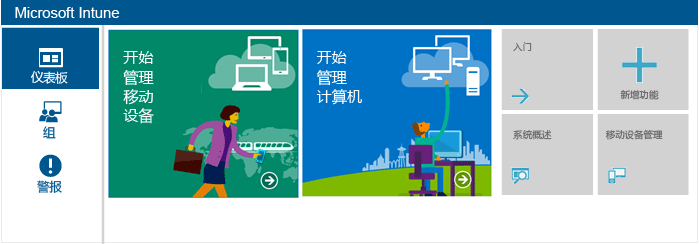

    2.  单击“设置移动设备管理机构”链接。

        

2.  启用 iOS 设备注册。 此过程在 Apple 推送通知服务 (APNs) 和你的 Intune 订阅之间设置了一个可信证书。

    1.  单击“启用 iOS 和 Mac OS X 平台”。

        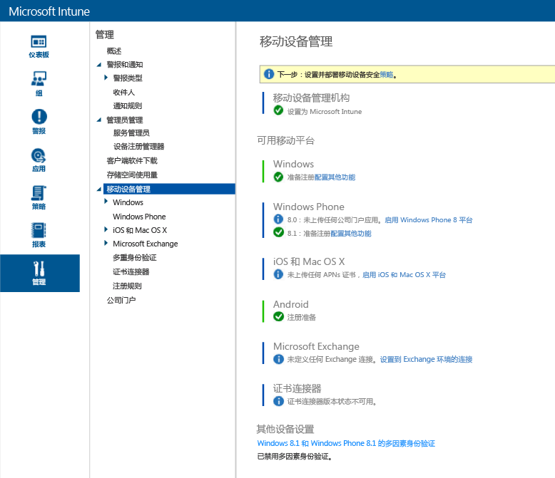

    2.  单击“下载 APN 证书请求”。

        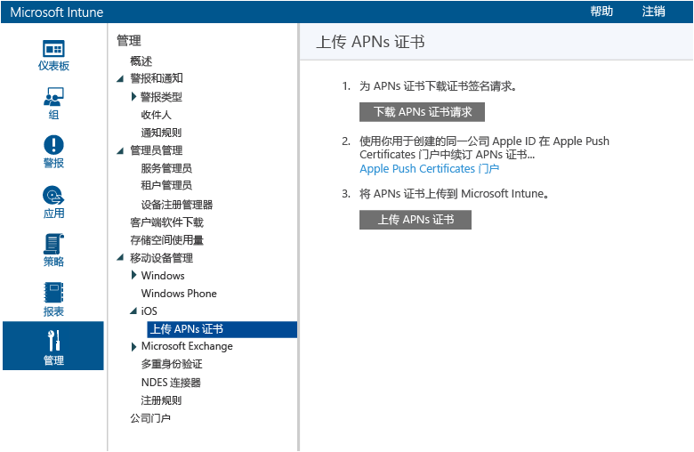

    3.  指定证书签名请求 (CSR) 的文件名和位置，然后单击“保存”。 此文件持有公钥，而 Intune 订阅持有与之相对应的私钥。

        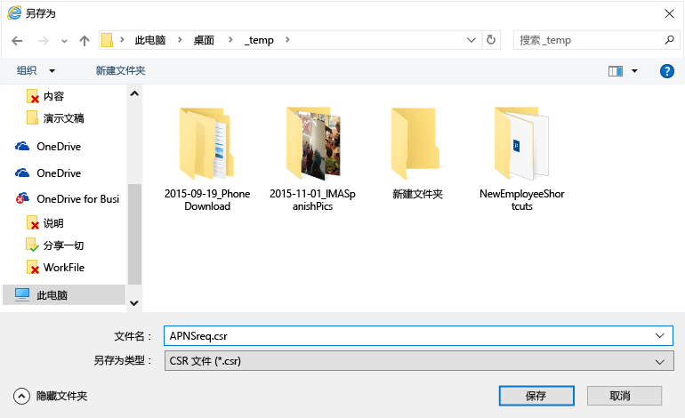

    4.  单击“Apple 推送证书门户”打开新的选项卡。

        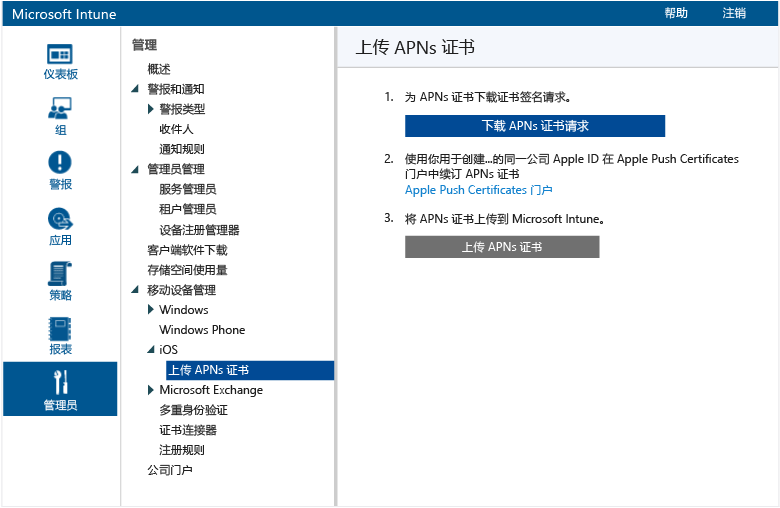

    5.  输入你的 Apple ID 和密码，然后单击“登录”。 此 ID 可以是你在 iOS 设备上用来从 iOS 应用商店获取应用的 ID。

        

    6.  单击“创建证书”。

        

    7.  阅读 Apple 的使用条款，选中复选框，然后单击“接受”。

        

    8.  单击“浏览”。

        

    9. 选择之前保存的 CSR 文件，然后单击“打开”。

        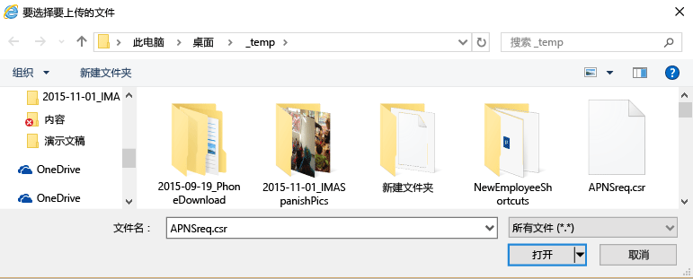

    10. 单击“上传”按钮。

        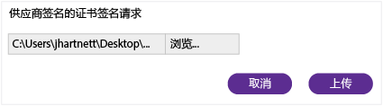

    11. 系统提示你下载 JSON 文件时，单击“另存为”。

        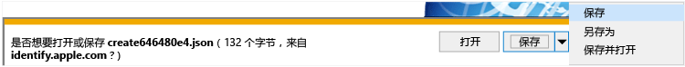

    12. 指定 JSON 文件的位置，然后单击“保存”。

        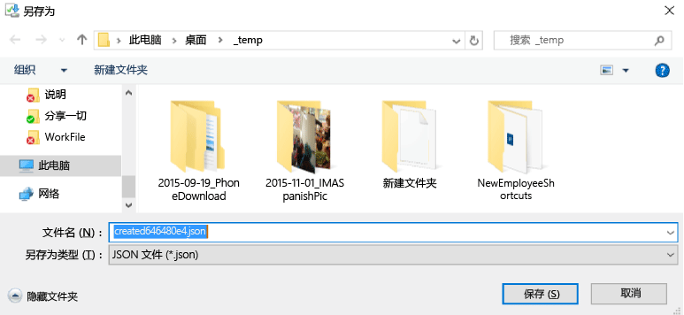

        如果几秒钟后页面未自动重定向，单击“取消”。

        

    13. 若要检索新创建的证书文件，单击“下载”。

        

    14. 系统提示你下载 PEM 文件时，单击“另存为”。

        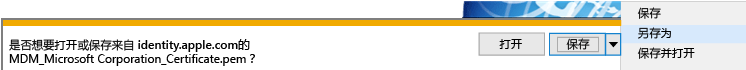

    15. 指定 PEM 文件的位置，然后单击“保存”。

        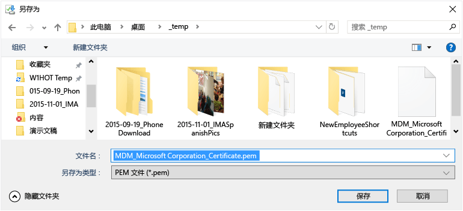

    16. 返回到 Intune 管理控制台选项卡，然后单击“上传 APN 证书”。

        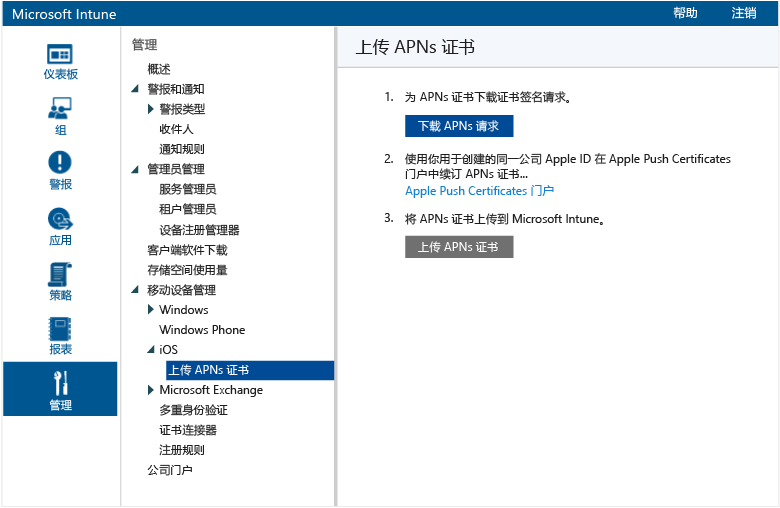

    17. 输入你的 Apple ID，然后单击“浏览”。

        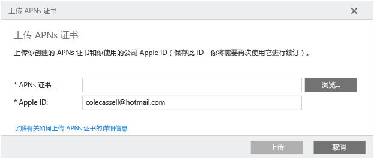

    18. 选择刚才保存的 PEM 文件，然后单击“打开”。

        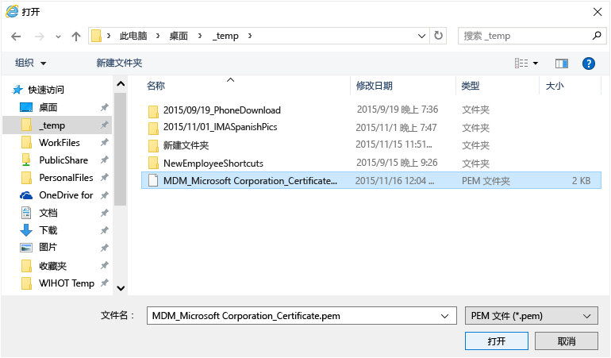

    19. 单击“上传”。

        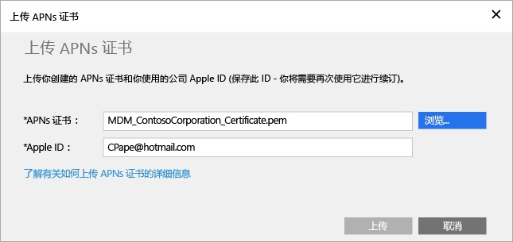

        现已完成你的 APN 证书配置。

        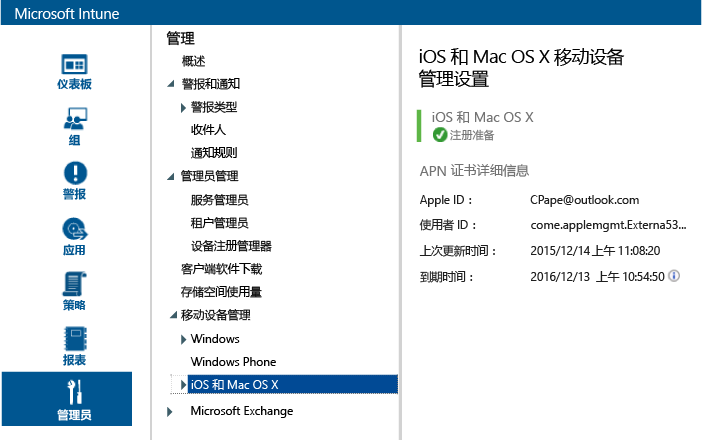

3.  为策略目标创建一个测试用户组：

    1.  在左窗格中，单击“组”。

        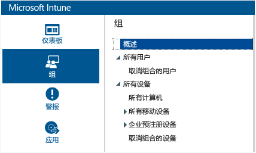

    2.  在最右侧，单击“创建组”。

        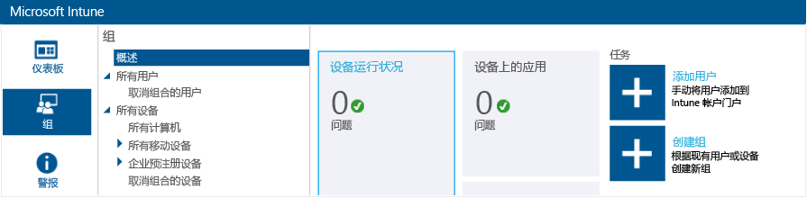

    3.  设置组名称，选择“所有用户”作为父组，然后单击“下一步”。

        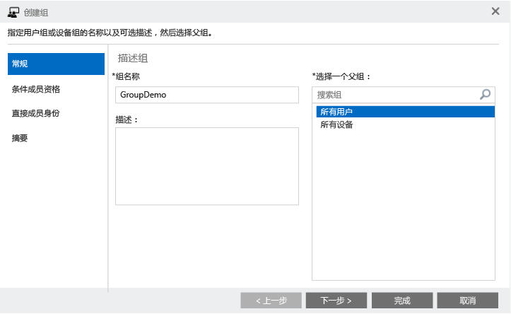

    4.  在“组成员资格开始为”字段中，选择“父组中的所有用户”，然后单击“完成”。

        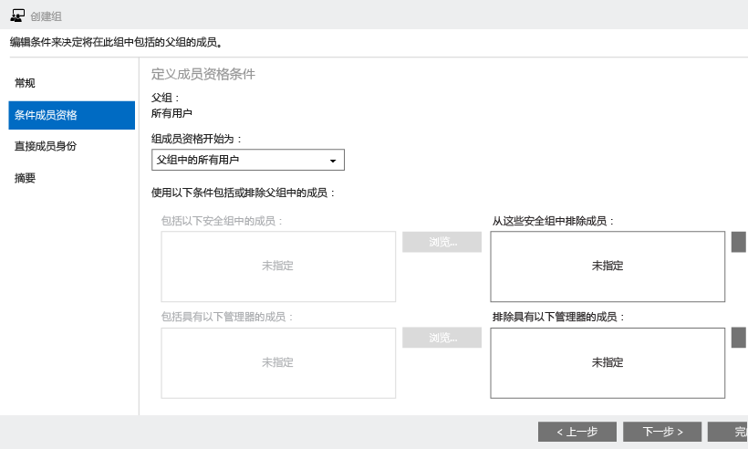

4.  创建 iOS PIN 策略并将其设定为测试用户组的目标：

    1.  在左窗格中，单击“策略”。

        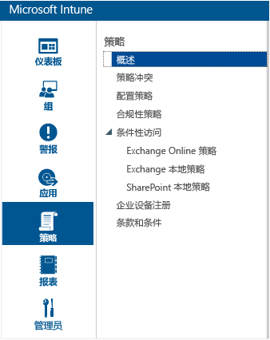

    2.  在最右侧，单击“添加策略”。

        

    3.  展开 iOS 节点，选择“常规配置”行，然后单击“创建策略”。

        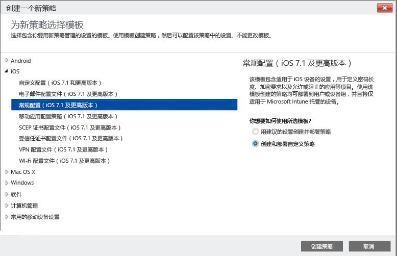

    4.  键入策略名称，打开“需要密码才可解锁移动设备”，然后将“最短密码长度”设置为“4”。

        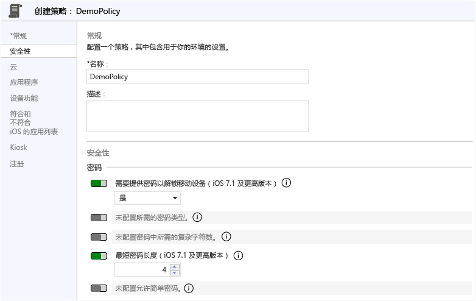

    5.  单击“是”以部署该策略。

        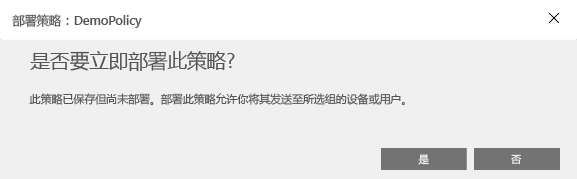

    6.  单击之前创建的用户组，单击“添加”然后单击“确定”。

        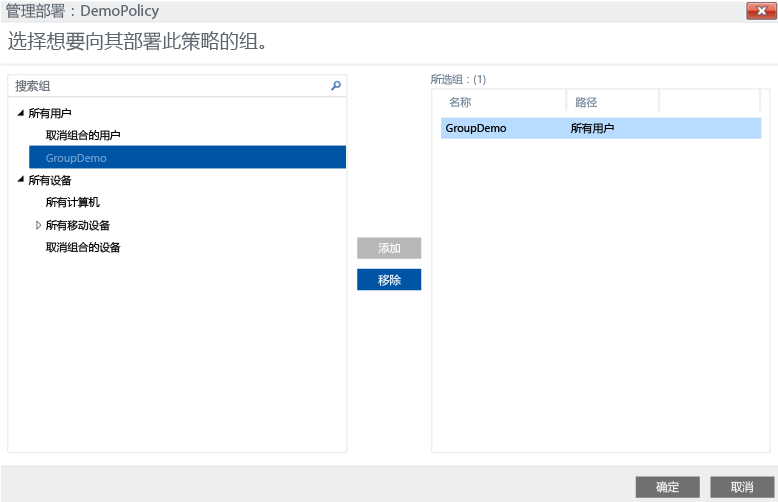

        现在你已经创建了一个作为测试用户组目标的 iOS PIN 策略。

        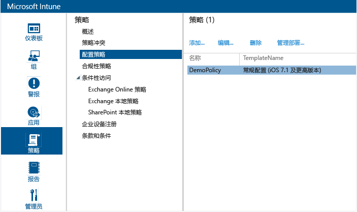

## 验证策略是否在 iOS 设备上强制执行

1.  在 iPad 上启动 iOS 应用商店，安装免费的“Microsoft Intune 公司门户”应用，并将其打开。

    

2.  输入你的测试用户帐户名和密码，然后点击“登录”。

    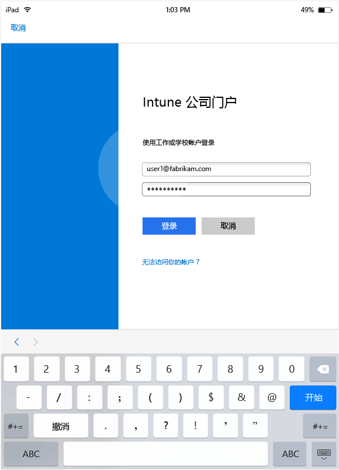

3.  点击“注册”，开始在 Intune 中注册设备。

    

4.  在“安装配置文件”屏幕上，点击“安装”。

    

5.  在“安装配置文件”对话框中，点击“安装”。

    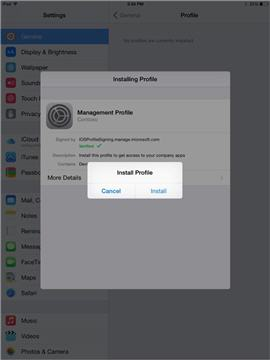

6.  在“警告”屏幕上，点击“安装”。

    

7.  在“远程管理”对话框中，点击“信任”。

    

8.  管理配置文件安装完成后，点击“完成”。 注册现已完成。

    

9. 注册完成后，点击“确定”，然后关闭公司门户应用。

    

10. 当系统提示你配置密码时，点击“继续”。

    

11. 输入你的密码，点击“继续”再次输入你的密码，然后点击“保存”。

    

12. 按下电源按钮锁定你的 iPad，然后滑动解锁，可以看到现在你需要输入你的密码来解锁设备。

### 另请参阅
[Intune 评估指南](get-started-with-a-30-day-trial-of-microsoft-intune.md)

<!--HONumber=Jul16_HO3-->

