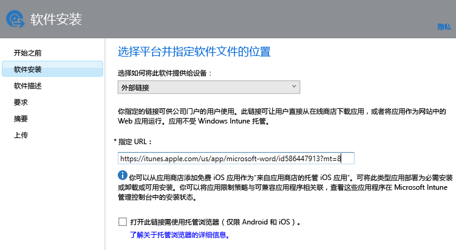
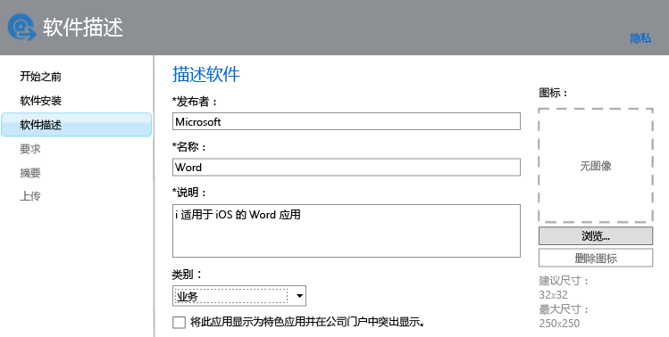

# 为注册设备添加应用到 Intune

[!INCLUDE[classic-portal](../includes/classic-portal.md)]

可部署或管理应用前，需将其添加到 Microsoft Intune。 本主题介绍如何为注册设备添加应用。

> [!IMPORTANT]
> 本主题中的信息可帮助你将要部署的应用添加到已注册的设备和已注册的 Windows 电脑。 如果想要为使用 Intune 客户端软件管理的 Windows 电脑添加应用，请参阅[在 Microsoft Intune 中为 Windows 电脑添加应用](add-apps-for-windows-pcs-in-microsoft-intune.md)。

## 添加应用
你可以使用 Intune 软件发行者来配置应用的属性，并将该应用上载到云存储空间（如果适用）。 请使用以下过程：

1.  在 [Microsoft Intune 管理员控制台](https://manage.microsoft.com)中，选择“**应用** &gt; **添加应用**”，启动 Intune 软件发行者。

    > [!TIP]
    > 在该发行者启动前，你可能需要先输入 Intune 用户名和密码。

2.  在发行者的“**软件安装程序**”页上，针对“**选择如何将此软件提供给设备**”选择下列选项之一：
    - **软件安装程序**，适用于扩展名为 **.msi** 的应用：
        - **选择软件安装程序文件类型**。 此设置指示要部署的软件的类型。 例如，如果你想要安装 iOS 应用，请选择“iOS 应用包(&#42;.ipa 文件)”。
        - **指定软件安装程序文件的位置**。 输入安装文件的位置，或选择“**浏览**”选择列表中某个位置。
        - **包括同一文件夹中的其他文件和子文件夹**。 此选项仅适用于 **Windows Installer** 文件类型。 某些使用 Windows Installer 的软件需要支持文件，这些支持文件通常与安装文件位于同一文件夹中。 如果还想要部署这些文件，请选择此选项。 此安装类型会使用一些云存储空间。

  -   **外部链接**，适用于要通过指定应用商店链接来创建的应用：

        - **指定 URL**。 将 URL 指定为下列任一格式：
            - 要部署的应用的应用商店 URL。 例如，如果你想要部署 Android 版 Microsoft 远程桌面应用，则请指定 **https://play.google.com/store/apps/details?id=com.microsoft.rdc.android**。 若要查找应用的 URL，请使用搜索引擎查找包含该应用的应用商店页面。 例如，若要查找远程桌面应用，你可以搜索 **Microsoft 远程桌面 Android 版**。
            - 网站。 Intune 将为设备部署该站点的快捷方式图标（称为 Web Clip）。
            - Web 上的应用。 Intune 将在设备上部署该应用的快捷方式图标。
        - **打开此链接需使用托管浏览器（仅限 Android 和 iOS）**。 为用户部署网站或 Web 应用的链接时，用户将只能在 Intune 托管浏览器中打开此链接。 必须在用户的设备上安装此浏览器。 有关托管浏览器的更多详细信息，请参阅[使用 Microsoft Intune 的托管浏览器策略管理 Internet 访问](manage-internet-access-using-managed-browser-policies.md)。 此安装类型不使用任何云存储空间。

  -   **来自应用商店的托管 iOS 应用**，适用于来自 iTunes 商店且要使用移动应用管理 (MAM) 策略进行管理的免费应用：

        - **指定 URL**。 输入要部署的应用的应用商店 URL。 例如，如果你想要部署 iOS 版 Microsoft 工作文件夹应用，请指定 **https://itunes.apple.com/us/app/work-folders/id950878067?mt=8**。 此安装类型不使用任何云存储空间。

        例如，如果你想要将来自 iTunes 商店的 Microsoft Word 应用部署到设备，页面将如下所示：

        

> [!NOTE]
> 如果要从商店添加和部署应用，最终用户必须具有该商店的帐户才能安装应用。

3.  在“软件描述”页上，配置下列设置：

    > [!TIP]
    > 由于所使用的安装程序类型不同，其中某些值可能已自动输入。

    - **发布者**。 输入应用发布者的名称。
    - **名称**。 输入应用的名称，该名称将显示在公司门户中。 请确保使用的所有应用名称都是唯一的。 如果同一应用名称存在两次，则在公司门户中将仅向用户显示其中一个应用。
    - **说明**。 输入应用的描述。 这将在公司门户中向用户显示。
    - **指向软件信息的 URL**。 仅当你选择“**软件安装程序**”时可用。 （可选）输入包含此应用相关信息的网站的 URL。 将在公司门户中向用户显示该 URL。
    - **隐私 URL**。 仅当你选择“**软件安装程序**”时可用。 （可选）输入包含此应用相关隐私信息的网站的 URL。 将在公司门户中向用户显示该 URL。
    - **类别**（可选）。 选择一个内置应用类别。 这可让用户在浏览公司门户时更轻松地查找应用。
    - **将此应用显示为特色应用并在公司门户中突出显示**。 当用户浏览应用时，在公司门户的主页上突出显示应用。
    - **图标**（可选）。 上载将与应用关联的图标。 用户浏览公司门户时，此图标将与应用一同显示。

        在本例中，你为 iOS 版 Microsoft Word 应用配置了一个描述：

        

4.  在“**要求**”页中，选择可以在设备上安装应用之前必须满足的要求。 例如，对于 iOS 应用包，可以选择 iOS 所需的最低版本。 此外，你可以选择设备必须是什么类型，如 iPhone 或 iPad。

    > [!TIP]
    > 并非所有类型的应用都会显示相应的“要求”页。

5.  选择“Windows Installer”文件类型时，将会显示更多向导页。 将软件部署到已注册 Intune 并运行 Windows 10 或更高版本的电脑中时，会使用此文件类型。

6.  在“**摘要**”页上，审阅你指定的信息。 准备就绪后，选择“**上载**”。

7.  选择“关闭”完成操作。

该应用将显示在“应用”工作区的“应用”节点中。

## 示例 - 将 .msi 应用程序部署到 Windows 10 设备
在此时长四分钟的视频中，你将了解如何将 Windows Installer (msi) 应用程序部署到运行 Windows 10 的已注册设备中。  

<iframe src="https://channel9.msdn.com/Series/How-to-Control-the-Uncontrolled/6--How-to-Deploy-MSI-Applications-to-Windows-10-Using-Intune-and-Mobile-Device-Management-MDM/player" width="640" height="360" allowFullScreen frameBorder="0"></iframe>

## 后续步骤

创建应用后，下一步是进行部署。 若要获取详细信息，请参阅[在 Microsoft Intune 中部署应用](deploy-apps.md)。

<!--HONumber=Jan17_HO2-->

