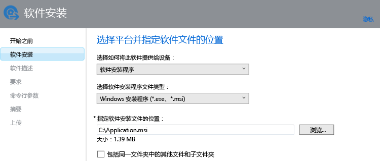

# 为运行 Intune 软件客户端的 Windows 电脑添加应用

通过本主题中的信息了解如何在部署应用之前将它们添加到 Intune。

> [!IMPORTANT]
> 本主题中的信息可帮助你为使用 Intune 软件客户端管理的 Windows 电脑添加应用。 如果想为已注册的 Windows 电脑和其他移动设备添加应用，请参阅[在 Microsoft Intune 中为移动设备添加应用](add-apps-for-mobile-devices-in-microsoft-intune.md)。

## 添加应用
遵循以下过程，使用 Intune 软件发行者来配置应用的属性，并将该应用上载到云存储空间：

1.  在 [Microsoft Intune 管理员控制台](https://manage.microsoft.com)中，选择“**应用** &gt; **添加应用**”，启动 Intune 软件发行者。

    > [!TIP]
    > 在该发行者启动前，你可能需要先输入 Intune 用户名和密码。

2.  在发行者的“**软件安装程序**”页上，在“**选择如何将此软件提供给设备**”下，选择“**软件安装程序**”，然后指定：

    - **选择软件安装程序文件类型**。 此设置指示要部署的软件的类型。 对于 Windows 电脑，选择**Windows Installer**。
    - **指定软件安装程序文件的位置**。 输入安装文件的位置，或选择“**浏览**”选择列表中某个位置。
    - **包括同一文件夹中的其他文件和子文件夹**。 某些使用 Windows Installer 的软件要求安装支持文件。 通常在安装文件所在的文件夹中可以找到这些软件。 如果还想要部署这些支持文件，请选择此选项。

    例如，如果你要将一个名为 Application.msi 的应用发布到 Intune，页面将如下所示：

   此安装类型会使用一些云存储空间。

3.  在“**软件描述**”页上，配置下列设置。

    > [!NOTE]
    > 由于所使用的安装程序文件不同，其中某些值可能已自动输入，或者可能不会显示。

    - **发布者**。 输入应用发布者的名称。
    - **名称**。 输入应用的名称，该名称将显示在公司门户中。 请确保使用的所有应用名称都是唯一的。 如果同一应用名称存在两次，则在公司门户中将仅向用户显示其中一个应用。
    - **说明**。 输入应用的描述。 这将在公司门户中向用户显示。
    - **指向软件信息的 URL**（可选）。 输入包含此应用相关信息的网站的 URL。 将在公司门户中向用户显示该 URL。
    - **隐私 URL**（可选）。 输入包含此应用相关隐私信息的网站的 URL。 将在公司门户中向用户显示该 URL。
    - **类别**（可选）。 选择一个内置应用类别。 这可让用户在浏览公司门户时更轻松地查找应用。
    - **图标**（可选）。 上载将与应用关联的图标。 用户浏览公司门户时，此图标将与应用一同显示。

4.  在“**要求**”页中，选择可以安装应用之前必须满足的要求。 选择：

    - **体系结构**。 选择是否可以在 32 位和/或 64 位操作系统上安装此应用。
    - **操作系统**。 选择可以安装此应用的最低操作系统版本。

5.  在“**检测规则**”页上，你可以配置规则，以便检测正在配置的应用是否已在电脑上安装。 或者，可以使用默认检测规则来自动覆盖以前安装的应用的所有版本。 此选项适用于 Windows Installer（仅限 .exe 文件）。

    可以配置的规则包括：
    - **文件存在**。 指定要检测的文件的路径。 可以在电脑上的 **%ProgramFiles%** 下搜索（搜索 **Program Files**\&lt;路径&gt; 和 **Program Files (x86)**\&lt;路径&gt;），或者在 **%SystemDrive%** 下搜索（从电脑的根驱动器搜索，通常为驱动器 C）。
    - **MSI 产品代码存在**。 选择“**浏览**”以选择想要检测的 Windows Installer (msi) 文件。
    - **注册表项存在**。 指定以 **HKEY_LOCAL_MACHINE\** 开头的注册表项。 将同时搜索 32 位和 64 位路径。 如果在任一位置中存在指定的项，则满足检测规则。

    如果应用满足任何配置的规则，则不会安装该应用。

6.  仅对于“**Windows Installer**”文件类型（.msi 和 .exe）：在“**命令行参数**”页上，选择是否想要为安装程序提供可选命令行参数。 例如，某些安装程序可能支持参数 **/q**，以便无需用户干预进行无提示安装。

7.  仅对于“**Windows Installer**”文件类型（仅 .exe）：在“**返回代码**”页上，你可以添加新的错误代码，在托管 Windows 电脑上安装应用时，Intune 将解释这些错误代码。

    默认情况下，Intune 使用行业标准的返回代码来报告应用包安装是失败还是成功：**0**（成功）或 **3010**（成功并重新启动）。 还可以向此列表中添加你自己的返回代码。 如果指定了返回代码列表，则在应用安装返回列表中不存在的代码，该代码会被解释为失败。

8.  在“**摘要**”页上，审阅你指定的信息。 准备就绪后，选择“**上载**”。

9. 选择“关闭”完成操作。

该应用将显示在“应用”工作区的“应用”节点中。

## 后续步骤

创建应用后，下一步是进行部署。 若要获取详细信息，请参阅[在 Microsoft Intune 中部署应用](deploy-apps.md)。

<!--HONumber=Dec16_HO5-->

