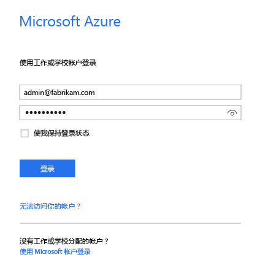
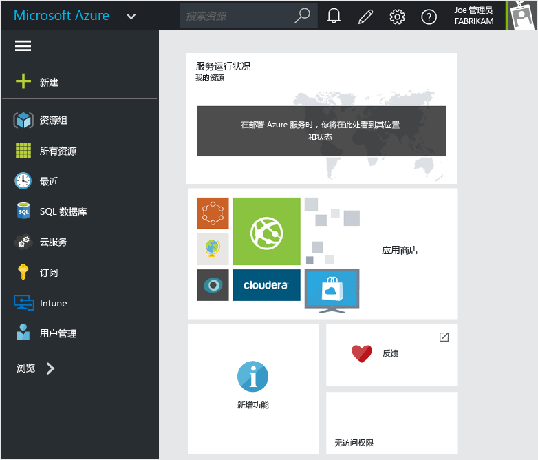

# 提供 Intune 应用保护策略的 Azure 门户

[!INCLUDE[classic-portal](../includes/classic-portal.md)]

Azure 门户可用于创建和管理以下项的应用保护策略：

- **Intune 中注册和管理**的设备上运行的应用。

- 未在任何 MDM 解决方案中**注册**的设备上运行的应用
- **已在第三方 MDM 解决方案中注册**的设备上运行的应用。

>[!IMPORTANT]
> Azure 门户是创建应用保护策略的新管理控制台，但也可以创建一个应用保护策略，用于支持在 Intune 中使用 MDM 方案的 [Intune 管理控制台](configure-and-deploy-mobile-application-management-policies-in-the-microsoft-intune-console.md)注册的设备的应用。

> 可能无法在 Intune 管理控制台上看到所有可用的应用保护策略设置。 此外，如果同时在 Intune 管理控制台和 Azure 门户中创建了应用保护策略，则在 Azure 门户中创建的策略将替代在 Intune 管理控制台中创建的策略。 在这种情况下，Azure 门户应用保护策略将应用于应用并部署到用户。

## 登录到 Azure 门户并自定义起始页

1.  转到 [Azure 门户](https://portal.azure.com)，然后使用你的 [!INCLUDE[wit_nextref](../includes/wit_nextref_md.md)] 凭据登录。

    

2.  成功登录后，会看到“仪表板”。 可以自定义“**仪表板**”页。

    

3.  从左侧菜单中选择“更多服务”，然后在文本框筛选器中键入 **Intune**。

    

4.  选择“Intune 应用保护” > “Intune 移动应用程序管理” > “所有设置”。

    

5. （可选）：若要将边栏选项卡固定到“开始”页上，可以使用边栏选项卡上的“固定”选项。 单击“Intune 移动应用管理”边栏选项卡上的图钉图标，将其固定到“开始”页面。

    

    

## 后续步骤
[准备好配置应用保护策略](get-ready-to-configure-mobile-app-management-policies-with-microsoft-intune.md)

<!--HONumber=Feb17_HO3-->

