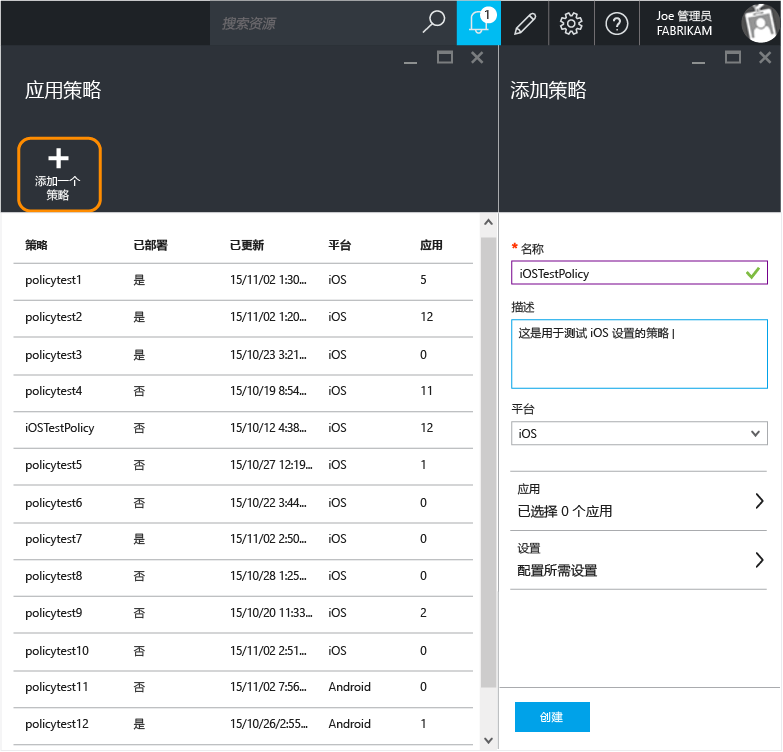
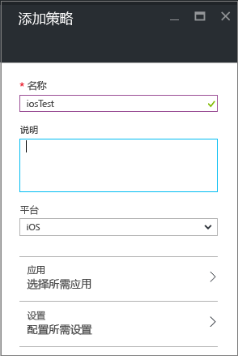
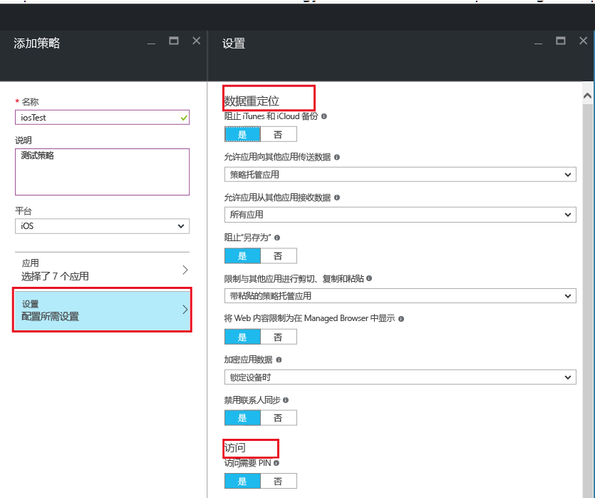
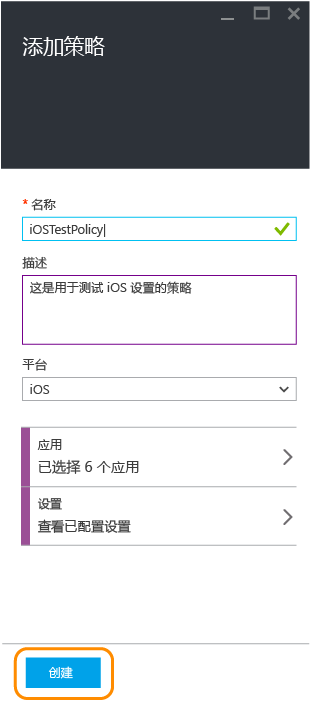
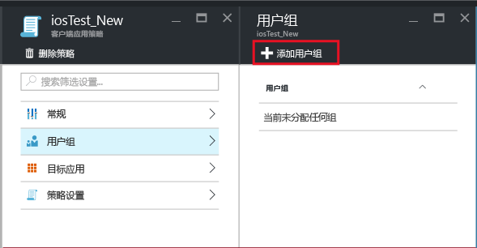
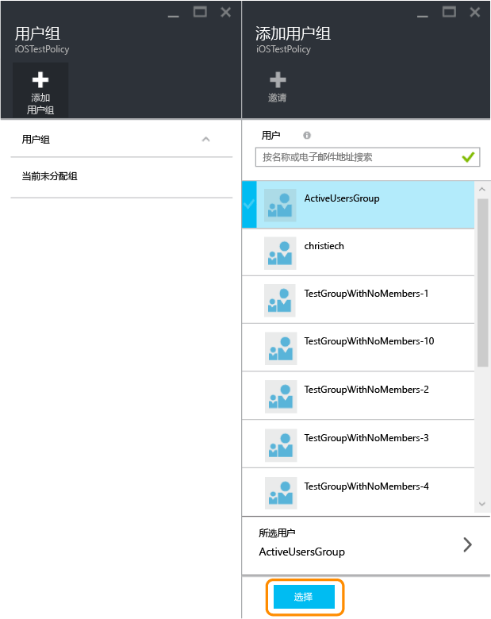
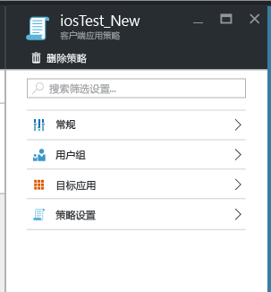
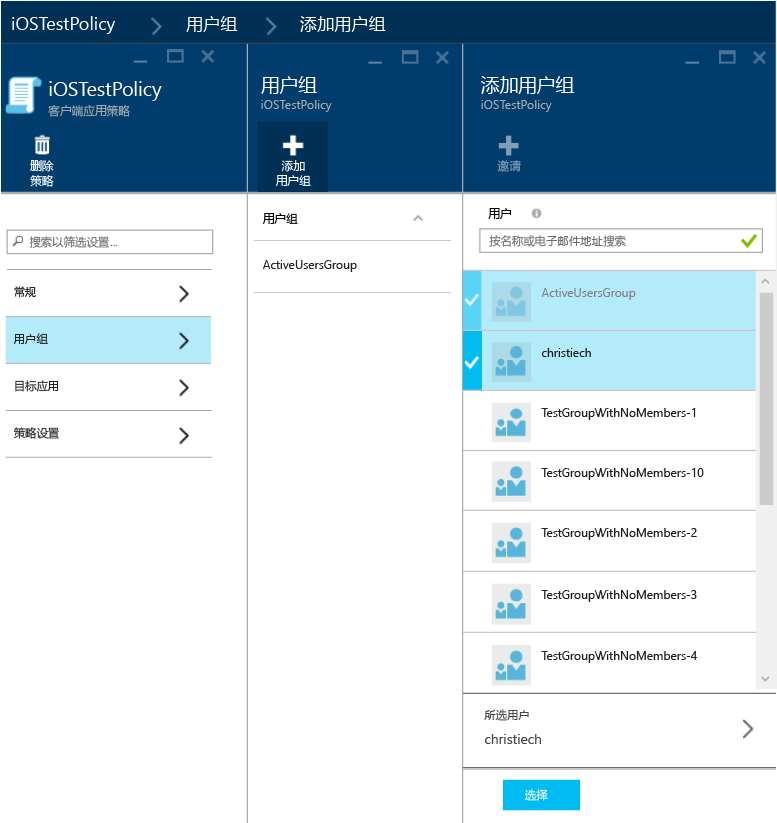
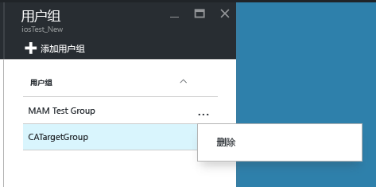
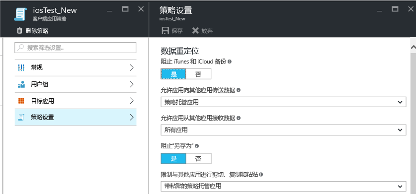

# 使用 Microsoft Intune 创建和部署应用保护策略

[!INCLUDE[classic-portal](../includes/classic-portal.md)]

本主题介绍在 **Azure 门户**中创建应用保护策略的过程。 Azure 门户是一款新的管理控制台，用于创建应用保护策略；建议使用此门户来创建应用保护策略。 Azure 门户支持以下 MAM 方案：

- 在 Intune 中注册的设备。
- 由第三方 MDM 解决方案管理的设备。
- 不受任何 MDM 解决方案管理的设备 (BYOD)。

>[!IMPORTANT]
如果正在使用 **Intune 管理控制台**管理设备，请注意以下事项：

> * 可使用 [Intune 管理控制台](configure-and-deploy-mobile-application-management-policies-in-the-microsoft-intune-console.md)创建支持在 Intune 中注册的设备应用的应用保护策略。
> * 在 Intune 管理控制台中创建的应用保护策略不能导入到 Azure 门户中。  在 Azure 门户中，必须重新创建应用保护策略。

> * 可能无法在 Intune 管理控制台中看到全部应用保护策略设置。 Azure 门户是用于创建应用保护策略的新管理控制台。

> * 若要部署托管应用，必须在 Intune 管理控制台中创建应用保护策略。 在此情况下，可能需要在 Intune 管理控制台和 Azure 门户中创建应用保护策略：Intune 管理控制台可确保你能部署托管应用，而选择 Azure 门户是因为它是具有所有应用保护策略设置的新管理控制台。

> * 如果同时在 Intune 管理控制台和 Azure 门户中创建了应用保护策略，则在 Azure 门户中创建的策略将应用到应用。

若要查看 Android 和 iOS 平台支持的策略设置的列表，请选择以下值之一：

> [!div class="op_single_selector"]
- [iOS 策略](ios-mam-policy-settings.md)
- [Android 策略](android-mam-policy-settings.md)

- 若要详细了解应用保护策略的工作原理以及 Intune 应用保护策略支持的方案，请参阅[使用应用保护策略保护应用数据](protect-app-data-using-mobile-app-management-policies-with-microsoft-intune.md)。

##  创建应用保护策略
应用保护策略需在 Azure 门户中进行创建。 如果首次使用 Azure 门户，请阅读[用于 Microsoft Intune 应用保护策略的 Azure 门户](azure-portal-for-microsoft-intune-mam-policies.md)以熟悉 Azure 门户。 在创建应用保护策略之前，请查看[先决条件和支持](get-ready-to-configure-mobile-app-management-policies-with-microsoft-intune.md)信息。

请按照以下步骤来创建应用保护策略：

1. 转到 [Azure 门户](https://portal.azure.com)，然后输入你的凭据。

2. 选择“更多服务”，然后键入“Intune”。

3. 选择“Intune 应用保护”。

4. 选择“Intune 移动应用程序管理”**&gt;**“设置”，以打开“全部设置”边栏选项卡。

    

2.  在“所有设置”边栏选项卡中，选择“应用策略”。 将打开“应用策略”边栏选项卡，你将在此创建新策略和编辑现有策略。 选择**添加策略**。

    

3.  为策略键入名称、添加简要说明并选择平台类型，以便为 iOS 或 Android 创建策略。 可以为每个平台创建多个策略。

    

4.  选择“应用”以打开“应用”边栏选项卡，其中显示了可用应用的列表。 可从该列表中选择希望与正创建的策略关联的一个或多个应用。 选择应用后，选择“应用”边栏选项卡底部的“选择”以保存选择。

    > [!IMPORTANT]
    > 必须至少选择一个应用才能创建策略。

5.  在“添加策略”边栏选项卡上，选择“配置所需设置”以打开“策略设置”边栏选项卡。

    有两种类别的策略设置：“数据重定位”和“访问”。  数据重定位策略适用于将数据移入和移出应用，而访问策略将决定最终用户在工作环境中如何访问应用。
    为了帮助你入门，策略设置具有默认值。 如果默认值满足你的需求，则无须进行任何更改。

    > [!TIP]
    > 仅在工作环境中使用应用时，才强制执行这些策略设置。  当最终用户使用应用执行个人任务时，他们将不受这些策略影响。

    

6.  选择“确定”保存此配置。 现将返回“添加策略”  边栏选项卡。 选择“创建”以创建策略并保存设置。

    

按上述流程创建策略后，它未部署到任何用户。 若要部署策略，请参阅下面的部分，即“将策略部署到用户”。

> [!IMPORTANT]
> 对于使用 Intune 管理控制台为应用创建的应用保护策略以及使用 Azure 门户创建的应用保护策略，使用 Azure 门户创建的策略优先。 但是，Intune 或 Configuration Manager 控制台中的报告将报告从 Intune 管理控制台创建的策略设置。 例如：
>
> -   在 Intune 管理控制台中创建了阻止从应用进行复制的应用保护策略。
> -   在 Azure 控制台中创建了允许从应用进行复制的应用保护策略。
> -   你将这两个策略关联到了同一应用。
> -   从 Azure 控制台中创建的策略为优先策略，且允许复制。
> -   但是，Intune 控制台中的状态和报告将错误地指示已阻止复制。

## 业务线 (LOB) 应用（可选）

从 Intune 1703 版本开始，当你在创建新的应用保护策略时通常可以选择将 LOB 应用添加到 Intune。 这样，你就可以选择使用 MAM SDK 定义 LOB 应用的应用保护策略，而不需要完整的应用部署权限。

> [!TIP]
> 在进入 [Intune App SDK](https://docs.microsoft.com/intune/develop/intune-app-sdk-get-started) 工作流时，你还可以将 LOB 应用添加到 Intune。

> [!IMPORTANT]
> 如果用户仅具有部署 MAM 应用的特定权限，而不具有完整的应用部署权限，则他们可以在 Intune 中部署任何应用，虽然他们无法进入 Intune SDK 工作流，但仍可以通过 MAM 应用保护策略创建工作流添加其 LOB 应用。

### 添加 LOB 应用（iOS 和 Android）

1.  在“添加一个策略”边栏选项卡上，选择“配置应用”打开“应用”边栏选项卡。

    

2.  单击“更多应用”，然后输入“捆绑 ID”（适用于 iOS）或“包 ID”（适用于 Android），然后单击“选择”添加你的 LOB 应用。

    

### 添加 LOB 应用 (Windows)

> [!IMPORTANT]
> 创建新的应用保护策略时，需要从平台下拉列表中选择 Windows 10。

1.  在“添加一个策略”边栏选项卡上，选择“允许的应用”或“豁免应用”以打开“允许或豁免应用”边栏选项卡。

    > [!NOTE]
    >
    - **允许的应用**：这些应用需要符合此策略。
    - **豁免应用**：这些应用从此策略中豁免，可以无限制地访问公司数据。
  
2. 在“允许或豁免应用”边栏选项卡上，单击“添加应用”。 你可以添加推荐的 Microsoft 应用、应用商店或桌面应用。

    a.  **推荐的应用：**一份预先填写好的应用列表（主要为 Office 应用），便于管理员轻松导入策略。

    b。  **应用商店应用：**管理员可以将 Windows 应用商店中的任何应用程序添加到策略。

    c.  **Windows 桌面应用：**管理员可以将任何传统 Windows 桌面应用添加到策略（例如，exe、dll 等）

## 将策略部署到用户

1.  在“策略”边栏选项卡中，选择“用户组”，随即将打开“用户组”边栏选项卡。 选择“用户组”边栏选项卡中的“添加用户组”，以打开“添加用户组”边栏选项卡。

    

2.  用户组列表将显示在“添加用户组”  边栏选项卡上。 这是你“Azure Active Directory” 中所有安全组的列表。 可选择希望将此策略应用于的用户组，然后选择“选择”。 选择“选择”会将策略部署到用户。

    

    你现已创建策略并将其部署到用户。

仅分配有 Intune 许可证的用户会受该策略影响。 所选安全组中未分配有 Intune 许可证的用户不会受到影响。

>[!IMPORTANT]
> 如果你使用 Intune 与配置管理器来管理 iOS 和 Android 设备，则该策略将仅应用于直接位于所选组中的用户。 所选组中嵌套子组的成员不会受影响。

最终用户可以从 App Store 或 Google Play 下载应用。 有关详情，请参阅：
* [Android 应用由应用保护策略托管时会出现的情况](user-experience-for-mam-enabled-android-apps-with-microsoft-intune.md)
* [iOS 应用由应用保护策略托管时会出现的情况](user-experience-for-mam-enabled-ios-apps-with-microsoft-intune.md)

##  更改现有策略
你可以编辑现有策略并将其应用于目标用户。 但是，当你更改现有策略时，已登录到应用的用户在 8 小时内将看不到更改。

若要立即看到更改的效果，最终用户必须注销应用，然后重新登录。

### 更改与策略关联的应用列表的步骤

1.  在“应用策略”边栏选项卡中，选择你想要更改的策略。 将打开特定于刚才所选策略的边栏选项卡。

    

2.  在该策略边栏选项卡中，选择“目标应用”以打开应用列表。

3.  在列表中删除或添加应用，然后选择“保存”图标以保存所做的更改。

### 更改用户组列表的步骤

1.  在“应用策略”边栏选项卡中，选择你想要更改的策略。 将打开特定于所选策略的边栏选项卡。

2.  在该策略边栏选项卡中，选择“用户组”以打开“用户组”边栏选项卡，其中显示了具有此策略的当前用户组的列表。

3.  若要向策略添加新用户组，请选择“添加用户组”，然后选择用户组。 选择“选择”以将策略部署到所选组。

    

4.  若要删除用户组，请突出显示要删除的用户组。 然后选择省略号 (…)，并选择“删除”以删除该用户组。

    

### 更改策略设置的步骤

1.  在“应用策略”边栏选项卡中，选择你想要更改的策略。 将打开特定于刚才所选策略的边栏选项卡。

    

2.  选择“策略设置”以打开“策略设置”边栏选项卡。

3.  更改设置，然后选择“保存”图标以保存所做的更改。

    

## 策略设置
若要查看 iOS 和 Android 的策略设置的完整列表，请选择以下值之一：

> [!div class="op_single_selector"]
- [iOS 策略](ios-mam-policy-settings.md)
- [Android 策略](android-mam-policy-settings.md)

## 后续步骤
[监视合规性和用户状态](monitor-mobile-app-management-policies-with-microsoft-intune.md)

### 另请参阅
* [Android 应用由应用保护策略托管时会出现的情况](user-experience-for-mam-enabled-android-apps-with-microsoft-intune.md)
* [iOS 应用由应用保护策略托管时会出现的情况](user-experience-for-mam-enabled-ios-apps-with-microsoft-intune.md)

